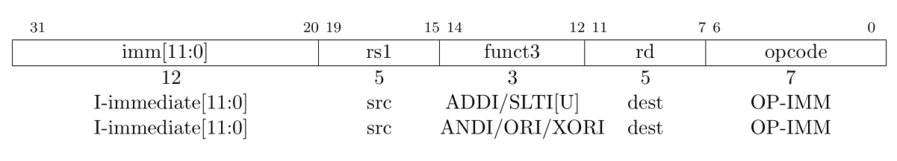

	shell 别有事没事加空格

fprintf(stderr, "%*s", Pos, "");   打印了pos個空格

[gcc使用](https://www.runoob.com/w3cnote/gcc-parameter-detail.html)
`- static`:禁止使用动态库
### 4 token流 构造

```c
// 为每个终结符都设置种类来表示
typedef enum
{
    TK_PUNCT, // 操作符如： + - 
    TK_NUM,   // 数字
    TK_EOF,   // 文件终止符，即文件的最后
} TokenKind;

// 终结符结构体
typedef struct Token Token;
struct Token
{
    TokenKind Kind; // 种类
    Token *Next;    // 指向下一终结符
    int Val;        // 值
    char *Loc;      // 在解析的字符串内的位置
    int Len;        // 长度
};

```
跳过空格啥的

### 5 支持 * / () 也就是优先级
简单的加减乘除的抽象语法树  加上括号  表示优先级


```c
// AST节点种类
typedef enum {
  ND_ADD, // +
  ND_SUB, // -
  ND_MUL, // *
  ND_DIV, // /
  ND_NUM, // (整型 int)  数字
} NodeKind;


// AST中二叉树节点
typedef struct Node Node;
struct Node {
  NodeKind Kind; // 节点种类
  Node *LHS;     // 左部，left-hand side
  Node *RHS;     // 右部，right-hand side
  int Val;       // 存储ND_NUM种类的值
};

// expr = mul ("+" mul | "-" mul)*
// mul = primary ("*" primary | "/" primary)*
// primary = "(" expr ")" | num
static Node *expr(Token **Rest, Token *Tok);
static Node *mul(Token **Rest, Token *Tok);
static Node *primary(Token **Rest, Token *Tok);

static void genExpr(Node *Nd) 
// 递归将最右节点入栈  解析完左子树之后弹出
```

### 6 一元运算符
一元运算符优先级高于乘除

```c
// expr = mul ("+" mul | "-" mul)*
// mul = unary ("*" unary | "/" unary)*
// unary = ("+" | "-") unary | primary
// primary = "(" expr ")" | num
```

### 7 == != > < >= <=
优先级
```c

// 优先级
// expr = equality
// equality = relational ("==" relational | "!=" relational)*
// relational = add ("<" add | "<=" add | ">" add | ">=" add)*
// add = mul ("+" mul | "-" mul)*
// mul = unary ("*" unary | "/" unary)*
// unary = ("+" | "-") unary | primary
// primary = "(" expr ")" | num
```

判断操作符占几个字节(1 or 2)
```c
// 判断Str是否以SubStr开头
static bool startsWith(char *Str, char *SubStr) {
  // 比较LHS和RHS的N个字符是否相等
  return strncmp(Str, SubStr, strlen(SubStr)) == 0;
}

// 读取操作符
static int readPunct(char *Ptr) {
  // 判断2字节的操作符
  if (startsWith(Ptr, "==") || startsWith(Ptr, "!=") || startsWith(Ptr, "<=") ||
      startsWith(Ptr, ">="))
    return 2;

  // 判断1字节的操作符
  return ispunct(*Ptr) ? 1 : 0;
}
```


### 8 代码重构, 将main分割为多个文件
- `codegen.c` 语义分析与代码生成  通过栈操作解析语法树生成代码
- `parse.c`   生成AST, 根据token序列生成抽象语法树   语法分析
- `tokenize.c`将输入字符串解析为一个一个token   词法分析


### 9 支持;分隔语句

- rvcc.h 里面
添加NodeKind::ND_EXPR_STMT, // 表达式语句 : 表示是一个语句

- parse.h 添加新语法规则
语法规则
```c
// program = stmt*
// stmt = exprStmt
// exprStmt = expr ";"
// expr = equality
// equality = relational ("==" relational | "!=" relational)*
// relational = add ("<" add | "<=" add | ">" add | ">=" add)*
// add = mul ("+" mul | "-" mul)*
// mul = unary ("*" unary | "/" unary)*
// unary = ("+" | "-") unary | primary
// primary = "(" expr ")" | num

```
program由多个表达式语句构成, 采用链表存储多个语句
```c
struct Node {
  // new!!
  Node *Next;    // 下一节点，指代下一语句
};
```
- codegen.c
生成多个语句, 为每个语句生成代码


### 10 支持单字母本地变量
- rvcc.h
  - add TokenKind::TK_IDENT  标记符
  - add NodeKind::ND_ASSIGN  赋值 NodeKind::ND_VAR 变量
  - add Node::char Name 变量名字

- tokenize.c
a-z 自动识别为变量

- parse.c
```c
// 语法
// program = stmt*
// stmt = exprStmt
// exprStmt = expr ";"
// expr = assign                                     new
// assign = equality ("=" assign)?                   new
// equality = relational ("==" relational | "!=" relational)*
// relational = add ("<" add | "<=" add | ">" add | ">=" add)*
// add = mul ("+" mul | "-" mul)*
// mul = unary ("*" unary | "/" unary)*
// unary = ("+" | "-") unary | primary
// primary = "(" expr ")" | ident | num             new
```
primary() 
```c
  // ident
  if (Tok->Kind == TK_IDENT){
    Node *Nd = newVarNode(*(Tok->Loc));  // 用字符位置
    *Rest = Tok->Next;
    return Nd;
  }
```


- codegen.c
入口函数初始化栈, 自动在栈上生成24个变量 a-z, 并存储a的地址fp
`Offset = (Nd->Name - 'a' + 1) * 8; `
之后变量的地址就是 
`addi a0, fp, %d (-Offset) `
最后释放


### 11 支持多字母本地变量
- rvcc.h
定义变量的结构体
```c
// 本地变量
typedef struct Obj Obj;
struct Obj {
  Obj *Next;  // 指向下一对象
  char *Name; // 变量名
  int Offset; // fp的偏移量
};

// 不再以node为入口, 函数由语法树及其附属结构(变量表)组成 
// 函数  
typedef struct Function Function;
struct Function {
  Node *Body;    // 函数体
  Obj *Locals;   // 本地变量
  int StackSize; // 栈大小
};

```
- tokennize.c
判断变量名是否合法

```c
// 解析标记符  [a-zA-Z_][a-zA-Z0-9_]*
    if (isIdent1(*P)){
      char *Start = P;
      do{
        ++P;
      }while(isIdent2(*P));


// 判断标记符的首字母规则
// [a-zA-Z_]
static bool isIdent1(char C) {
  // a-z与A-Z在ASCII中不相连，所以需要分别判断
  return ('a' <= C && C <= 'z') || ('A' <= C && C <= 'Z') || C == '_';
}

// 判断标记符的非首字母的规则
// [a-zA-Z0-9_]
static bool isIdent2(char C) { return isIdent1(C) || ('0' <= C && C <= '9'); }

```

- parse.c
因为变量由 char升级为 Obj, 做一些相应的修改
```c
// 维持一个链表结构存储本地变量名
Obj *Locals;
// 通过名称，查找一个本地变量
static Obj *findVar(Token *Tok);

// 新变量
static Node *newVarNode(Obj *Var);
// 在链表中新增一个变量
static Obj *newLVar(char *Name);
```

- codegen.c

`static void assignLVarOffsets(Function *Prog) `
根据链表长度计算初始化栈的大小, 并对齐16位`Prog->StackSize = alignTo(Offset, 16)`, 修改初始化栈大小


### 12 支持return语句
目前成果 
```c
foo2=70; bar4=4;return foo2+bar4;

编译结果:
  .globl main
main:
  addi sp, sp, -8
  sd fp, 0(sp)
  mv fp, sp
  addi sp, sp, -16
  addi a0, fp, -16
  addi sp, sp, -8
  sd a0, 0(sp)
  li a0, 70
  ld a1, 0(sp)
  addi sp, sp, 8
  sd a0, 0(a1)
  addi a0, fp, -8
  addi sp, sp, -8
  sd a0, 0(sp)
  li a0, 4
  ld a1, 0(sp)
  addi sp, sp, 8
  sd a0, 0(a1)
  addi a0, fp, -8
  ld a0, 0(a0)
  addi sp, sp, -8
  sd a0, 0(sp)
  addi a0, fp, -16
  ld a0, 0(a0)
  ld a1, 0(sp)
  addi sp, sp, 8
  add a0, a0, a1
  j .L.return
.L.return:
  mv sp, fp
  ld fp, 0(sp)
  addi sp, sp, 8
  ret
```

- rvcc.h
  - TokenKind::TK_KEYWORD
  - NodeKind::ND_RETURN
- tokenize.c
  void convertKeywords(Token *Tok) : 扫描token, 将 字符为`return`的token的Kind换为TK_KEYWORD
- parse.c
  语法更新
  `stmt = "return" expr ";" | exprStmt`
  为returntoken建立单叉树

- codegen.c
  现在stmt由return语句或者exprstmt组成, 写一个switch分别翻译, 并在epilogue上加入 `.L.return`的跳转标签

### 13 支持{...}代码块


- rcvv.h
  - NodeKind::ND_BLOCK
  - Node::Body // 代码块

- parse.c
  // program = "{" compoundStmt
  // compoundStmt = stmt* "}"
  // stmt = "return" expr ";" | "{" compoundStmt | exprStmt
  // exprStmt = expr ";"

  parse()  为{}, 必须以{开始, 到}结束, 多个stmt用链表存储
- codegen.c
  ```c
  genStmt()
   switch(Nd->Kind){
    // 生成代码块，遍历代码块的语句链表
    case ND_BLOCK: 从Nd->Body开始一个一个按照stmt解析
    ...
    }
  ```

### 14 支持空语句 ;;;
// exprStmt = expr? ";"
- parse.c
```c
  // ";"
  if (equal(Tok, ";")){
    *Rest = Tok->Next;
    return newNode(ND_BLOCK);
  }
```


### 15 if
- rvcc.h
  - NodeKind::ND_IF
  - Node
    - Node *Cond; // 条件内的表达式
    - Node *Then; // 符合条件后的语句
    - Node *Els;  // 不符合条件后的语句
- tokenize.c
  关键字不再只有return, isKeyWord(Token *Tok) 判断是否为关键字
- parse.c
  ```c
  // stmt = "return" expr ";"
  //        | "if" "(" expr ")" stmt ("else" stmt)?
  //        | "{" compoundStmt
  //        | exprStmt
  if "if":
    Node *Nd = newNode(ND_IF);
    并根据token对 Cond, Then, Els 赋值
  ```
  
- codegen.c
static int count 记录每个if else


if 解释规则
```c
  case ND_IF: 
    // 代码段计数
    int C = count();
    // 生成条件内语句
    genExpr(Nd->Cond);
    // 判断结果是否为0，为0则跳转到else标签
    printf("  beqz a0, .L.else.%d\n", C);
    // 生成符合条件后的语句
    genStmt(Nd->Then);
    // 执行完后跳转到if语句后面的语句
    printf("  j .L.end.%d\n", C);
    // else代码块，else可能为空，故输出标签
    printf(".L.else.%d:\n", C);
    // 生成不符合条件后的语句
    if (Nd->Els)
      genStmt(Nd->Els);
    // 结束if语句，继续执行后面的语句
    printf(".L.end.%d:\n", C);
    return;`
```


### 16 for
- rvcc.h
  ND_FOR
  - Node
    - Node *Init; // 初始化语句
    - Node *Inc;  // 递增语句
- tokenize.c 
  简单把isKeyword 加上一个for就行
- parse.c
```c
  // stmt = "return" expr ";"
  //        | "if" "(" expr ")" stmt ("else" stmt)?
  //        | "for" "(" exprStmt expr? ";" expr? ")" stmt
  //        | "{" compoundStmt
  //        | exprStmt
```
 `"for" "(" exprStmt expr? ";" expr? ")" stmt`
```c
  Nd->Init = exprStmt
  Nd->Cond = expr? ";"
  Nd->Inc = expr?
  Nd->Then = stmt
```
- codegen.c
`{j = 0;for (i=0; i<=10; i=i+1) j=i+j; return j; } => 55`
```
  .globl main
main:
  addi sp, sp, -8
  sd fp, 0(sp)
  mv fp, sp
  addi sp, sp, -16
  addi a0, fp, -16
  addi sp, sp, -8
  sd a0, 0(sp)
  li a0, 0
  ld a1, 0(sp)
  addi sp, sp, 8
  sd a0, 0(a1)
  addi a0, fp, -8
  addi sp, sp, -8
  sd a0, 0(sp)
  li a0, 0             # init 
  ld a1, 0(sp)
  addi sp, sp, 8
  sd a0, 0(a1)
.L.begin.1:            # Cond
  li a0, 10
  addi sp, sp, -8
  sd a0, 0(sp)
  addi a0, fp, -8
  ld a0, 0(a0)
  ld a1, 0(sp)
  addi sp, sp, 8
  slt a0, a1, a0
  xori a0, a0, 1
  beqz a0, .L.end.1
  addi a0, fp, -16     # Then
  addi sp, sp, -8
  sd a0, 0(sp)
  addi a0, fp, -16
  ld a0, 0(a0)
  addi sp, sp, -8
  sd a0, 0(sp)
  addi a0, fp, -8
  ld a0, 0(a0)
  ld a1, 0(sp)
  addi sp, sp, 8
  add a0, a0, a1
  ld a1, 0(sp)
  addi sp, sp, 8
  sd a0, 0(a1)
  addi a0, fp, -8
  addi sp, sp, -8
  sd a0, 0(sp)
  li a0, 1
  addi sp, sp, -8
  sd a0, 0(sp)
  addi a0, fp, -8
  ld a0, 0(a0)
  ld a1, 0(sp)
  addi sp, sp, 8
  add a0, a0, a1
  ld a1, 0(sp)
  addi sp, sp, 8
  sd a0, 0(a1)
  j .L.begin.1
.L.end.1:             # end
  addi a0, fp, -16
  ld a0, 0(a0)
  j .L.return
.L.return:
  mv sp, fp
  ld fp, 0(sp)
  addi sp, sp, 8
  ret
```

### 17 while
while 本质上和for一样
```c
// stmt = "return" expr ";"
//        | "if" "(" expr ")" stmt ("else" stmt)?
//        | "for" "(" exprStmt expr? ";" expr? ")" stmt
//        | "while" "(" expr ")" stmt
//        | "{" compoundStmt
//        | exprStmt
```

### 18 更新辅助信息
简单的把代码生成部分每段打印个注释

### 19 为节点添加相应的终结符，以改进报错信息
AST中每个节点添加 Tok结构

QUESTION:

解析正则表达式带*的  怎么停止的??
`add = mul ("+" mul | "-" mul)*`
```c 
static Node *add(Token **Rest, Token *Tok) {
  // mul
  Node *Nd = mul(&Tok, Tok);

  // ("+" mul | "-" mul)*
  while (true) {
    Token *Start = Tok;
    // "+" mul
    if (equal(Tok, "+")) {
      Nd = newBinary(ND_ADD, Nd, mul(&Tok, Tok->Next), Start);
      continue;
    }

    // "-" mul
    if (equal(Tok, "-")) {
      Nd = newBinary(ND_SUB, Nd, mul(&Tok, Tok->Next), Start);
      continue;
    }

    *Rest = Tok;
    return Nd;  // 瞎了艹, return在while里面, 之前还看清楚的
  }
}

```
### 20 支持一元& *运算符
主要难点在于代码生成节点

- rvcc.h
  添加两个node类型 ND_ADDR, ND_DEREF(dereference)
- parse.c 
  新语法`unary = ("+" | "-" | "*" | "&") unary | primary`简单在unary加两个类型即可
- codegen.c
  对于取地址函数, 目前只有变量存在地址, 且该函数(genAddr)的调用者只有genExpr, 
  - 对于*解引用, 将节点左部的结果按照expr生成代码,结果存入a0, 然后将a0当地址来使用 `ld a0, 0(a0)`
  - 对于&取址, 直接把左部的地址存入a0即可, 现在的左部可以为变量,或者解引用*语句, &*直接怼掉, 直接解析后面的Nd->LHS即可 


### 21 支持指针的算术运算
类型改变了语法但**暂时**和代码生成没有关系, 所有类型大小目前都为8
目前的类型只有 指针及int类型  TY_INT, // int整型    TY_PTR, // 指针

- rvcc.h
AST节点中添加type信息  `Type *Node::Ty`

类型系统需要的数据结构
```c
typedef enum {
  TY_INT, // int整型
  TY_PTR, // 指针
} TypeKind;

struct Type{
  TypeKind Kind;  // 种类
  Type *Base;     // 指向的类型
};

// 全局变量
extern Type *TyInt;
```
需要的函数
```c
// 判断是否为整型
bool isInteger(Type *TY);
// 为节点内的所有节点添加类型
void addType(Node *Nd);
```

添加新文件
- type.c
函数
  - `Type *pointerTo(Type *Base)` 生成一个指向Base的TY_PTR的 Type结构
  - `void addType(Node *Nd)` 递归给语法树中的节点添加类型 先递归再判断类型
  ```c
    // 递归访问所有节点以增加类型
    addType(Nd->LHS);
    addType(Nd->RHS);
    addType(Nd->Cond);
    addType(Nd->Then);
    addType(Nd->Els);
    addType(Nd->Init);
    addType(Nd->Inc);

    // 访问链表内的所有节点以增加类型
    for (Node *N = Nd->Body; N; N = N->Next)
      addType(N);
  ```
  判断类型
    - ND_ADD, ND_SUB, ND_MUL, ND_DIV, ND_NEG, ND_ASSIGN: 设置为左值的类型
    - ND_EQ, ND_NE, ND_LT, ND_LE, ND_VAR, ND_NUM: int类型
    - ND_ADDR: & 使用pointerTo函数 设置为指向左值类型的ND_PTR类型
    - ND_DEREF:* 解引用, 左值要是指针, 设置为指针指向内容(`Nd->LHS->Ty->Base`)的类型, 否则设置为int, 嵌套(`&***&&(int)`)也会嵌套下去

- parse.c
  主要针对指针算术运算(+ or -)以及节点的类型做了修改
  - 节点类型, 在构造完AST后, 用`addType`函数为节点添加类型信息, 所有类型大小目前都为8
  newAdd(newSub)替换原来的直接构建, newAdd(newSub)判断左部右部的类型进行响应的修改, 同时注意, 此步骤需要在构建AST中就需要知道节点类型, 所以进入函数需要先
  ```c
    addType(LHS);
    addType(RHS);
  ```
  - add:
    - num+num: 正常构建
    - ptr+ptr: 错误
    - ptr + num (num + ptr) ==> ptr + num * 8
  - sub:
    - num-num : 正常构造
    - ptr - num  ==>  ptr - 8*num
    - ptr - ptr : 返回两只真之间的元素数量: ==> (ptr - ptr)/8

### 22 支持int关键字以及定义变量
发生了一个段错误哈哈
测试`{ int i=0; while(i<10) { i=i+1; } return i; }`
在parse.c:393, 此时Loc = `$1 = 0x7fffffffdf38 "+1; } return i; }"` 出错
右子树出错了, 右子树没有赋值
```c
(gdb) p RHS->Ty
$3 = (Type *) 0x0
```

破案了: parse.c::addType()函数, 忘记加入对于ND_NUM类型的type赋值了(自己删的哈哈)

- rvcc.h
给变量 Obj加入类型 `Type *Obj::Ty`
给type加入name  `Token* Type::Name` (TODO : 为什么是Token类型的??)

- type.c
  ND_VAR的type不再直接设置为INT, 改为Nd->Var->Ty
  另外解引用只能对指针进行, 不再对INT适用
- token.c
  - 添加函数 `consume()`:消耗指定的Token, 返回`true/false`, 与`skip()`相比, 不强制要求存在(`skip()`不存在会直接报错, 退出程序)
- parse.c
  语法添加声明
  ```c
    // compoundStmt = (declaration | stmt)* "}"
    // declaration =
    //         declspec (declarator ("=" expr)? ("," declarator ("=" expr)?)*)? ";"
    // declspec = "int"
    // declarator = "*"* ident
  ```
  新语法对compoundStmt小幅修改, 若开头为 `"int"`则进入`declaration()`
  - `declaration = declspec (declarator ("=" expr)? ("," declarator ("=" expr)?)*)? ";"`
    `              int         a          =  expr     ,     b         =  expr2  ;`
    `int a, b = 10;`
    `int;` 可以单独出现???  TODO : 搞懂这一句  
    改成`declaration = declspec declarator ("=" expr)? ("," declarator ("=" expr)?)* ";"`这样不就可以了吗??
  - `Node *declaration(Token **Rest, Token *Tok)`
    这里把每个声明短句都看作一个句子, 就是一行声明语句可能为多个句子, 用list存储一下, 存储到block里面
    类似于这种
    ```c
    int {
      a = 1,
      b = 2, 
      c = 3,
      d = 4
    };
    ```
    左边为VAR, 右边为assign
    ```c
    // 解析“=”后面的Token
    Node *LHS = newVarNode(Var, Ty->Name);
    // 解析递归赋值语句
    Node *RHS = assign(&Tok, Tok->Next);
    Node *Node = newBinary(ND_ASSIGN, LHS, RHS, Tok);
    // 存放在表达式语句中
    Cur->Next = newUnary(ND_EXPR_STMT, Node, Tok);
    ```
  - `Type *declarator(Token **Rest, Token *Tok, Type *Ty)`// declarator = "*"* ident
  - `char *getIdent(Token *Tok)` Obj *Var = newLVar(getIdent(Ty->Name), Ty), 就获取一下变量的名字


### 插曲 episode
```sh
cat <<EOF | riscv64-linux-gnu-gcc -xc -c -o tmp2.o -
int ret3() { return 3; }
int ret5() { return 5; }
EOF
```
cat 输出多行的方法
```bash
cat <<EOF
content 内容
EOF
```
然后加上管道就变成了后面的输入数据

### 23 支持零参数函数调用
主要是test.sh `cat <<EOF` 的用法
语法  注意是函数调用, 不是函数声明
// primary = "(" expr ")" | ident args? | num
// args = "(" ")"
- rvcc.h
  添加 `NodeKind::ND_FUNCALL`
  添加 `Node::char *FuncName; // 函数名`
- parse.c 根据新语法简单修改即可
- codegen.c  加一个`call %s\n", Nd->FuncName`
  然后 fp之外多一个ra寄存器, sp初始减16


### 24 支持最多6个参数的函数调用
对于 fun语法 核心两个指针
- rvcc.h
  ```c
  struct Node{
    // 函数调用
    char *FuncName; // 函数名
    Node *Args; // 函数参数  new
  }
  ```
- parse.c
  语法更新为
  ```c
  // primary = "(" expr ")" | ident func-args? | num
  
  // funcall = ident "(" (assign ("," assign)*)? ")"
  ```
  解析primary时, 当前`Tok->Kind == TK_IDENT && Tok->Next == ")"`则进入 `funcall()`
  多条语句都用链表存储, 结果放入Nd->Args中
- codegen.c
  添加6个寄存器对应调用参数, 解析`Args`时, 数数量, 并将结果依次压入栈中然后倒着pop出来
  第1-6个参数分别对应`"a0", "a1", "a2", "a3", "a4", "a5"`


### 25 支持零参数函数定义
新的语法
// program = functionDefinition*
// functionDefinition = declspec declarator? ident "(" ")" "{" compoundStmt*
// declspec = "int"
// declarator = "*"* ident typeSuffix
// compoundStmt = (declaration | stmt)* "}"
// typeSuffix = ("(" ")")?

```c
int main(){

}

```
- rvcc.h
  添加类型:TypeKind::TY_FUNC
  仿照变量类型Obj改Function, 多个函数,增加`char *Name;      // 函数名` 和 `Function *Next;  // 下一函数`
  Type增加  `Type *ReturnTy; // 函数返回的类型`
- type.c
  `Type *funcType(Type *ReturnTy)`新建一个有ReturnTy的TY_FUNC的Type
- parse.c
  新语法
  ```c
  // program = functionDefinition*
  // functionDefinition = declspec declarator"{" compoundStmt*
  // declspec = "int"
  // declarator = "*"* ident typeSuffix
  // compoundStmt = (declaration | stmt)* "}"
  // typeSuffix = ("(" ")")?
  ```
  parse主体改为function
  `functionDefinition = declspec declarator"{" compoundStmt*`
  function中给Fn的`Name` `Body` `Locals`赋值
- codegen.c
  因为改为了多个函数, 所以要为每个函数分配参数啥的
  每个函数各自计算变量的offset
  然后用一个地址空间, 不过不用担心, 栈的赋值是相对赋值
  ```c
  printf("  addi sp, sp, -16\n"); // 分配两个位置
  printf("  sd ra, 8(sp)\n");
  // 将fp压入栈中，保存fp的值
  printf("  sd fp, 0(sp)\n");
  // 将sp写入fp
  printf("  mv fp, sp\n");
  ```
  ```c
  // 代码生成入口函数，包含代码块的基础信息
  void codegen(Function *Prog) {
    assignLVarOffsets(Prog);
    // 为每个函数单独生成代码
    for (Function *Fn = Prog; Fn; Fn = Fn->Next) {
      genFun(Fn);
    }
  }
  ```

### 26 支持最多6个参数的函数定义
增加参数的函数调用,本质上就是解析完括号中的参数, 然后将形参加入本地变量, 代码生成的时候, 将a0-a5寄存器的值存入sp中的参数地址中

- rvcc.h
  - `Type`::Type *Params;   // 形参  Type::Type *Next;     // 下一类型
  - `Function`::Obj *Params; // 形参
- type.c
  addtype时, 为每个形参也addType
- parse.c
  新语法
  // typeSuffix = ("(" funcParams? ")")?
  // funcParams = param ("," param)*
  // param = declspec declarator
  typeSuffix: 算是Type的补充, 如果有括号就不是变量类型, 就变为函数类型

  - function
  `Obj *newLVar(char *Name, Type *Ty)` 往参数列表中添加参数需要知道参数的name和type
  function函数中需要先用`createParamLVars(Ty->Params);`给locals添加上形参, 添加中倒着添加, 因为codegen是倒着出栈的
- codegen.c
  生成函数的时候将寄存器中的值load到参数地址中(`%d(fp)\n", ArgReg[I++]`)

### 26 支持一维数组

debug:
```c
return arrayOf(Ty, sz);
// 这里写成了arrayOf(Ty->Base, sz);
```
Type->Base->Size 和 Base->size区别:
准确说是理清Type 和 Type->Base的关系
- Type->Base:只有当前Type为指针或者数组时才有意义, 也就是指针类型才有Base

发现一个error(a quirk of the C grammar)
```c
  case ND_ADDR:{
    Type *Ty = Nd->LHS->Ty;     // 外面不加{}的话, 声明语句会报错
    if(Ty->Kind == TY_ARRAY)
      Nd->Ty = pointerTo(Ty->Base);
    else
      Nd->Ty = pointerTo(Ty);
    return;
  }

// 所以这东西语法是这样的
// case expr: ("{" compoundStmt) | stmt*
// 而stmt 如果不选择 "{" compoundStmt 是不会包含declaration语法的, 所以声明语句不行哈哈哈哈哈
```

节点一直没有Nd->Type, 破案了妈的  不知道哪一版重写function函数的时候把addType删了, 气死我了 debug了两个小时

- rvcc.h
  - `TokenKind::TY_ARRAY`
  - `Type::Size, Type::ArrayLen`
- type.c
  `Type *arrayOf(Type *Base, int Len)` 构建一个数组类型的Type
  赋值语句暂不支持对数组ident赋值
  并且ND_ADDR做限制, 数组类型为 `pointerTo(Ty->Base);`, 而指针类型为`pointerTo(Ty);`
- parse.c
  // typeSuffix = "(" funcParams | "[" num "]" | ε
  // funcParams = (param ("," param)*)? ")"
  注意更改newAdd newSub中指针运算时 ptr+1, 不再固定为8, 而是`LHS->Ty->Base->Size`
  ```c
    // 构造数组类型, 传入 数组基类, 元素个数
    Type *arrayOf(Type *Base, int Len) {
      Type *Ty = calloc(1, sizeof(Type));
      Ty->Kind = TY_ARRAY;
      // 数组大小为所有元素大小之和
      Ty->Size = Base->Size * Len; // Size为数组大小
      Ty->Base = Base;
      Ty->ArrayLen = Len;
      return Ty;
    }
  ```
- codegen.c
  每个变量分配字节由8改为size


`typeSuffix`函数是type的补充
```c
  int a;
  int b[5];
  int a();
```
碰到`int a`, 这时标识符`a`已经出现了, 标识符被判断为前面的`declspec "*"*`, 然后碰到`[` 或者 `(`需要改变标识符的类型

### 28 支持多维数组

// typeSuffix = "(" funcParams | "[" num "]" typeSuffix | ε
```c
if (equal(Tok, "[")) {
    int Sz = getNumber(Tok->Next);
    Tok = skip(Tok->Next->Next, "]");
    Ty = typeSuffix(Rest, Tok, Ty); 
    // 最终会递归到 ε 然后设置Rest  *Rest = Tok, 如果在这里设置 会把原来的指向末尾的Rest 重新设置为 "["
    return arrayOf(Ty, Sz);
  }
```

### 29 支持[]操作符
// unary = ("+" | "-" | "*" | "&") unary | postfix
// postfix = primary ("[" expr "]")*

x[y] 等价于 *(x+y)

### 30 支持sizeof
// primary = "(" expr ")" | "sizeof" unary | ident funcArgs? | num
```c
  if (equal(Tok, "sizeof")){
    Node *Nd = unary(Rest, Tok);
    addType(Nd);
    return newNum(Nd->Ty->Size, Tok);
  }

```
  - CRUX:注意这个要放到`ident funcArgs?`前面, 否则, 会将sizeof()判定为函数, 因为`ident funcArgs?`除了当前tok还会判断下一个tok,
  - 明明有`TK_KEYWORD`为什么`sizeof`仍然被判定为`TK_IDENT`?
    破案了 当时`convertKeywords`条件被我改了, 原版是 `T->Kind != TK_EOF`, 被我改成了`T->Kind == TK_IDENT`, 导致中间出现个别的类型的tok就停止了 智障啊 

### 31 融合var和function
- rvcc.h
```c
// 本地变量
typedef struct Obj Obj;
struct Obj {
  Obj *Next;  // 指向下一对象
  char *Name; // 变量名
  Type *Ty;   // 变量类型
  int Offset; // fp的偏移量
};

// 函数
typedef struct Function Function;
struct Function {
  Function *Next;  // 下一函数
  char *Name;      // 函数名

  Obj *Params;     // 形参
  Node *Body;      // 函数体
  Obj *Locals;     // 本地变量
  int StackSize;   // 栈大小
};
```
两者相同点多了去了 
更改为
```c
// 变量 或 函数
typedef struct Obj Obj;
struct Obj {
  Obj *Next;       // 指向下一对象
  char *Name;      // 变量名
  Type *Ty;        // 变量类型
  bool IsLocal;    // 局部变量还是全局变量

  // 局部变量
  int Offset;      // fp的偏移量

  // 函数或全局变量
  bool IsFunction;

  // 函数
  Obj *Params;     // 形参
  Node *Body;      // 函数体
  Obj *Locals;     // 本地变量
  int StackSize;   // 栈大小
};
```
eposide::本地变量存哪去了???
`newLVar`函数会维护本地变量

- parse.c
// program = (functionDefinition | global-variable)*
将函数存放在全局变量里

- codegen.c
  注意输入Prog为Globals,(目前Globals中存储的全部为变量, 后面会加入全局变量), 要判断一下 `bool IsFunction`

### 32 支持全局变量声明
不支持初始化
- parse.c
  // program = (functionDefinition | global-variable)*
  对每个需要判断是函数类型还是全局变量类型`isFunction()`
  ```c
    // 区分 函数还是全局变量
    static bool isFunction(Token *Tok) {
      if (equal(Tok, ";"))  // int;
        return false;
  
      // CRUX 虚设变量，用于调用declarator, 判断下后面的类型
      Type Dummy = {};
      Type *Ty = declarator(&Tok, Tok, &Dummy);
      return Ty->Kind == TY_FUNC;
    }
  ```
  global-variable = declarator?("," declarator)* ";"
  `while(!consume(&Tok, Tok, ";"))` 用 `newGVar`加入到Globals中
- codegen.c
  全局变量存放在`.data`中, `printf("  la a0, %s\n", Nd->Var->Name);  // 全局变量存放在符号表中, data段`
  用下述函数生成.data
  ```c
  // .data 全局变量
    static void emitData(Obj *Prog) {
      for (Obj *Var = Prog; Var; Var = Var->Next) {
        if (Var->IsFunction)
          continue;
  
        printf("  # 数据段标签\n");
        printf("  .data\n");
        printf("  .globl %s\n", Var->Name);
        printf("  # 全局变量%s\n", Var->Name);
        printf("%s:\n", Var->Name);
        printf("  # 零填充%d位\n", Var->Ty->Size);
        printf("  .zero %d\n", Var->Ty->Size);
      }
    }
  ```
  效果如下
  ```armasm
      # 数据段标签
      .data
      .globl x
      # 全局变量x
    x:
      # 零填充32位
      .zero 32
  
      # 定义全局main段
      .globl main
      .text
    # =====main段开始===============
    # main段标签
    main:
      # 将ra寄存器压栈,保存ra的值
      addi sp, sp, -16
      sd ra, 8(sp)
      ...
  ```


### 33 char类型

`TypeKind::TY_CHAR`
增加 TyChar变量
Type *TyChar = &(Type){TY_CHAR, 1};

// declspec = "char" | "int"
后面代码生成时要判断一下 `ty->size`, 选择 `lb / ld   sb/sd`

### 34 字符串字面量 
'\0'在哪里存储?

- rvcc.h
```c
TokenKind::TK_STR;  // tokenize碰到'"' 检测
Type* Token::Ty;    // TK_STR使用  parse.c::newStringLiteral()使用
char *Obj::InitData;  // 字符串初始化值 存在.data中
```

- tokenize.c
  "abc", start = "(the left one), endP = " (the right one)
  `Tok->Ty = arrayOf(TyChar, P - Start);` 开辟n+1个空间,最后一个存储'\0'
  `Tok->Str = strndup(Start + 1, P - Start - 1);` 复制abc

- parse.c
  创建全局变量需要
  `Obj *newGVar(char *Name, Type *Ty)`
  然而字符串是没名字的, 所以需要建立匿名唯一名称
  在`newStringLiteral()`中, `tok->str`会被复制到新创建的匿名全局变量的`InitData`中
  关于 `Tok->Ty`, 因为对ty的判断提前到了tokenize中, 所有后续不用再弄了
  ```c
    if (Tok->Kind == TK_STR){
      Obj *Var = newStringLiteral(Tok->Str, Tok->Ty);
      *Rest = Tok->Next;
      return newVarNode(Var, Tok);
    }
  ```
  TK_STR被定义为VAR, 但var中的某些字段不同(`InitData`以及`Ty`(`Ty`为n+1长度的数组))
- codegen.c
  之前的全局变量只声明, 并没有初始化, 但str类型有初始化, 需要判断(`Var->InitData != null`)  
  生成代码如下格式  
  源代码
  ```c
  int a[10]; 
  int main() { return sizeof("abc"); }
  ```
  ```armasm
      # 数据段标签
      .data
    .L..0:
      # 字符串字面量
      .byte 97	# a
      .byte 98	# b
      .byte 99	# c
      .byte 0
      # 数据段标签
      .data
      # 全局段a
      .globl a
    a:
      # 全局变量零填充80位
      .zero 80
  
      # 定义全局main段
      .globl main
      .text
    # =====main段开始===============
    # main段标签
    main:
    ...
  ```


### 35 格式化字符串输入
CRUX:搞懂原理
```c
// 格式化后返回字符串
char *format(char *Fmt, ...) {
  char *Buf;
  size_t BufLen;
  // 将字符串对应的内存作为I/O流
  FILE *Out = open_memstream(&Buf, &BufLen);  //函数可以实现在一段内存上进行IO操作
  // open_memstream() 函数可以为用户动态申请和扩展内存，并将内存大小通过参数返回
  // 另一个函数是fmemopen(), 但fmemopen需要调用者提供一段已经分配好的内存
  va_list VA;
  va_start(VA, Fmt);
  // 向流中写入数据
  vfprintf(Out, Fmt, VA);
  va_end(VA);

  fclose(Out);
  return Buf;
}
```

### 36 支持多个转义字符
主要是 对转移字符 '\\'的处理, 要把"\t"类似的字符串转换为'\t'
对应如下
|   转义字符   |  意思   |
| --- | ---|
|  \a   |  响铃(报警)  |
|  \b   |  退格  |
|  \t   |  水平制表符  |
|  \n   |  换行  |
|  \v   |  垂直制表符  |
|  \f   |  换页  |
|  \r   |  回车  |
|  \e   |  转义符(GNU C拓展)  |

### 37 支持八进制转义字符
转义字符还能八进制?? `\123` ==> `(1*8+2)*8+3`   不能长于3位, `\1500` ==> `"'104'0"`
- tokenize.c
  在readEscapedChar 更改P的位置, 传入`&P`
  - `\t` 跳到 t下一个
  - `\123` 跳到3下一个

### 38 支持十六进制转义字符
16进制可以是多位

### 39 [GNU]语句表达式
`({ int x=3; x; })` 这个就叫语句表达式

NodeKind::ND_STMT_EXPR
// 解析括号、数字、变量
// primary = "(" "{" stmt+ "}" ")"
//         | "(" expr ")"
//         | "sizeof" unary
//         | ident funcArgs?
//         | str
//         | num

按照 "(" "{" compoundStmt ")"解析, 结果存入Node->Body中

注意addType中// 节点类型为 最后的表达式语句的类型
```c
Node *Stmt = Nd->Body;
while (Stmt->Next)
  Stmt = Stmt->Next;
if (Stmt->Kind == ND_EXPR_STMT) {
  Nd->Ty = Stmt->LHS->Ty;
  return;
}
```


### 40从文件中读取代码,改进报错信息
输入格式更改
核心两个函数**CRUX**, 好好学  太秀了
从文件读取代码
```c

// 返回指定文件的内容  把文件转为字符串
  static char *readFile(char *Path) {
    FILE *FP;

    if (strcmp(Path, "-") == 0) {
      // 如果文件名是"-"，那么就从输入中读取
      FP = stdin;
    } else {
      FP = fopen(Path, "r");
      if (!FP)
        // errno为系统最后一次的错误代码
        // strerror以字符串的形式输出错误代码
        error("cannot open %s: %s", Path, strerror(errno));
    }

    // 要返回的字符串
    char *Buf;
    size_t BufLen;
    FILE *Out = open_memstream(&Buf, &BufLen);

    // 读取整个文件
    while(true) {
      char Buf2[4096];
      // fread从文件流中读取数据到数组中
      // 数组指针Buf2，数组元素大小1，数组元素个数4096，文件流指针
      int N = fread(Buf2, 1, sizeof(Buf2), FP);
      if (N == 0)
        break;
      // 数组指针Buf2，数组元素大小1，实际元素个数N，文件流指针
      fwrite(Buf2, 1, N, Out);
    }

    // 对文件完成了读取
    if (FP != stdin)
      fclose(FP);

    // 刷新流的输出缓冲区，确保内容都被输出到流中
    fflush(Out);
    // 确保最后一行以'\n'结尾
    if (BufLen == 0 || Buf[BufLen - 1] != '\n')
      // 将字符输出到流中
      fputc('\n', Out);
    fputc('\0', Out);
    fclose(Out);
    return Buf;
  }
```
改进报错信息
```c
  // 输出例如下面的错误，并退出
  // foo.c:10: x = y + 1;
  //               ^ <错误信息>
  static void verrorAt(char *Loc, char *Fmt, va_list VA) {
    // 查找包含loc的行
    char *Line = Loc;
    // Line递减到当前行的最开始的位置
    // Line<CurrentInput, 判断是否读取到文件最开始的位置
    // Line[-1] != '\n'，Line字符串前一个字符是否为换行符（上一行末尾）
    while (CurrentInput < Line && Line[-1] != '\n')
      Line--;

    // End递增到行尾的换行符
    char *End = Loc;
    while (*End != '\n')
      End++;

    // 获取行号, 一个字符一个字符的遍历, 数'\n'个数
    int LineNo = 1;
    for (char *P = CurrentInput; P < Line; P++)
      // 遇到换行符则行号+1
      if (*P == '\n')
        LineNo++;

    // 输出 文件名:错误行
    // Indent记录输出了多少个字符
    int Indent = fprintf(stderr, "%s:%d: ", CurrentFilename, LineNo); // foo.c:10
    // 输出Line的行内所有字符（不含换行符）
    fprintf(stderr, "%.*s\n", (int)(End - Line), Line); // 从Line开始 打印出 int(End-Line)个字符

    // 计算错误信息位置，在当前行内的偏移量+前面输出了多少个字符
    int Pos = Loc - Line + Indent;

    // 将字符串补齐为Pos位，因为是空字符串，所以填充Pos个空格。
    fprintf(stderr, "%*s", Pos, "");  // Pos个空格。
    fprintf(stderr, "^ ");
    vfprintf(stderr, Fmt, VA);
    fprintf(stderr, "\n");
    va_end(VA);
  }
```
**CRUX**  
[格式化输出字符串](https://www.cnblogs.com/dapaitou2006/p/6428122.html)

对于m.n的格式还可以用如下方法表示（例）  
char ch[20];  
printf("%\*.\*s/n",m,n,ch);  
前边的*定义的是总的宽度，后边的定义的是输出的个数。分别对应外面的参数m和n 。我想这种方法的好处是可以在语句之外对参数m和n赋值，从而控制输出格式。

| 格式代码 | A  |ABC | ABCDEFGH |
| -- | --- | -- | -- |
|%s  | A   |ABC | ABCDEFGH |
|%5s | ####A   |##ABC | ABCDEFGH |
|%.5s  | A   |ABC | ABCDE |
|%5.5s  | ####A   |##ABC | ABCDE |
|%-5s  | A####   |ABC## | ABCDEFGH |

`%m.ns` : 宽度为m(不够了补齐, 默认右对齐, `-`左对齐), 长度为n
`%*.*s` : 自己指定m,n:`printf("%\*.\*s/n",m,n,ch);`
- 注意readfile中这么写的
```c
if (strcmp(Path, "-") == 0) {
      // 如果文件名是"-"，那么就从输入中读取
      FP = stdin;
```
因为sh中
```sh
echo "$input" | ./rvcc - > tmp.s || exit
```
管道的数据从stdin中进来, argv[1] = "-"
**CRUX****管道从stdin来**


### 42 支持-o和--help(-h)选项
输出格式的更改
`./rvcc input.c -o output`
`./rvcc --help` / `./rvcc -h`  ==> `rvcc [ -o <path> ] <file>`

- main.c中添加`parseArgs()`, 解析输入参数
输入参数为 `-` 则 `OptO = stdout`
`-oXXX` 或者 `-o XXX`, `OptO = openFile(XXX)`

至于`test-dirver.sh`应该是后续测试需要的

### 43 支持行注释和块注释
```c
    // 跳过行注释
    if (startsWith(P, "//")) {
      P += 2;
      while (*P != '\n')
        P++;
      continue;
    }

    // 跳过块注释
    if (startsWith(P, "/*")) {
      // 查找第一个"*/"的位置
      char *Q = strstr(P + 2, "*/");
      if (!Q)
        errorAt(P, "unclosed block comment");
      P = Q + 2;
      continue;
    }
```

### 44 处理代码块域
```c
// 局部和全局变量的域
typedef struct VarScope VarScope;
struct VarScope {
  VarScope *Next; // 下一变量域
  char *Name;     // 变量域名称
  Obj *Var;       // 对应的变量  Var->Next 本身就是一个链表结构
};

// 表示一个块域
typedef struct Scope Scope;
struct Scope {
  Scope *Next;    // 指向上一级的域
  VarScope *Vars; // 指向当前域内的变量
};

// 所有的域的链表   CRUX 不是一个链表结构, 而是一个树状结构  Scp指向当前的作用域,而非最后一个作用域
static Scope *Scp = &(Scope){};
```
维持这个结构需要的函数
```c
// 类似于栈
// 进入域
static void enterScope(void) {
  Scope *S = calloc(1, sizeof(Scope));
  // 后来的在链表头部
  // 类似于栈的结构，栈顶对应最近的域
  S->Next = Scp;
  Scp = S;
}

void leaveScope(void) { Scp = Scp->Next; }  // 这个函数非常的牛逼
```
`{}`对应着变量域, 在函数定义`function`和复合语句`compoundStat`存在变量域的概念, 进入函数时 `enterScope`, 离开时`leaveScope`, 改变`Scp`指针的位置

// TODO : 暂不支持检测变量是否在同一作用域内声明过`redefined`
加入作用域后
```c
// 通过名称，查找一个变量  
// 一个树状结构
static Obj *findVar(Token *Tok) {
  // 此处越先匹配的域，越深层
  for (Scope *S = Scp; S; S = S->Next)  // next指向上一级的域
    // 遍历域内的所有变量
    for (VarScope *S2 = S->Vars; S2; S2 = S2->Next)  // next指向下一变量域
      if (equal(Tok, S2->Name))
        return S2->Var;
  return NULL;
}
```

### 45 C重写测试
这命令行sh够我看一礼拜


```sh
# 短短两行代码, 我得用一生治愈
test/%.exe: rvcc test/%.c
	$(CC) -o- -E -P -C test/$*.c | ./rvcc -o test/$*.s -
	riscv64-linux-gnu-gcc -static -o $@ test/$*.s -xc test/common
```
makefile里面这几行shell命令 CRUX TODO  吐了
```sh
TEST_SRCS=$(wildcard test/*.c)
TESTS=$(TEST_SRCS:.c=.exe)

# 测试标签，运行测试
test/%.exe: rvcc test/%.c
	$(CC) -o- -E -P -C test/$*.c | ./rvcc -o test/$*.s -
	# riscv64-linux-gnu-gcc -o- -E -P -C test/$*.c | ./rvcc -o test/$*.s -
	# $(CC) -static -o $@ test/$*.s -xc test/common
	riscv64-linux-gnu-gcc -static -o $@ test/$*.s -xc test/common

test: $(TESTS)
	# for i in $^; do echo $$i; ./$$i || exit 1; echo; done
	for i in $^; do echo $$i; qemu-riscv64 -L $(RISCV)/sysroot ./$$i || exit 1; echo; done
#	for i in $^; do echo $$i; $(RISCV)/bin/spike --isa=rv64gc $(RISCV)/riscv64-unknown-linux-gnu/bin/pk ./$$i || exit 1; echo; done
	test/driver.sh
# 清理标签，清理所有非源代码文件
clean:
	rm -rf rvcc tmp* $(TESTS) test/*.s test/*.exe
	find * -type f '(' -name '*~' -o -name '*.o' ')' -exec rm {} ';'
```

运行起来了

`riscv64-linux-gnu-gcc -static -o test/arith.exe test/arith.s -xc test/common`
-xc:用`riscv64-gcc` 以C程序编译的common文件

`gcc -o- -E -P -C test/arith.c | ./rvcc -o test/arith.s -`
- -E  Preprocess only; do not compile, assemble or link.
- -P  // TODO 没找到
- -C  // TODO 没找到

### 46 为Token预计算行号
在tokenize中算好每个token在哪一行

### 47 生成.file和.loc汇编指令
将 `.file 1 "-"`  和 `.loc 1 39` 标注输入文件和文件行号的汇编指令写入`.s`文件

### 48 支持 , 运算符
- ND_COMMA, // , 逗号
- 语法`expr = assign ("," expr)?`
, 干嘛的??  就是 `,`连接起来的一系列表达式, 相比stmt 的`expr*`解释多一个尾部值的Type
```c
  ASSERT(5, ({ int i=2, j=3; (i=5,j)=6; i; }));
  ASSERT(6, ({ int i=2, j=3; (i=5,j)=6; j; }));
```
有两种
- 正常的并列语句
- 赋值语句使用(也就是上面的例子), `括号 ASSIGN Val`, 赋值为为括号中的,右部变量赋值

### 49 支持struct
下述格式的
```c
{ 
  struct {
    char a[3]; 
    char b[5];
  }x; 
  char *p=&x; 
  x.b[0]=7; 
  p[3]; 
}
```
**CRUX**x为变量 ND_VAR类型, 但是member为ND_MEMBER类型, ND_MEMBER类型不存储在locals或者globals中, 而是依托于x存在 


- rvcc.h
  ```cpp
  NodeKind::ND_MEMBER // . 结构体成员访问   那个点
  Member *Node::Mem;
  TypeKind::TY_STRUCT


  // 结构体成员
  struct Member {
    Member *Next; // 下一成员
    Type *Ty;     // 类型
    Token *Name;  // 名称
    int Offset;   // 偏移量
  };

  ```

- tokenize.c
简单的把关键字`struct`加进去就行

- parse.c
新语法
  ```c
  // declspec = "char" | "int" | structDecl

  // structDecl = "{" structMembers
  // structMembers = (declspec declarator (","  declarator)* ";")*
  // postfix = primary ("[" expr "]" | "." ident)*
  ```
  以新语法修改下列函数
  ```c
  bool isTypename(Token *Tok);
  Type *declspec(Token **Rest, Token *Tok);
  Node *postfix(Token **Rest, Token *Tok);
  ```
  新增下列函数
  ```c
  // structMembers = (declspec declarator (","  declarator)* ";")* "}"
  void structMembers(Token **Rest, Token *Tok, Type *Ty);
  // 每一个按照 Member 构建, , 存入链表中Member.Next

  // structDecl = "{" structMembers
  Type *structDecl(Token **Rest, Token *Tok);
  // 判断类型, 同时遍历链表计算偏移量

  // 获取结构体成员 遍历Mems
  Member *getStructMember(Type *Ty, Token *Tok);

  // 构建结构体成员的节点  用于 struct_a.member_b这种语法
  // Nd中不直接存储成员, 而是存储在mem中
  Node *structRef(Node *LHS, Token *Tok) {
    addType(LHS);
    if (LHS->Ty->Kind != TY_STRUCT)
      errorTok(LHS->Tok, "not a struct");

    Node *Nd = newUnary(ND_MEMBER, LHS, Tok); // member ND的左子树存储struct_a, tok为member_b
    Nd->Mem = getStructMember(LHS->Ty, Tok);
    return Nd;
  }
  ```
- type.c
  ```c
  case ND_MEMBER:
    Nd->Ty = Nd->Mem->Ty;  
  ```
- codegen.c
  ND_MEMBER使用和ND_VAR相同,都是`genaddr`后`load`
  ```c
  genadd():
    case ND_MEMBER:
      genAddr(Nd->LHS);  // struct_a位置
      printLn("  # 计算成员变量的地址偏移量");
      printLn("  addi a0, a0, %d", Nd->Mem->Offset);
  ```

### 50 对齐结构体成员变量
- rvcc.h
`Type::Align`
同时给`char, int, struct`还有`struct.member`添加Align
struct的默认对齐为1, 存在member则为member中的最大对齐
```c
  // 修改成员offset的构建
  for (Member *Mem = Ty->Mems; Mem; Mem = Mem->Next) {
    Offset = alignTo(Offset, Mem->Ty->Align);
    Mem->Offset = Offset;
    Offset += Mem->Ty->Size;

    if (Ty->Align < Mem->Ty->Align)
      Ty->Align = Mem->Ty->Align;
  }
```
### 51 对齐局部变量
计算完`offset`后对齐一下
```c
  for (Obj *Var = Fn->Locals; Var; Var = Var->Next) {
      // 每个变量分配空间
      Offset += Var->Ty->Size;
      // 对齐变量
      Offset = alignTo(Offset, Var->Ty->Align);
      // 为每个变量赋一个偏移量，或者说是栈中地址
      Var->Offset = -Offset;
  }
```

### 52 支持结构体标签
下述格式的
```c
{ a
  struct a{
    char a[3]; 
    char b[5];
  };
  struct a x; // x is type(struct a)  
  char *p=&x; 
  x.b[0]=7; 
  p[3]; 
}
```

结构体标签域
整体的域结构
```c
// 局部和全局变量的域
typedef struct VarScope VarScope;
struct VarScope {
  VarScope *Next; // 下一变量域
  char *Name;     // 变量域名称
  Obj *Var;       // 对应的变量  
};

// 结构体标签的域
typedef struct TagScope TagScope;
struct TagScope {
  TagScope *Next; // 下一标签域
  char *Name;     // 域名称
  Type *Ty;       // 域类型
};

// 表示一个块域
typedef struct Scope Scope;
struct Scope {
  Scope *Next;    // 指向上一级的域

  // C有两个域：变量域，结构体标签域
  VarScope *Vars; // 指向当前域内的变量
  TagScope *Tags; // 指向当前域内的结构体标签
};
```
标识一个数据结构暂时有两种格式
- `ident` 变量 Var
- `"struct" ident` 标签 Tag

语法应该是下面这样的, 同时也支持之前不带标识符的语法(见49)
```c
// declspec = "char" | "int" | "struct" structDecl
// structDecl = ident? ("{" structMembers)?
{ 
  struct t {
    char a[2];
  }; 
  { 
    struct t {
      char a[4];
    }; 
  } 
  int t = 1;
  struct t y; 
  return sizeof(y); 
}
```
**CRUX : 终于明白为什么 `int;` 不违法了**
因为支持struct类型的声明, 下面几种struct都合法
```c
// 这个就对应 int;
struct a {
  int b;
  int c;
};

struct a s_a;

struct a {
  int b;
  int c;
}b;

```

### 53 支持->运算符
x->y <==> (*x).y
// postfix = primary ("[" expr "]" | "." ident)* | "->" ident)*
```c
  // "->" ident
  if (equal(Tok, "->")) {
    // x->y 等价于 (*x).y
    Nd = newUnary(ND_DEREF, Nd, Tok);  // *x
    Nd = structRef(Nd, Tok->Next);     // *x.y
    Tok = Tok->Next->Next;
    continue;
  }
```

### 54 支持union
联合体需要设置为最大的对齐量与大小，变量偏移量都默认为0
union就是一个偏移量都为0的结构体, 注意设置`size`和`align`为最大值

### 55 增加结构体赋值
下列形式
```c
{ 
  struct t {
    char a, b;
  } x, y; 
  x.a=5; 
  y=x;   // this line
  return y.a; 
}
```

对于`sturct/union`在ASSIGN阶段直接赋值, 复制`size`的内存

CRUX : load为什么直接跳过?
只有 `*a`(a为结构体)的情况才会调用`load`, 而`*a`的使用只能依托于`*a`的postfix和赋值语句, 单独`load` `*a`没有意义, 而且有错 
```c
// 加载a0指向的值
static void load(Type *Ty) {
  if (Ty->Kind == TY_ARRAY || Ty->Kind == TY_STRUCT || Ty->Kind == TY_UNION)
    return;

  printLn("  # 读取a0中存放的地址, 得到的值存入a0");
  if(Ty->Size == 1){
    printLn("  lb a0, 0(a0)");
  }else{
    printLn("  ld a0, 0(a0)");
  }
}
```

### 56 将int大小由8改为4
改一下`TyInt`
主要该`codegen.c`, 生成指令时判断一下size

### 57 支持long类型
主要是把默认类型int改为long, 如`ND_EQ,ND_NE,ND_LT,ND_LE,ND_NUM,ND_FUNCALL`
其次是把默认val类型由int改为int64_t
外加添加`long`关键字

### 58 short
添加一些

### 59 嵌套类型声明符
// declarator = "*"* ( "(" ident ")" | "(" declarator ")" | ident ) typeSuffix
嵌套类型声明符就是 `()`
以下情况
```c
({ char *x[3]; sizeof(x); }) => 24
({ char (*x)[3]; sizeof(x); }) => 8   // 一个指向 char[3] 类型的指针
({ char *x[3]; char y; x[0]=&y; y=3; x[0][0]; }) => 3
({ char x[3]; char (*y)[3]=x; y[0][0]=4; y[0][0]; }) => 4
```

`char (*x)[3];` 当作 `char[3] *x;`解析, 重新判断`type`
```c
  // "(" declarator ")"
  if (equal(Tok, "(")) {
    // 记录"("的位置
    Token *Start = Tok;
    Type Dummy = {};
    // 使Tok前进到")"后面的位置
    declarator(&Tok, Start->Next, &Dummy);
    Tok = skip(Tok, ")");
    // 获取到括号后面的类型后缀，Ty为解析完的类型，Rest指向分号
    Ty = typeSuffix(Rest, Tok, Ty);
    // 解析Ty整体作为Base去构造，返回Type的值
    return declarator(&Tok, Start->Next, Ty);
  }
```

TODO :: 所以`char (*x)[3]` 和 `char *x`相比有什么多余的作用吗?

### 60 支持函数声明
// functionDefinition = declarator ("{" compoundStmt | ";" )
```c
// function():
  Fn->IsDefinition = !consume(&Tok, Tok, ";");

  // 判断是否没有函数定义
  if (!Fn->IsDefinition)
    return Tok;
```

暂时没什么实际作用, 因为这个编译器没有先后顺序

### 61 void
处处受限制, 应该是指针强转, 类接口的需要
TODO void 类型干嘛的? 
```c
if (Nd->LHS->Ty->Base->Kind == TY_VOID)  // 不能解引用
  errorTok(Nd->Tok, "dereferencing a void pointer"); 

if (Ty->Kind == TY_VOID)   // 不能声明void类型(可以声明void *)
  errorTok(Tok, "variable declared void"); 
```

### 62 修正解析复杂类型声明
// declspec = ("void" | "char" | "short" | "int" | "long" | structDecl | unionDecl)+
主要解析 `short int,  int short, long int, int long`
1左移 2,4 ,6, 8, 10 代表
```c
  enum {
    VOID  = 1 << 0,
    CHAR  = 1 << 2,
    SHORT = 1 << 4,
    INT   = 1 << 6,
    LONG  = 1 << 8,
    OTHER = 1 << 10,
  };
```
循环用加法判断结果属于哪个

### 63 long long
`long long`, `long long int`

### 64 typedef

- 对于语句 `typedef struct a b;` :
  1. 设置Attr->IsTypedef = trye
  2. 返回 strcut a 的baseTy
  3. 然后调用`parseTypedef`, 设置 b->Typedef = baseTy
- 对于语句 `b a;`: `Istypename(b)`直接返回`findTypedef(b)`, 也就是b->Typedef

新结构
```c
struct VarScope {
  VarScope *Next; // 下一变量域
  char *Name;     // 变量域名称
  Obj *Var;       // 对应的变量  
  Type *Typedef;  // 别名    new
};

// 变量属性
typedef struct {
  bool IsTypedef; // 是否为类型别名
} VarAttr;
```

新函数
```c
// 查找类型别名
static Type *findTypedef(Token *Tok) {
  // 类型别名是个标识符
  if (Tok->Kind == TK_IDENT) {
    // 查找是否存在于变量域内
    VarScope *S = findVar(Tok);
    if (S)
      return S->Typedef;
  }
  return NULL;
}


// 解析类型别名 
// typedef struct a b  ==> 将 b 的Typedef 改为  struct a 
static Token *parseTypedef(Token *Tok, Type *BaseTy) {
  bool First = true;

  while (!consume(&Tok, Tok, ";")) {
    if (!First)
      Tok = skip(Tok, ",");
    First = false;

    Type *Ty = declarator(&Tok, Tok, BaseTy);
    // 类型别名的变量名存入变量域中，并设置类型
    pushScope(getIdent(Ty->Name))->Typedef = Ty;
  }
  return Tok;
}
```

`struct a b` : a 存在标签域中
`typedef struct a b` : b 存在于变量域中

```c

// 一个 typedef struct a b进来 do
// 1. 设置Attr->IsTypedef = true
// 2. 返回 strcut a 的baseTy
static Type *declspec(Token **Rest, Token *Tok, VarAttr *Attr) {
  // 类型的组合，被表示为例如：LONG+LONG=1<<9
  // 可知long int和int long是等价的。
  // ...................

  Type *Ty = TyInt;
  int Counter = 0; // 记录类型相加的数值

  // 遍历所有类型名的Tok
  while (isTypename(Tok)) {
    // 处理typedef关键字
    if (equal(Tok, "typedef")) {
      if (!Attr)
        errorTok(Tok, "storage class specifier is not allowed in this context");
      Attr->IsTypedef = true;
      Tok = Tok->Next;
      continue;
    }

    // 处理用户定义的类型
    // typedef struct a b;
    Type *Ty2 = findTypedef(Tok);   // struct a
    if (equal(Tok, "struct") || equal(Tok, "union") || Ty2) {
      if(Counter)  // 这几种不能嵌套
        break;
      if (equal(Tok, "struct")){
        Ty = structDecl(&Tok, Tok->Next);
      }else if (equal(Tok, "union")) {
        Ty = unionDecl(&Tok, Tok->Next);
      }else{
        // 将类型设为类型别名指向的类型
        Ty = Ty2;   // struct a 
        Tok = Tok->Next;
      }
      Counter += OTHER;
      continue;
    }
  }
   // ..............................

  *Rest = Tok;
  return Ty;

}

```

typedef 语法
```c
    // typedef struct a b;
    if(isTypename(Tok)){
      VarAttr Attr = {};
      Type *BaseTy = declspec(&Tok, Tok, &Attr);
      // 解析typedef的语句
      if(Attr.IsTypedef){
        Tok = parseTypedef(Tok, BaseTy);  // 将b放入变量域,并将b->Typedef = struct a
        continue;
      }
    }
```
### 65 对类型进行sizeof

`parse.c/primary() : sizeof(int[10])`
```c
  // "sizeof" "(" typeName ")"
  if (equal(Tok, "sizeof") && equal(Tok->Next, "(") &&
      isTypename(Tok->Next->Next)) {
    Type *Ty = typename(&Tok, Tok->Next->Next);
    *Rest = skip(Tok, ")");
    return newNum(Ty->Size, Start);
  }

static Type *typename(Token **Rest, Token *Tok) {
  // declspec
  Type *Ty = declspec(&Tok, Tok, NULL);
  // abstractDeclarator
  return abstractDeclarator(Rest, Tok, Ty);
}

```
`abstractDeclarator` 和 `declarator`比起来就是没有`ident`, 其他相同, 虚空声明一个, 算一下type的大小完事

### 66 增加对32位指令的支持
`codegen.c/genExpr()`
```c
  char *Suffix = Nd->LHS->Ty->Kind == TY_LONG || Nd->LHS->Ty->Base ? "" : "w";
  printLn("  add%s a0, a0, a1", Suffix);
```

### 67 类型转换
- parse.c
// mul = cast ("*" cast | "/" cast)*
// cast = ("(" typeName ")" cast) | unary
// unary = ("+" | "-" | "*" | "&") cast | postfix

```c
// 新转换节点
static Node *newCast(Node *Expr, Type *Ty) {
  addType(Expr);

  Node *Nd = calloc(1, sizeof(Node));
  Nd->Kind = ND_CAST;
  Nd->Tok = Expr->Tok;
  Nd->LHS = Expr;
  Nd->Ty = copyType(Ty);
  return Nd;
}

// 解析类型转换
// cast = ("(" typeName ")" cast) | unary
static Node *cast(Token **Rest, Token *Tok) {
  // cast = "(" typeName ")" cast
  if (equal(Tok, "(") && isTypename(Tok->Next)) {
    Token *Start = Tok;
    Type *Ty = typename(&Tok, Tok->Next);
    Tok = skip(Tok, ")");
    // 解析嵌套的类型转换
    Node *Nd = newCast(cast(Rest, Tok), Ty);
    Nd->Tok = Start;
    return Nd;
  }

  // unary
  return unary(Rest, Tok);
}
```
改变expr的类型

- codegen.c 对 ND_CAST的处理
```c
  case ND_CAST:
    genExpr(Nd->LHS);
    cast(Nd->LHS->Ty, Nd->Ty); //  cast(from , to)
    return;
```

**高位64-n位置零**
```c
// 类型枚举
enum { I8, I16, I32, I64 };  // 0 1 2 3 

// 获取类型对应的枚举值
static int getTypeId(Type *Ty) {
  switch (Ty->Kind) {
  case TY_CHAR:
    return I8;
  case TY_SHORT:
    return I16;
  case TY_INT:
    return I32;
  default:
    return I64;
  }
}

// 类型映射表. 高64-n位置零
// 先逻辑左移N位，再算术右移N位，就实现了将64位有符号数转换为64-N位的有符号数
static char i64i8[] = "  # 转换为i8类型\n"
                      "  slli a0, a0, 56\n"
                      "  srai a0, a0, 56";
static char i64i16[] = "  # 转换为i16类型\n"
                       "  slli a0, a0, 48\n"
                       "  srai a0, a0, 48";
static char i64i32[] = "  # 转换为i32类型\n"
                       "  slli a0, a0, 32\n"
                       "  srai a0, a0, 32";

// 所有类型转换表
static char *castTable[10][10] = {
    // clang-format off

    // 转换到 cast to
    // {i8,  i16,    i32,    i64}
    {NULL,   NULL,   NULL,   NULL}, // 从i8转换
    {i64i8,  NULL,   NULL,   NULL}, // 从i16转换
    {i64i8,  i64i16, NULL,   NULL}, // 从i32转换
    {i64i8,  i64i16, i64i32, NULL}, // 从i64转换

    // clang-format on
};

// 类型转换
static void cast(Type *From, Type *To) {
  if (To->Kind == TY_VOID)
    return;

  // 获取类型的枚举值
  int T1 = getTypeId(From);
  int T2 = getTypeId(To);
  if (castTable[T1][T2]) {
    printLn("  # 转换函数");
    printLn("%s", castTable[T1][T2]);
  }
}
```

### 68 实现常规算术转换
- type.c
```c
// 根据Ty1, Ty2的类型, 返回能容纳两者类型的类型
Type *getCommonType(Type *Ty1, Type *Ty2);
// 将左右部用newcast函数转换为上述函数获得的通用类型
void usualArithConv(Node **LHS, Node **RHS);
```

 ASSERT(0, 1073741824 * 100 / 100); // 0x4000 0000  
`integer overflow in expression of type ‘int’ results in ‘0’`

### 69 对未定义或未声明的函数报错 
funCall中查找
```c
  VarScope *S = findVar(Start);
  if (!S)
    errorTok(Start, "implicit declaration of a function");
  if (!S->Var || S->Var->Ty->Kind != TY_FUNC)
    errorTok(Start, "not a function");

  Type *Ty = S->Var->Ty->ReturnTy;
```

### 70 返回值的类型转换
stmt中的 return语句 用`newcast()`转换为 `CurrentFn->returnTy`

### 71 函数实参类型转换
添加了 `Node::FunctionTy`, 但暂时只赋值, 没有用到
- parse.c

Params中保存了所有参数的类型, 循环遍历参数中, 用cast逐一转换
`funCall()`  
```c
  // 函数名的类型
  Type *Ty = S->Var->Ty;
  // 函数形参的类型
  Type *ParamTy = Ty->Params;    // Params中保存了所有参数的类型

  Node Head = {};
  Node *Cur = &Head;

  while (!equal(Tok, ")")) {
    if (Cur != &Head)
      Tok = skip(Tok, ",");
    // assign
    Node *Arg = assign(&Tok, Tok);
    addType(Arg);
    // 逐一用cast转换
    if (ParamTy) {
      if (ParamTy->Kind == TY_STRUCT || ParamTy->Kind == TY_UNION)
        errorTok(Arg->Tok, "passing struct or union is not supported yet");
      // 将参数节点的类型进行转换
      Arg = newCast(Arg, ParamTy);
      // 前进到下一个形参类型
      ParamTy = ParamTy->Next;
    }
    // 对参数进行存储
    Cur->Next = Arg;
    Cur = Cur->Next;
    addType(Cur);
  }
```

### 72 _Bool类型

addType中, 会对ASSIGN语句进行newCast转换

- codegen.c/newCast()
```c
  if (To->Kind == TY_BOOL) {
    printLn("  # 转为bool类型：为0置0，非0置1");
    printLn("  snez a0, a0");
    return;
  }
```
其他就是简单的添加类型


### 73 字符字面量
和字符串字面量类似, 解析以 `'`开头的序列, 并设置位TK_NUM类型(int long char在tokenize中都为TK_NUM类型)
literal 文字, 字面

### 74 enum枚举类型
- type.c
TY_ENUM为整数
构造枚举类型
`Type *enumType(void) { return newType(TY_ENUM, 4, 4); }`  

- parse.c
VarScope中添加
```c
  Type *EnumTy;   // 枚举的类型   固定为enumType
  int EnumVal;    // 枚举的值
```

语法更新
// declspec =  ("void" | "_Bool" | "char" | "short" | "int" |"long" 
//            | "typedef"
//            | "struct" structDecl | "union" unionDecl
//            | "enum" enumSpecifier)+
// enumSpecifier = ident? "{" enumList? "}"
//                 | ident ("{" enumList? "}")?

几种enum语法
```c
enum { zero, five=5, three=3, four };
enum t { zero, one, two }; enum t y;
```
枚举常量 `zero, one, two`要当作变量, 存入pushScope
如果有别名(标签), 要`pushTagScope(Tag, Ty);`

`primary()`解析标识符时`VarScope *S = findVar(Tok);`, 需判断标识符的类型, 按照`S->Var`和`S->EnumTy` 是否为空判断是变量还是枚举常量, 变量为`newVarNode(S->Var, Tok)`, 枚举常量为`newNum(S->EnumVal, Tok)`

### 75 文件域内函数
也就是 `static`修饰函数的作用

函数用`Obj`存储, 在其中添加`bool IsStatic`
- parse.c  
`declspec` 检查是否有`static`
// declspec =  ("void" | "_Bool" | "char" | "short" | "int" |"long" 
//            | "typedef" | | "static"
//            | "struct" structDecl | "union" unionDecl
//            | "enum" enumSpecifier)+
并在`function()`参数列表中添加`VarAttr *Attr`, declspec 设置Attr, 然后将`Fn->IsStatic`赋值为`Attr->IsStatic`
- codegen.c  
生成函数代码时, 判断`IsStatic`, 判断是`.global` 还是 `.local`

### 76 for循环域内定义局部变量
```c
{ 
  int i=3; 
  int j=0; 
  for (int i=0; i<=10; i=i+1) 
    j=j+i; 
  return i; 
}
```
Stmt中进入for语句时, `enterScope`, 然后末尾`leaveScope`, 主要判断开头是否为TypeName `isTypeName()`


### 77 支持+= -= *= /=
- tokenize  
操作符中添加`+= -= *= /=`
- parse  

转换 `A op= B`为 `TMP = &A, *TMP = *TMP op B`
// TODO : 为什么不能转换为`A = A op B` ?, 等到后面版本改一下, 测试用例里面没有指针加减法
改了暂时也没问题
```c
  // ("+=" assign)?
  if (equal(Tok, "+="))
    return newBinary(ND_ASSIGN, Nd, newAdd(Nd, assign(Rest, Tok->Next), Tok), Tok);
    // return toAssign(newAdd(Nd, assign(Rest, Tok->Next), Tok));

  // ("-=" assign)?
  if (equal(Tok, "-="))
    return newBinary(ND_ASSIGN, Nd, newSub(Nd, assign(Rest, Tok->Next), Tok), Tok);
    // return toAssign(newSub(Nd, assign(Rest, Tok->Next), Tok));

  // ("*=" assign)?
  if (equal(Tok, "*="))
    return newBinary(ND_ASSIGN, Nd, newBinary(ND_MUL, Nd, assign(Rest, Tok->Next), Tok), Tok);
    // return toAssign(newBinary(ND_MUL, Nd, assign(Rest, Tok->Next), Tok));

  // ("/=" assign)?
  if (equal(Tok, "/="))
    return newBinary(ND_ASSIGN, Nd, newBinary(ND_DIV, Nd, assign(Rest, Tok->Next), Tok), Tok);
    // return toAssign(newBinary(ND_DIV, Nd, assign(Rest, Tok->Next), Tok));
```


转换 A op= B为 TMP = &A, *TMP = *TMP op B
```c
static Node *toAssign(Node *Binary) {
  // A B
  Node *A = Binary->LHS, *B = Binary->RHS;
  NodeKind op = Binary->Kind;
  addType(A);
  addType(B);
  Token *Tok = Binary->Tok;

  // TMP
  Obj *Var = newLVar("", pointerTo(A->Ty));

  // TMP = &A
  Node *Expr1 = newBinary(ND_ASSIGN, newVarNode(Var, Tok),
                          newUnary(ND_ADDR, A, Tok), Tok);

  // *TMP = *TMP op B
  Node *Expr2 = newBinary(
      ND_ASSIGN, 
      newUnary(ND_DEREF, newVarNode(Var, Tok), Tok),  // LHS
      //RHS  *TMP op B
      newBinary(op, newUnary(ND_DEREF, newVarNode(Var, Tok), Tok), B, Tok), 
      Tok);

  // TMP = &A, *TMP = *TMP op B
  return newBinary(ND_COMMA, Expr1, Expr2, Tok);
}
```

### 78 前置++ --
// unary = ("+" | "-" | "*" | "&") cast | ("++" | "--") unary | postfix
// 转换 ++i 为 i+=1  `toAssign(newAdd(unary(Rest, Tok->Next), newNum(1, Tok), Tok));`
// 转换 --i 为 i-=1

### 79 后置++ --
// postfix = primary ("[" expr "]" | "." ident)* | "->" ident | "++" | "--")*
转换 A++ 为 `(typeof A)((A += 1) - 1)`  
```c
if (equal(Tok, "++")) {
  Nd = newIncDec(Nd, Tok, 1); // -- -1
  Tok = Tok->Next;
  continue;
}

// 转换 A++ 为 `(typeof A)((A += 1) - 1)`
// Increase Decrease
static Node *newIncDec(Node *Nd, Token *Tok, int Addend) {
  addType(Nd);
  return newCast(newSub(toAssign(newAdd(Nd, newNum(Addend, Tok), Tok)),
                        newNum(Addend, Tok), Tok),
                 Nd->Ty);
}
```

### 80 2,8,16进制的数字
八进制：以0开头，由0~7组成的数。如 0126, 050000.  
511, 0777   # 8进制
0, 0x0   
10, 0xa  
10, 0XA  
48879, 0xbeef  
48879, 0xBEEF  
48879, 0XBEEF  
0, 0b0  
1, 0b1  
47, 0b101111  
47, 0B101111  

用到的几个函数
```c
/* Compare no more than N chars of S1 and S2, ignoring case.  */
int strncasecmp (const char *__s1, const char *__s2, size_t __n)  // <strings.h>
// a hexadecimal character, isxdigit() returns a non-zero integer.
int isxdigit( int arg ); // char类型会被转换为int     // ctype.h
// 字符串转无符号长整型, 并更改endptr的值
unsigned long int strtoul(const char *str, char **endptr, int base) // <stdlib.h>
```

### 81 !操作符
// unary = ("+" | "-" | "*" | "&" | "!") cast | ("++" | "--") unary | postfix
ND_NOT, 类型为TypeInt
codegen
```c
case ND_NOT:
  genExpr(Nd->LHS);
  printLn("  # 非运算");
  // seqz rd, rs  set rd to 1 if rs == 0
  printLn("  seqz a0, a0"); 
  return;
```

### 82 ~按位取反
// unary = ("+" | "-" | "*" | "&" | "!" | "~") cast
//       | ("++" | "--") unary
//       | postfix
ND_NOT, 类型为左部的类型
codegen 
```c
case ND_BITNOT:
  genExpr(Nd->LHS);
  printLn("  # 按位取反");
  // 这里的 not a0, a0 为 xori a0, a0, -1 的伪码
  // printLn("  not a0, a0");
  printLn("  xori a0, a0, -1");
  return;
```

### 83 % %=
与 `* *=`相同
汇编指令
```c
case ND_MOD: // % a0=a0%a1
  printLn("  # a0%%a1, 结果写入a0");
  printLn("  rem%s a0, a0, a1", Suffix);
  return;
```

### 84  & ^ |
优先级`& ^ | assign` 
// assign = bitOr (assignOp assign)?
// bitOr = bitXor ("|" bitXor)*
// bitXor = bitAnd ("^" bitAnd)*
// bitAnd = equality ("&" equality)*
// assignOp = "=" | "+=" | "-=" | "*=" | "/=" | "%=" | "&=" | "|=" | "^="

**CRUX BUG** : A & B, B变为了0   
代码生成放错位置了, 按照一元运算符去解析了 nlgbd
- rvcc.h
  ND_BITAND,    // &, 按位与
  ND_BITOR,     // |, 按位或
  ND_BITXOR,    // ^, 按位异或
- type.c
按照 * 规则来


- parse.c
```c
// 按位与
// bitAnd = equality ("&" equality)*
static Node *bitAnd(Token **Rest, Token *Tok) {
  Node *Nd = equality(&Tok, Tok);
  while (equal(Tok, "&")) {
    Token *Start = Tok;
    Nd = newBinary(ND_BITAND, Nd, equality(&Tok, Tok->Next), Start);
  }
  *Rest = Tok;
  return Nd;
}
```

### 85 支持&&和||
其他基本和 ND_NOT, ND_BITAND等相同  
codegen有点不同
因为实际的 `&&` 和 `||` 有提前跳转的机制, 比如 `1 && 0 && 1 && 26`, 计算到`1 && 0`就会停止, 需要实际模仿这个过程  
放到 ND_NOT 下面  
TODO: 搞明白 为什么放到前面和放到后面
```c
  // 逻辑与
  case ND_LOGAND: {
    int C = count();
    printLn("\n# =====逻辑与%d===============", C);
    genExpr(Nd->LHS);
    // 判断是否为短路操作
    printLn("  # 左部短路操作判断, 为0则跳转");
    printLn("  beqz a0, .L.false.%d", C);
    genExpr(Nd->RHS);
    printLn("  # 右部判断, 为0则跳转");
    printLn("  beqz a0, .L.false.%d", C);
    printLn("  li a0, 1");
    printLn("  j .L.end.%d", C);
    printLn(".L.false.%d:", C);
    printLn("  li a0, 0");
    printLn(".L.end.%d:", C);
    return;
  }
  // 逻辑或
  case ND_LOGOR: {
    int C = count();
    printLn("\n# =====逻辑或%d===============", C);
    genExpr(Nd->LHS);
    // 判断是否为短路操作
    printLn("  # 左部短路操作判断, 不为0则跳转");
    printLn("  bnez a0, .L.true.%d", C);
    genExpr(Nd->RHS);
    printLn("  # 右部判断, 不为0则跳转");
    printLn("  bnez a0, .L.true.%d", C);
    printLn("  li a0, 0");
    printLn("  j .L.end.%d", C);
    printLn(".L.true.%d:", C);
    printLn("  li a0, 1");
    printLn(".L.end.%d:", C);
    return;
  }
```

|| 操作的汇编
左部右部存在1就把`a0`置1, 然后结束
```armasm
  #LHS
  bnez a0, .L.true
  #RHS
  bnez a0, .L.true
  li a0, 0
  j .L.end
.L.true:
  li a0,1
.L.end:
```

### 86 不完整数组类型 a[]
```c
// typeSuffix = "(" funcParams | "[" arrayDimensions | ε
// arrayDimensions = num? "]" typeSuffix

  // "]" 无数组维数的 "[]"
  if (equal(Tok, "]")) {
    Ty = typeSuffix(Rest, Tok->Next, Ty);
    return arrayOf(Ty, -1);
  }
```


TODO 下面表示啥的?   增加不完整数组类型的概念  
  ASSERT(8, sizeof(int(*)[10]));  
  ASSERT(8, sizeof(int(*)[][10]));

### 87 在函数形参中退化数组为指针

T类型的数组被替换为`T*`

主要承接上面86,  `int a[]`在形参中等价于`int *a`

TODO: 但是 `int a[10]` 也会被退化为 int *a, 那数组越界如何处理?

### 88 增加不完整结构体概念
允许使用未声明过的结构体类型, 只要在后面补上

未声明过的结构体类型先用不完整结构体补上,同时加入标签域

声明结构体查表同名时替换之前的不完整结构体的类型
```c
  *S->Ty = *Ty;
```

### 89 goto和标签语句

```c
  goto thisline;
// ....

thisline:
```
用链表存储当前函数中所有的goto和label, 最后统一解析
```c
  // "goto" ident ";"
  if (equal(Tok, "goto")) {
    Node *Nd = newNode(ND_GOTO, Tok);
    Nd->Label = getIdent(Tok->Next);
    // 将Nd同时存入Gotos，最后用于解析UniqueLabel
    Nd->GotoNext = Gotos;
    Gotos = Nd;
    *Rest = skip(Tok->Next->Next, ";");
    return Nd;
  }

  // ident ":" stmt
  if (Tok->Kind == TK_IDENT && equal(Tok->Next, ":")) {
    Node *Nd = newNode(ND_LABEL, Tok);
    Nd->Label = strndup(Tok->Loc, Tok->Len);
    Nd->UniqueLabel = newUniqueName();
    Nd->LHS = stmt(Rest, Tok->Next->Next);  // goto后语句
    // 将Nd同时存入Labels，最后用于goto解析UniqueLabel
    Nd->GotoNext = Labels;
    Labels = Nd;
    return Nd;
  }
```

解析函数: 对于每个goto语句都必须有存在的标签, 代码翻译时通过`UniqueLabel`记录位置
```c
// 匹配goto和标签
// 因为标签可能会出现在goto后面，所以要在解析完函数后再进行goto和标签的解析
static void resolveGotoLabels(void) {
  // 遍历使goto对应上label
  for (Node *X = Gotos; X; X = X->GotoNext) {
    for (Node *Y = Labels; Y; Y = Y->GotoNext) {
      if (!strcmp(X->Label, Y->Label)) {
        X->UniqueLabel = Y->UniqueLabel;
        break;
      }
    }

    if (X->UniqueLabel == NULL)
      errorTok(X->Tok->Next, "use of undeclared label");
  }

  Gotos = NULL;
  Labels = NULL;
}

```

翻译后代码
```armasm
#goto 
  j uniquelabel

uniquelabel:
  # nd->LHS (stmt)
```

### 90 解决typedef和标签之间的冲突
```c
    //declaration 
    if(isTypename(Tok) && !equal(Tok->Next, ":"))
```

isTypename()函数中会将tok和typedef的内容匹配, 如果标签名字和typedef定义相同, 会走这条控制分支


### 91 break
for和while循环中使用

break本质上是 `goto end` 语句, 不同点是goto语句需要在语法分析节点就要清楚跳转标签  
所以增加 `Node::brkLabel`  

每进入一个新的for/while循环语句, 就获取一个新的唯一标签  
并把`brkLabel`设置为该标签    
另外循环语句存在嵌套, 还需要一个局部变量存储上一标签以便复原
```c
  // "break" ";"
  if (equal(Tok, "break")) {
    if (!BrkLabel)
      errorTok(Tok, "stray break");
    // 跳转到break标签的位置
    Node *Nd = newNode(ND_GOTO, Tok);
    Nd->UniqueLabel = BrkLabel;
    *Rest = skip(Tok->Next, ";");
    return Nd;
  }
```

代码生成中直接替换原来的end和条件跳转end为BrkLabel即可


### 92 continue

和 break基本相同
在 Inc语句前添加continue标签
```c
  // 生成循环体语句
  genStmt(Nd->Then);
  // continue标签语句
  printLn("%s:", Nd->ContLabel);
  // 处理循环递增语句
  if (Nd->Inc)
    // 生成循环递增语句
    genExpr(Nd->Inc);
  // 跳转到循环头部
  printLn("  j .L.begin.%d", C);
  // 输出循环尾部标签
  printLn("%s:", Nd->BrkLabel);
```

### 93 << >>  <<= >>=
优先级
```c
// equality = relational ("==" relational | "!=" relational)*
// relational = shift ("<" shift | "<=" shift | ">" shift | ">=" shift)*
// shift = add ("<<" add | ">>" add)*  
// 也就是
 a << 1+3 <=> a << 4
```

### 94 switch case语句
case 的 constant-expression 必须与 switch 中的变量具有相同的数据类型，且必须是一个常量或字面量
```c
  // switch和case
  Node *CaseNext;
  Node *DefaultCase;
```
链表中存储了 一个switch后跟的所有case  

ND_SWITCH节点负责 CurrentSwitch, 和break跳转目标的唯一性
ND_CASE根据 CurrentSwitch 找到当前case链表, 并插入头部
跳转标签是倒着来的, 但是case后语句是正常顺序

```c
 // "switch" "(" expr ")" stmt
  if (equal(Tok, "switch")) {
    Node *Nd = newNode(ND_SWITCH, Tok);
    Tok = skip(Tok->Next, "(");
    Nd->Cond = expr(&Tok, Tok);
    Tok = skip(Tok, ")");

    // 记录此前的CurrentSwitch
    Node *Sw = CurrentSwitch;
    // 设置当前的CurrentSwitch
    CurrentSwitch = Nd;

    // 存储此前break标签的名称
    char *Brk = BrkLabel;
    // 设置break标签的名称
    BrkLabel = Nd->BrkLabel = newUniqueName();

    // 进入解析各个case
    // stmt
    Nd->Then = stmt(Rest, Tok);

    // 恢复此前CurrentSwitch
    CurrentSwitch = Sw;
    // 恢复此前break标签的名称
    BrkLabel = Brk;
    return Nd;
  }
  // "case" num ":" stmt
  if (equal(Tok, "case")) {
    if (!CurrentSwitch)
      errorTok(Tok, "stray case");
    // case后面的数值
    int Val = getNumber(Tok->Next);

    Node *Nd = newNode(ND_CASE, Tok);
    Tok = skip(Tok->Next->Next, ":");
    Nd->Label = newUniqueName();
    // case中的语句
    Nd->LHS = stmt(Rest, Tok);
    // case对应的数值
    Nd->Val = Val;
    // 将旧的CurrentSwitch链表的头部存入Nd的CaseNext
    Nd->CaseNext = CurrentSwitch->CaseNext;
    // 将Nd存入CurrentSwitch的CaseNext
    CurrentSwitch->CaseNext = Nd;
    return Nd;
  }
  // "default" ":" stmt
  if (equal(Tok, "default")) {
    if (!CurrentSwitch)
      errorTok(Tok, "stray default");

    Node *Nd = newNode(ND_CASE, Tok);
    Tok = skip(Tok->Next, ":");
    Nd->Label = newUniqueName();
    Nd->LHS = stmt(Rest, Tok);
    // 存入CurrentSwitch->DefaultCase的默认标签
    CurrentSwitch->DefaultCase = Nd;
    return Nd;
  }
```
```c
switch(a){
  case 1:
  case 2:
    break;
  case 3:
    break;
  default:
}

```
翻译后的代码
```armasm
  a0 = cond(a)
  beq a0, t0, j 3
  beq a0, t0, j 2
  beq a0, t0, j 1
  j default
# Then
1 : 
2 : 
  j brk
3 : 
  j brk
brk:
```

### 95 三元条件运算符
```c
// assign = conditional (assignOp assign)?
// conditional = logOr ("?" expr ":" conditional)?
```
`cond ? then(expr) : els(expr)`  
等价于必定含有else语句的if语句
但是属于表达式级别的(有结果值)

### 96 常量表达式
1+2 ==> 3  
1 || 2 == > 1  
直接在编译阶段将常量表达式算出来  
但只能将提前知道结果为数字的类型算出来
`1+2+3`可以算出来
`1+2+3+a`不可以

以下语法中要求为num的可以替换为constExpr
```c
// enumList = ident ("=" constExpr)? ("," ident ("=" constExpr)?)*
// arrayDimensions = constExpr? "]" typeSuffix
// "case" constExpr ":" stmt
// 优先级
// constExpr = conditional -> num

static int64_t eval(Node *Nd); 
// 先构造,后替换
static int64_t constExpr(Token **Rest, Token *Tok) {
  // 进行常量表达式的构造
  Node *Nd = conditional(Rest, Tok);
  // 进行常量表达式的计算
  return eval(Nd);
}
```

TODO  搞懂后面两个
printf("%d\n", (int *)16-1);

因为是%d  <==> int((int *)16-1)
指针运算  会将  16-1 转换为了 16-1*sizeof(int) = 12
然后 就  (int)(int *)12
这个是 先把 22 存到 a0
然后`load()`

```c
#include <stdio.h>

int main(){ 
  printf("%d\n", (int *)16-1);  // 12
  printf("%d\n", (int *)0+2);   // 8
  printf("%d\n", (int *)16 - (int *)4);   // 3
}
```

两个测试用例错误 **CRUX**原因: tokenize.c  **0的处理**
```c
ASSERT(8, ({ char x[(int*)0+2]; sizeof(x); }));
ASSERT(2, ({ char x[!0+1]; sizeof(x); }));

// tokenize中 readIntLiteral()读取数字, 对0的处理出错, 直接将0跳过了
// 原:
int Base = 10;
if (*P == '0')
{
  // 八进制
  P++  // 这句应该删除
  Base = 8;
}
```
0直接被跳过了, 导致上面变为了 `x[(int*)+2]` `x[!+1]`

### 97 局部数组变量初始化器 CRUX
添加 空表达式 `ND_NULL_EXPR`  
啥也不干, 直接跳过  
- 定义结构  
```c
// 可变的初始化器。此处为树状结构。
// 因为初始化器可以是嵌套的，
// 类似于 int x[2][2] = {{1, 2}, {3, 4}} ，
typedef struct Initializer Initializer;  // {1,2,3,4,5}
struct Initializer {
  Initializer *Next; // 下一个
  Type *Ty;          // 原始类型
  Token *Tok;        // 终结符

  // 如果不是聚合类型，并且有一个初始化器，Expr 有对应的初始化表达式。
  Node *Expr;

  // 如果是聚合类型（如数组或结构体），Children有子节点的初始化器
  Initializer **Children;
};

// 指派初始化，用于局部变量的初始化器
typedef struct InitDesig InitDesig;  // designate
struct InitDesig {
  InitDesig *Next; // 下一个
  int Idx;         // 数组中的索引
  Obj *Var;        // 对应的变量
};
```
常规类型比如int, 就直接用Expr进行赋值, 聚合类型比如struct, array就用children指向每个成员/数组成员  


最后每个基础类型的初始化器中的`init`都存了一个`assign`语句
```c
int A[2][3] = {1, 2,3,4,5,6};
// 转化为: 逗号表达式
A[1][2] = 6, A[1][1] = 5, A[1][0] = 4, A[0][2] = 3, A[0][1] = 2, A[0][0] = 1;
```
```c
// declaration = declspec (declarator ("=" initializer)? ("," declarator ("=" initializer)?)*)? ";"  
// initializer = "{" initializer ("," initializer)* "}" | assign  
static Node *LVarInitializer(Token **Rest, Token *Tok, Obj *Var) {
  // 获取初始化器，将值与数据结构一一对应
  Initializer *Init = initializer(Rest, Tok, Var->Ty);
  // 指派初始化
  InitDesig Desig = {NULL, 0, Var};
  // 创建局部变量的初始化
  return createLVarInit(Init, Var->Ty, &Desig, Tok);
}
```
LVarInitializer
- 构造一个初始化器
  `initializer()   initializer2()   newInitializer()`
  - 初始化器中存着数组的结构
  - 初始化器中末端存着初始的表达式值
  - 初始化器不会产生任何语法树相关的内容(比如变量表, 赋值等)
- 根据初始化器指派(designate)赋值
  复合类型:`createLVarInit()` 基本类型:`initDesigExpr`
  - Desig存储着每层每个(伪)变量的信息, 比如A\[2]\[3]一共三层

因为逗号表达式是两个值, 数组初始化指派中空出来一个, 所以有了空表达式占个位置 ND_NULL_EXPR

```c
// 指派初始化表达式  获取偏移地址, 逐层向外计算
static Node *initDesigExpr(InitDesig *Desig, Token *Tok) {
  // 返回Desig中的变量
  if (Desig->Var)
    return newVarNode(Desig->Var, Tok);

  // 需要赋值的变量名
  // 递归到次外层Desig，有此时最外层有Desig->Var
  // 然后逐层计算偏移量
  Node *LHS = initDesigExpr(Desig->Next, Tok);
  // 偏移量
  Node *RHS = newNum(Desig->Idx, Tok);
  // 返回偏移后的变量地址
  return newUnary(ND_DEREF, newAdd(LHS, RHS, Tok), Tok);
}

```

### 98 为多余的数组元素赋0
将原来的 `assign*, NULL_EXPR`改为 `memzero, assign*, NULL_EXPR`
```c
// codegen.c:genexpr():
  case ND_MEMZERO: {
    printLn("  # 对%s的内存%d(fp)清零%d位", Nd->Var->Name, Nd->Var->Offset,
            Nd->Var->Ty->Size);
    // 对栈内变量所占用的每个字节都进行清零
    for (int I = 0; I < Nd->Var->Ty->Size; I++)
      printLn("  sb zero, %d(fp)", Nd->Var->Offset + I);
    return;
  }
  // parse.c:LVarInitializer():
  // 先为所有元素赋0，然后有指定值的再进行赋值
  Node *LHS = newNode(ND_MEMZERO, Tok);
  LHS->Var = Var;
```
int A[3] = {};
为空直接加 NULL_EXPR, *还不能跳着赋值*

### 99 跳过数组初始化中多余的元素
`{ int x[2][3]={{1,2,3,4},{4,5,6}}; x[1][0]; }`
检查赋值的数量, 超过`ArrayLen`就开始跳过
```c
// 跳过多余的元素  保留 "}"
static Token *skipExcessElement(Token *Tok) {
  if (equal(Tok, "{")) {
    Tok = skipExcessElement(Tok->Next);
    return skip(Tok, "}");
  }

  // 解析并舍弃多余的元素
  assign(&Tok, Tok);  // 只解析  不赋值
  return Tok;
}
```

### 100 字符串字面量的初始化
修改下初始化器
```c
// stringInitializer = stringLiteral
static void stringInitializer(Token **Rest, Token *Tok, Initializer *Init) {
  // 取数组和字符串的最短长度
  int Len = MIN(Init->Ty->ArrayLen, Tok->Ty->ArrayLen);
  // 遍历赋值
  for (int I = 0; I < Len; I++)
    Init->Children[I]->Expr = newNum(Tok->Str[I], Tok);
  *Rest = Tok->Next;
}
```

### 101 支持存在在初始化器时省略数组长度
`int a[]`; 会在声明阶段将 `Ty->Size`标记为-1, 并用`arrayOf`声明一个假的array类型
根据此在initializer中设置 `init->IsFlexible = true`
```c
    if (IsFlexible && Ty->Size < 0) {  // 为啥多个参数IsFlexible?, 因为数组最外层一定不是灵活的
    // 暂时把IsFlexible 删了也没事  TODO
      // 设置初始化器为可调整的，之后进行完数组元素数的计算后，再构造初始化器
      Init->IsFlexible = true;
      return Init;
    }
```

后面进入数组和字符串的构建:
```c
// 字符串
  if (Init->IsFlexible)
    *Init = *newInitializer(arrayOf(Init->Ty->Base, Tok->Ty->ArrayLen), false);
// 数组
  if (Init->IsFlexible) {
    int Len = countArrayInitElements(Tok, Init->Ty);
    // 在这里Ty也被重新构造为了数组
    *Init = *newInitializer(arrayOf(Init->Ty->Base, Len), false);
  }

// 计算数组初始化元素个数
static int countArrayInitElements(Token *Tok, Type *Ty) {
  Initializer *Dummy = newInitializer(Ty->Base, false);
  // 项数
  int I = 0;

  // 遍历所有匹配的项
  for (; !equal(Tok, "}"); I++) {
    if (I > 0)
      Tok = skip(Tok, ",");
    initializer2(&Tok, Tok, Dummy);
  }
  return I;
}
```

设置`Type **newTy`为了在重新声明时改变原有的类型(原来是-1)

### 102 为局部变量处理结构体初始化 
本质上还是转换为一一对应的ASSIGN语句
- rvcc.h : 添加 `Member::Idx;`  这个Idx主要是对应哪个init
- parse.c

```c
// 指派的左值生成
// 指派初始化表达式 左值
static Node *initDesigExpr(InitDesig *Desig, Token *Tok) {
  // 返回Desig中的变量
  if (Desig->Var)
    return newVarNode(Desig->Var, Tok);  // // 最终在这里停止递归
  // 返回Desig中的成员变量
  if (Desig->Mem) {
    Node *Nd = newUnary(ND_MEMBER, initDesigExpr(Desig->Next, Tok), Tok);  // struct_a.b, 计算的是 struct_a 的地址
    Nd->Mem = Desig->Mem;
    return Nd;
  }

  // 需要赋值的变量名
  // 递归到次外层Desig，有此时最外层有Desig->Var 或者 Desig->Mem
  // 然后逐层计算偏移量
  Node *LHS = initDesigExpr(Desig->Next, Tok);
  // 偏移量
  Node *RHS = newNum(Desig->Idx, Tok);
  // 返回偏移后的变量地址
  return newUnary(ND_DEREF, newAdd(LHS, RHS, Tok), Tok);  *(a + offset*baseSize)
}
```

### 103 初始化结构体时可使用其他结构体
```c
// initializer2() , 在初始化器阶段就赋值了, 所以后面不用赋值了
  if (Init->Ty->Kind == TY_STRUCT) {
    // 匹配使用其他结构体来赋值，其他结构体需要先被解析过
    if (!equal(Tok, "{")) {   // T a = b;
      Node *Expr = assign(Rest, Tok);
      addType(Expr);
      if (Expr->Ty->Kind == TY_STRUCT) {
        Init->Expr = Expr;
        return;
      }
    }
// createLVarInit()
 if (Ty->Kind == TY_STRUCT && !Init->Expr) {

```

### 104 局部变量的联合union体赋值
```c
// unionInitializer = "{" initializer "}"
static void unionInitializer(Token **Rest, Token *Tok, Initializer *Init) {
  // CRUX联合体只接受第一个成员用来初始化, 另外也只接受一个
  Tok = skip(Tok, "{");
  initializer2(&Tok, Tok, Init->Children[0]); 
  *Rest = skip(Tok, "}");
}
```

### 105 标量和数组的全局变量初始化器
// TODO 字符串初始化
能被eval解析的变量
global-variable = (declarator( "=" GVarinitializer)?)?("," declarator("=" GVarinitializer)?)* ";"  
存入 `Var->InitData(char *)`

获取全局变量
```c
  printLn("  # 获取全局变量%s的地址", Nd->Var->Name);
  printLn("  la a0, %s", Nd->Var->Name);  // 全局变量存放在符号表中, data段
```
按字符串存储, 并按照size写入字符串内容, 内容为实际的值, 注意数组需递归
```c
// 临时转换Buf类型对Val进行存储
static void writeBuf(char *Buf, uint64_t Val, int Sz) {
  if (Sz == 1)
    *Buf = Val;
  else if (Sz == 2)
    *(uint16_t *)Buf = Val;
  else if (Sz == 4)
    *(uint32_t *)Buf = Val;
  else if (Sz == 8)
    *(uint64_t *)Buf = Val;
  else
    unreachable();
}

// 对全局变量的初始化器写入数据
static void writeGVarData(Initializer *Init, Type *Ty, char *Buf, int Offset) {
  // 处理数组
  if (Ty->Kind == TY_ARRAY) {
    int Sz = Ty->Base->Size;
    for (int I = 0; I < Ty->ArrayLen; I++)
      writeGVarData(Init->Children[I], Ty->Base, Buf, Offset + Sz * I);
    return;
  }

  // 计算常量表达式
  if (Init->Expr)
    writeBuf(Buf + Offset, eval(Init->Expr), Ty->Size);
}


// 全局变量在编译时需计算出初始化的值，然后写入.data段。
static void GVarInitializer(Token **Rest, Token *Tok, Obj *Var) {
  // 获取到初始化器
  Initializer *Init = initializer(Rest, Tok, Var->Ty, &Var->Ty);

  // 写入计算过后的数据
  char *Buf = calloc(1, Var->Ty->Size);
  writeGVarData(Init, Var->Ty, Buf, 0);
  Var->InitData = Buf;
}
```

### 106 结构体的全局变量初始化

全局变量初始化  就是把数组按照顺序写出来即可
```c
  if (Ty->Kind == TY_STRUCT) {
    for (Member *Mem = Ty->Mems; Mem; Mem = Mem->Next)
      writeGVarData(Init->Children[Mem->Idx], Mem->Ty, Buf,
                    Offset + Mem->Offset);
    return;
  }
```


### 107 全局变量初始化重构, 联合体初始化
字符串的全局变量为让当前变量指向一个已有变量的指针, relocate
全局变量靠一个链表结构维持, 而每个全局变量中有一个relocate链表, 通过其中的offset判断链表中的数据属于当前全局变量中的哪一个成员  
```c
// 全局变量可被 常量表达式 或者 指向其他全局变量的指针 初始化。
// 此结构体用于 指向其他全局变量的指针 的情况。
typedef struct Relocation Relocation;
struct Relocation {
  Relocation *Next; // 下一个
  int Offset;       // 偏移量
  char *Label;      // 标签名
  long Addend;      // 加数
};
```
**TODO** : 其中的变量 数组 结构体  地址 等部分

eval部分, eval为编译阶段可算出的常量表达式, `"="`右边的内容
```c
int64_t eval(Node *Nd) { return eval2(Nd, NULL); } // 只能含有数字的常量表达式

// 常量表达式可以是数字或者是 ptr±n，ptr是指向全局变量的指针，n是偏移量。
int64_t eval2(Node *Nd, char **Label)// 此时常量表达式中可含有指针内容
// 可含有指针内容的表达式为:
  case ND_ADD:
    return eval2(Nd->LHS, Label) + eval(Nd->RHS);
  case ND_SUB:
    return eval2(Nd->LHS, Label) - eval(Nd->RHS);
  case ND_COND:
    return eval(Nd->Cond) ? eval2(Nd->Then, Label) : eval2(Nd->Els, Label);
  case ND_COMMA:
    return eval2(Nd->RHS, Label);
  case ND_CAST: 
    int64_t Val = eval2(Nd->LHS, Label);

  // 也可解析地址类变量, 比如, 常规全局变量的地址, 数组 函数等
  case ND_ADDR:
    return evalRVal(Nd->LHS, Label);
  case ND_MEMBER:
    // 未开辟Label的地址，则表明不是表达式常量
    if (!Label)
      errorTok(Nd->Tok, "not a compile-time constant");
    // 不能为数组  TODO
    if (Nd->Ty->Kind != TY_ARRAY)
      errorTok(Nd->Tok, "invalid initializer");
    // 返回左部的值（并解析Label），加上成员变量的偏移量
    return evalRVal(Nd->LHS, Label) + Nd->Mem->Offset;
  case ND_VAR:
    // 未开辟Label的地址，则表明不是表达式常量
    if (!Label)
      errorTok(Nd->Tok, "not a compile-time constant");
    // 必须为数组或者函数
    if (Nd->Var->Ty->Kind != TY_ARRAY && Nd->Var->Ty->Kind != TY_FUNC)
      errorTok(Nd->Tok, "invalid initializer");
    *Label = Nd->Var->Name;
    return 0;

// 计算重定位变量, return offset  返回的一个偏移量, 基址通过label寻找
static int64_t evalRVal(Node *Nd, char **Label) {
  switch (Nd->Kind) {
  case ND_VAR:
    // 局部变量不能参与全局变量的初始化
    if (Nd->Var->IsLocal)
      errorTok(Nd->Tok, "not a compile-time constant");
    *Label = Nd->Var->Name;
    return 0;
  case ND_DEREF:
    // 直接进入到解引用的地址
    return eval2(Nd->LHS, Label);
  case ND_MEMBER:
    // 加上成员变量的偏移量
    return evalRVal(Nd->LHS, Label) + Nd->Mem->Offset;
  default:
    break;
  }

  errorTok(Nd->Tok, "invalid initializer");
  return -1;
}
```

全局变量数据写入 `writeGVarData()`: 找到label直接存入链表结构
```c

  // 预设使用到的 其他全局变量的名称
  char *Label = NULL;
  uint64_t Val = eval2(Init->Expr, &Label);

  // 如果不存在Label，说明可以直接计算常量表达式的值
  if (!Label) {
    // 计算常量表达式
    writeBuf(Buf + Offset, Val, Ty->Size);
    return Cur;
  }else{  
    // 存在Label，则表示使用了其他全局变量
    Relocation *Rel = calloc(1, sizeof(Relocation));
    Rel->Offset = Offset;
    Rel->Label = Label;
    Rel->Addend = Val;
    // 压入链表顶部
    Cur->Next = Rel;
    return Cur->Next;
  }
  
```

通过其中的offset判断链表中的数据属于当前全局变量中的哪一个成员  

```c
if (Var->InitData) { // 初始化了
  printLn("%s:", Var->Name);
  // 打印出字符串的内容，包括转义字符
  Relocation *Rel = Var->Rel;
  int Pos = 0;
  while (Pos < Var->Ty->Size) {
    if (Rel && Rel->Offset == Pos) {
      // 使用其他变量进行初始化
      printLn("  # %s全局变量", Var->Name);
      printLn("  .quad %s%+ld", Rel->Label, Rel->Addend);
      Rel = Rel->Next;
      Pos += 8;
    } else {
      // 打印出字符串的内容，包括转义字符
      printLn("  # 字符串字面量");
      char C = Var->InitData[Pos++];
      if (isprint(C))
        printLn("  .byte %d\t# %c", C, C);
      else
        printLn("  .byte %d", C);
    }
  }
}
```

ps : 果然没人关心union怎么做的

### 108 允许省略初始化器内的括号
`arrayInitializer2()`  
`structInitializer2()`  
与` 1 `  的区别就是要求有不有`"{"`  
```c
struct {int a[2];} g41[2] = {1, 2, 3, 4, 5, 6, 7, 8, 9, 10};
char g43[][4] = {'f', 'o', 'o', 0, 'b', 'a', 'r', 0};
```
CRUX: 怎么跳过多余元素?  
initializer是根据var->type构建的, 而不是根据{}中内容构建  
initializer2给init->expr赋值  
因为一开始必含有一个`"{"`, 所以最开始的构建init必定调用的含有`skipExcessElement()`最后跳过多余元素
```c
// 初始化器
static Initializer *initializer(Token **Rest, Token *Tok, Type *Ty, Type **NewTy) {
  // 新建一个解析了类型的初始化器
  Initializer *Init = newInitializer(Ty, true);
  // 解析需要赋值到Init中
  initializer2(Rest, Tok, Init);
    // 将新类型传回变量
  *NewTy = Init->Ty;
  return Init;
}
```

### 109 允许初始化时有无关的大括号
CRUX 
> 在C语言中，枚举类型、字符型和各种整数的表示形式统一叫做标量类型。
> 
> 当在C表达式中使用标量类型的值时，编译器就会自动将这些标识符转换为整数保存。
> 
> 这种机制的作用是，在这些标量类型上执行的操作与整型上执行的操作完全一样。

初始化器中非数组 结构体等类型却出现了 `{}` 就直接跳过
```c
  // 处理标量外的大括号，例如：int x = {3};
  if (equal(Tok, "{")) {
    initializer2(&Tok, Tok->Next, Init);
    *Rest = skip(Tok, "}");
    return;
  }
```

### 110 允许枚举类型或初始化器有无关的逗号
下面这种
```c
enum {x,y,z,};
int a[]={1,2,3,};
// enumList = ident ("=" constExpr)? ("," ident ("=" constExpr)?)* ","?
// arrayInitializer1 = "{" initializer ("," initializer)* ","? "}"
// arrayIntializer2 = initializer ("," initializer)* ","?
// structInitializer1 = "{" initializer ("," initializer)* ","? "}"
// structIntializer2 = initializer ("," initializer)* ","?
// unionInitializer = "{" initializer ","? "}" 
```
CRUX : 这里用isEnd是否可以?   暂时没问题
```c
// 计算数组初始化元素个数
static int countArrayInitElements(Token *Tok, Type *Ty) {
  Initializer *Dummy = newInitializer(Ty->Base, false);
  // 项数
  int I = 0;

  // 遍历所有匹配的项  此时的 &Tok是个假的, 形参
  for (; !consumeEnd(&Tok, Tok); I++) {  // 这里不能用 isEnd
    if (I > 0)
      Tok = skip(Tok, ",");
    initializer2(&Tok, Tok, Dummy);
  }
  return I;
}
```


### 111 未初始化的全局变量存入bss段
```armasm
# 初始化的数据
  .global
  .data
s: 
  .byte %d
/ .quad %d+%ld

# 未初始化的数据
  .global
  .bss
s: 
  .zero %d
```

### 112 支持灵活数组成员
`struct a{ int x, y[]; }` 
因为 `y[]`的len会被设置为-1, 导致 `sizeof(a)` = 4 + 4*-1 = 0
所以要把结构体中的y[]的len设置为0;

**CRUX 灵活数组必须放到结构体最后面**
```
root@DESKTOP-9N8RNGB:/mnt/d/PROJECT/rvcc# gcc testdemo.c -o t.exe
testdemo.c: In function ‘main’:
testdemo.c:4:19: error: flexible array member not at end of struct
```

CRUX : 为什么不做修改 `ASSERT(8, sizeof(struct { int y[], x; int c;}));`的结果仍然正确?  
第一个成员结束后, offset的值为-4, 但是-4会被对齐到0, 实际达到了灵活数组不占位置的效果  
int(-1/4) = 0  舍入为向0舍入, 而不是向低舍入  
```c
  int Offset = 0;
  for (Member *Mem = Ty->Mems; Mem; Mem = Mem->Next) {
    Offset = alignTo(Offset, Mem->Ty->Align);
    Mem->Offset = Offset;
    Offset += Mem->Ty->Size;
    // struct的默认对齐为1, 存在member则为member中的最大对齐
    if (Ty->Align < Mem->Ty->Align)
      Ty->Align = Mem->Ty->Align;
  }

int alignTo(int N, int Align) {
  // (0,Align]返回Align
  return (N + Align - 1) / Align * Align;
}

```

### 113 初始化灵活数组成员

添加 `Type::isFlexible` // 结构体或联合体使用  
如果结构体(联合体)的最后一个成员为灵活数组, 则结构体的`Ty->siFlexible = true`

- parse  
因为在上一节中将结构体中的灵活数组成员的大小改为了0, 导致递归构建成员初始化器时无法识别为灵活数组, 会按照正常数组构建初始化器:
```c
// newInitializer():
  // 处理数组类型
  if (Ty->Kind == TY_ARRAY) {
    // 判断是否需要调整数组元素数并且数组不完整
    if (IsFlexible && Ty->Size < 0) {
      // 设置初始化器为可调整的，之后进行完数组元素数的计算后，再构造初始化器
      Init->IsFlexible = true;
      return Init;
    }
    // ...

// 所以要在结构体的初始化器中检查最后一个成员, 直接给其做好初始化器
// 遍历子项进行赋值
for (Member *Mem = Ty->Mems; Mem; Mem = Mem->Next){
  // 判断结构体是否是灵活的，同时成员也是灵活的并且是最后一个
  // 在这里直接构造，避免对于灵活数组的解析
  if (IsFlexible && Ty->IsFlexible && !Mem->Next) {
    Initializer *Child = calloc(1, sizeof(Initializer));
    Child->Ty = Mem->Ty;
    Child->IsFlexible = true;
    Init->Children[Mem->Idx] = Child;
  } else {
    // 对非灵活子项进行赋值
    Init->Children[Mem->Idx] = newInitializer(Mem->Ty, false);
  }
}
```

**不复制的化, sizeof结果错误CRUX**  
原Ty指向声明结构体时产生的类型, 一个灵活结构体的每个`entity`的大小都不相同, 不能在原Ty上作修改, 新的类型为独立于原类型存在的类型, 所以要`copyStructType()`  
`Init->Children[Mem->Idx]` 中存储了调用了`countArrayInitElements()`的实际数组长度, 要对原类型覆盖, 并更改结构体的大小  
```c
// 灵活数组类型替换为实际的数组类型
Mem->Ty = Init->Children[Mem->Idx]->Ty;  // 此时mem为灵活结构体中的最后一个成员
// 增加结构体的类型大小
Ty->Size += Mem->Ty->Size;
```

### 114 支持void作为形参
// funcParams = ("void" | param ("," param)*)? ")"

funcParams, 相比正常的参数解析, 就是没有任何参数的函数 `int ret()` 等价于 `int ret(void)`
```c
  // "void"
  if (equal(Tok, "void") && equal(Tok, ")")){
    *Rest = Tok->Next->Next;
    return funcType(Ty);
  }
```

### 115 对齐全局变量
在每个全局变量前打印:  
`printLn("  .align %d", (int)log2(Var->Ty->Align));`  

编译前链接上math库, -lm

### 116 extern
主要为`Obj::IsDefinition`, 除了函数, 全局变量也会使用这个成员, 如果有extern则将其赋值为false  
VarAttr中添加 IsExtern, 处理方式与static相同  
同时更改globalVariable()接口: `Token *globalVariable(Token *Tok, Type *Basety, VarAttr *Attr)`

代码生成中, 对未定义的全局变量不处理, 直接跳过

extern 修饰函数时, 暂时只做了表示, 啥也没干

### 117 处理块中的extern
在compoundStmt 仿照typedef处理
```c
  // 解析typedef的语句
  if(Attr.IsTypedef){
    Tok = parseTypedef(Tok, BaseTy);
    continue;
  }

  // 解析函数
  if (isFunction(Tok)) {
    Tok = function(Tok, BaseTy, &Attr);
    continue;
  }

  // 解析外部全局变量
  if (Attr.IsExtern) {
    Tok = globalVariable(Tok, BaseTy, &Attr);
    continue;
  }
```


### makefile  cmakelist

### 支持_Alignof和_Aligns
变量的对其要求与类型独立, `Obj::Align`  
```c
// declspec =  ("void" | "_Bool" | "char" | "short" | "int" |"long" 
//            | "typedef" | "static" | "extern"
//            | "_Alignas" ("(" typename | constExpr ")")
//            | "struct" structDecl | "union" unionDecl
//            | "enum" enumSpecifier)+
// primary = "(" "{" stmt+ "}" ")"
//         | "(" expr ")"
//         | "sizeof" "(" typeName ")"
//         | "sizeof" unary
//         | "_Alignof" "(" typeName ")"
//         | ident funcArgs?
//         | str
//         | num

// 用法:
int _Alignas(512) g2;
_Alignas(long) char x
// _Alignof 用法与 sizeof相同 返回type的对齐要求
```

align在declspec中解析, 与 `"typedef" | "static" | "extern"` 一同存在 Attr中
```c
// 变量属性
typedef struct {
  bool IsTypedef; // 是否为类型别名
  bool IsStatic;  // 是否为文件域内
  bool IsExtern;  // 是否为外部变量
  int Align;      // 对齐量
} VarAttr;
```

同时 `declaration()`中添加了 `VarAttr* Attr`参数, 但只有原本的compoundstmt需要传入

其他就是对齐默认值为type的align, 如果Attr存在 则改为Attr中的对齐  


### 119 支持对变量使用_Alignof
"_Alignof" unary   
类型sizeof, 返回类型的align (TODO 那设置过对齐的变量参与的表达式呢)  

### 120 静态局部变量 
**CRUX只能通过某个局部变量找到的全局变量**  


变量通过变量域查找, 变量域中的名字和变量的实际名字可以不一样, 变量与中存储着定义时的名字, 且存储在当时局部变量的域中,而非最外层的全局变量域
```c
if (Attr && Attr->IsStatic) {
  // 静态局部变量
  Obj *Var = newAnonGVar(Ty);
  pushScope(getIdent(Ty->Name))->Var = Var;
  if (equal(Tok, "="))
    GVarInitializer(&Tok, Tok->Next, Var);
  continue;
}
```

### 121 复合字面量
**CRUX** "(" typeName ")" "{" initializerList "}"   =  var(anonymous)

// postfix = "(" typeName ")" "{" initializerList "}"
//         | primary ("[" expr "]" | "." ident)* | "->" ident | "++" | "--")*

```c
(int){1}
((struct {char a; int b;}){'a', 3}).a
```

优先级很高, 仅次于基本单元

递归下降法进入此语法前, 会先进入cast语法, `"{" initializerList "}"` 不能按照 unary语法解析, 要截断直接进入postfix语法

构建的核心为定义一个假的变量, 然后用初始化器构造变量, 再将变量本身当成一个右值
- 全局变量: 因为全局变量的构造器不用放入语法树中也会执行, 所以直接返回变量即可  
- 局部变量: 局部变脸的构造器不会自动执行, 用逗号表达式`执行+返回`  

```c

// postfix = "(" typeName ")" "{" initializerList "}"
//         | primary ("[" expr "]" | "." ident)* | "->" ident | "++" | "--")*
static Node *postfix(Token **Rest, Token *Tok) {

  // "(" typeName ")" "{" initializerList "}"
  if (equal(Tok, "(") && isTypename(Tok->Next)) {
    // 复合字面量
    Token *Start = Tok;
    Type *Ty = typename(&Tok, Tok->Next);
    Tok = skip(Tok, ")");
    
    // 全局变量
    if (Scp->Next == NULL) {
      Obj *Var = newAnonGVar(Ty);
      GVarInitializer(Rest, Tok, Var);
      return newVarNode(Var, Start);
    }

    Obj *Var = newLVar("", Ty);
    Node *LHS = LVarInitializer(Rest, Tok, Var);
    Node *RHS = newVarNode(Var, Tok);
    return newBinary(ND_COMMA, LHS, RHS, Start);
  }

  // primary

// ...
}
```

### 122 允许返回空语句 return;
// stmt = "return" expr? ";"

构建语法树时 看一下 ";"  
啥也不干, 判断下LHS有没有

### 123 支持静态全局变量
根据Attr 给全局变量的isStatic赋值

生成代码时 判断一下 打印 `.global`还是`.local`


### 124 do while
// "do" stmt "while" "(" expr ")" ";"

```c
case ND_DO: {
  int C = count();
  printLn("\n# =====do while语句%d============", C);
  printLn("\n# begin语句%d", C);
  printLn(".L.begin.%d:", C);

  printLn("\n# Then语句%d", C);
  genStmt(Nd->Then);

  printLn("\n# Cond语句%d", C);
  printLn("%s:", Nd->ContLabel);
  genExpr(Nd->Cond);

  printLn("  # 跳转到循环%d的.L.begin.%d段", C, C);
  printLn("  bnez a0, .L.begin.%d", C);

  printLn("\n# 循环%d的%s段标签", C, Nd->BrkLabel);
  printLn("%s:", Nd->BrkLabel);
  return;
}
```

### 125 对齐栈帧到16字节的边界
TODO:WHY?
一个栈由16字节对齐起始, 16字节对齐结束 <==> 函数的栈 的 align = 16
ND_FUNCALL:

```c
  if (Depth % 2 == 0) {
    // 偶数深度，sp已经对齐16字节
    printLn("  # 调用%s函数", Nd->FuncName);
    printLn("  call %s", Nd->FuncName);
  } else {
    // 对齐sp到16字节的边界
    printLn("  # 对齐sp到16字节的边界，并调用%s函数", Nd->FuncName);
    printLn("  addi sp, sp, -8");
    printLn("  call %s", Nd->FuncName);
    printLn("  addi sp, sp, 8");
  }

  // 原本是直接 call funcName 
```

### 126 支持函数调用返回短整数
- codegen.c
ND_FUNCALL

`Nd->Ty`中存储了`returnTy`
根据returnTy 对结果(a0寄存器)进行相应的移位高位置0

CRUX: 不同文件中的函数的返回值可以不一样, funcall只是单纯的根据函数名找, 即汇编代码只有  `call funcName`  
如果编译器没有相应的检查就不会报错, 会按照自己定义时的格式执行下去


### 127 允许声明可变参数函数
只是调用, 啥也不用做

funcParams = ("void" | param ("," param)* ("," "...")?)? ")"

`bool Type::isVariadic`  Variadic: 可变参数

然后根据函数定义时的参数, 如果含有`...`就设置一下

### 128 增加__va_area__以支持可变参数函数

使用: ,` __va_area__ `指向可变参数 `...`
```c
int vsprintf(char *buf, char *fmt, va_list ap);

char *fmt(char *buf, char *fmt, ...) {
  va_list ap = __va_area__;
  vsprintf(buf, fmt, ap);
}
```

上一节中设置了函数定义中的`...` `isVariadic`

在解析函数定义`function()`中, 如果`isBariadic` 就 给函数添加一个 `__va_area__`的局部变量
```c
  // 判断是否为可变参数
  if (Ty->IsVariadic)
    Fn->VaArea = newLVar("__va_area__", arrayOf(TyChar, 64)); // VaArea 暂时没被codegen用到
```
 `__va_area__` 占了64个字节, 所以在代码生成中如果含有可变参数, 直接将值全放进剩余寄存器即可, 不存在的参数会被置0(NULL), **CURX所以可变参数要为函数的最后一个形参**
```c
for (Obj *Var = Fn->Params; Var; Var = Var->Next) {
  if (Var->Ty->Kind != TY_ARRAY){
    storeGeneral(I++, Var->Offset, Var->Ty->Size);
  }else{
    // 可变参数存入__va_area__，注意最多为7个
    int Offset = Var->Offset;
    while(I < 8){
      printLn("  # 可变参数，相对%s的偏移量为%d", Var->Name, Offset - Var->Offset);
      storeGeneral(I++, Offset, 8);
      Offset += 8;
    }
  }
}
```

### 129 设置空参函数调用为可变的
```c
// funcParams()
  // 设置空参函数调用为可变的
  if (Cur == &Head)
    IsVariadic = true;
```

### 130 signed关键字
`signed int`
// declspec = ("void" | "_Bool" | "char" | "short" | "int" | "long"
//             | "typedef" | "static" | "extern"
//             | "_Alignas" ("(" typeName | constExpr ")")
//             | "signed"
//             | "struct" structDecl | "union" unionDecl
//             | "enum" enumSpecifier)+

与其他类型的加不同, signed是 |= 
```c
    else if (equal(Tok, "signed"))
      Counter |= SIGNED;
```

kw和typename里面添加 `aligned`

### 131 无符号整型unsigned
- rvcc.h
`bool Type::IsUnsigned; // 是否为无符号的`  
- type.c
新的取通用类型的规则
```c
// 获取容纳左右部的类型
static Type *getCommonType(Type *Ty1, Type *Ty2) {
  if (Ty1->Base)
    return pointerTo(Ty1->Base);
  // 小于四字节则为int
  if (Ty1->Size < 4)
    Ty1 = TyInt;
  if (Ty2->Size < 4)
    Ty2 = TyInt;

  // 选择二者中更大的类型
  if (Ty1->Size != Ty2->Size)
    return (Ty1->Size < Ty2->Size) ? Ty2 : Ty1;

  // 优先返回无符号类型（更大）
  if (Ty2->IsUnsigned)
    return Ty2;
  return Ty1;
}
```
另外添加了 TyUint, TyUshort, TyUchar, TyUlong等类型, 将isUnsigned设置为true

CRUX int64_t和long的区别:  
`typedef unsigned long int64_t`  所以暂时没有区别
```c
// tokenize:readIntLiteral()
// 用int64_t替换long来存储数字
int64_t Val = strtoul(P, &P, Base);
```

- parse.c
declspec语法中添加了`unsigned`, 同时改一些类型的赋值  
注意::CRUX RISCV当中char是无符号类型的

- codegen.c
  - load(访问变量结构体成员或者对指针解引用时使用), 判断一下需要load的类型, 判断需不需要加个u  
    `ld` --> `ldu`  
  - 类型转换规则改变, 类型转换只需要注意转换的目标类型, 大小负责高位置零, 是否无符号整型选择使用逻辑右移(srli)还是算术右移(srai)  
  - 另外, 函数调用后需要清除寄存器高位的值用到移位, 也需要判断类型选择算术右移还是逻辑右移   
  TODO :: 为什么int类型不用清除? 因为32位指令自动高位置0吗?
  - 一些常规运算也需要判断无符号, 除法, 取余, 移位, 比较运算(小于, 小于等于)

### 132 支持U L LL后缀
在token序列化阶段像字符串一样可以判断出数字的具体类型  
使用`Tok->Ty`

后缀有大小写的`LLU, ULL, LU, UL, L, U`等, 解析完数字后, 通过 `strncasecmp(char* sourse, char* dst, int len)`函数确定后缀, 并以此设置 L U, 规则如下:  TODO : 其他进制的数字判断规则?  
就是其他进制的数字不带U, 不一定不为U, 需判断最高位
```c
  // 推断出类型，采用能存下当前数值的类型
  Type *Ty;
  if (Base == 10) {
    if (L && U)
      Ty = TyULong;
    else if (L)
      Ty = TyLong;
    else if (U)
      Ty = (Val >> 32) ? TyULong : TyUInt;  //能存下当前数值的类型
    else 
      Ty = (Val >> 31) ? TyLong : TyInt; // 能存下当前数值的类型
  } else {
    if (L && U)
      Ty = TyULong;
    else if (L)
      Ty = (Val >> 63) ? TyULong : TyLong;
    else if (U)
      Ty = (Val >> 32) ? TyULong : TyUInt;
    else if (Val >> 63)
      Ty = TyULong;
    else if (Val >> 32)
      Ty = TyLong;
    else if (Val >> 31)
      Ty = TyUInt;
    else
      Ty = TyInt;
  }
```

此外 addType中会对没有类型的数字节点添加默认的int类型


### 133 在一些表达式中用long或ulong替代int
有的值不会为负, 所以用ulong替换int
- sizeof
- _Alignof

指针相减返回元素个数 TyInt->Tylong, (为什么不是TyULong, 可以为负数)

### 134 将指针作为无符号类型进行比较
riscv 中没有 `ldu` 指令

`pointerTo()`函数中设置 `Ty->IsUnsigned = true`

### 135 处理常量表达式的无符号整型
error
```
test/constExpr.s:2963: Error: illegal operands `addi sp,sp,-33520'
test/constExpr.s:2966: Error: illegal operands `sd a0,-33508(fp)'
test/constExpr.s:2969: Error: illegal operands `sd a1,-33500(fp)'
test/constExpr.s:2972: Error: illegal operands `sd a2,-33492(fp)'
test/constExpr.s:2975: Error: illegal operands `sd a3,-33484(fp)'
test/constExpr.s:2978: Error: illegal operands `sd a4,-33476(fp)'
test/constExpr.s:2981: Error: illegal operands `sd a5,-33468(fp)'
test/constExpr.s:2984: Error: illegal operands `sd a6,-33460(fp)'
test/constExpr.s:2987: Error: illegal operands `sd a7,-33452(fp)'
test/constExpr.s:3032: Error: illegal operands `sb zero,-33444(fp)'
test/constExpr.s:3033: Error: illegal operands `sb zero,-33443(fp)'
test/constExpr.s:3034: Error: illegal operands `sb zero,-33442(fp)'
test/constExpr.s:3035: Error: illegal operands `sb zero,-33441(fp)'
test/constExpr.s:3038: Error: illegal operands `addi a0,fp,-33444'
test/constExpr.s:3074: Error: illegal operands `addi a0,fp,-33440'
test/constExpr.s:3080: Error: illegal operands `addi a0,fp,-33444'
```


32位指令只有11位留给立即数, -33444 超出了 imm的范围
所以在含有立即数的指令中, 要将立即数先存入t0, 在addi可能越界的地方替换  
64位:risc-spec-v2.2:p30:
>ADDIW is an RV64I-only instruction that adds the sign-extended 12-bit immediate to register rs1
and produces the proper sign-extension of a 32-bit result in rd. Overflows are ignored and the
result is the low 32 bits of the result sign-extended to 64 bits. Note, ADDIW rd, rs1, 0 writes the
sign-extension of the lower 32 bits of register rs1 into register rd (assembler pseudo-op SEXT.W).
```c
printLn(" addi a0, fp, %d", Nd->Var->Offset);
//==>
printLn("  li t0, %d", Nd->Var->Offset);
printLn("  add a0, fp, t0");
```
其他如load, store使用 imm时也要改为寄存器
```c
printLn(" sb zero, %d(fp)", Nd->Var->Offset + I);
// ==>
printLn("  li t0, %d", Nd->Var->Offset + I);
printLn("  add t0, fp, t0");
printLn("  sb zero, 0(t0)");
```

- parse.c
在 `constExpr()`中做131中类似的操作  
除法  求余, 向右移位, 比较(小于, 小于等于)  
注意移位:
```c
case ND_SHR:
  if (Nd->Ty->IsUnsigned && Nd->Ty->Size == 8)  // TODO : 为什么判断8字节??
    return (uint64_t)eval(Nd->LHS) >> eval(Nd->RHS);
```

### 136 忽略多个关键字
`"const", "volatile", "auto", "register", "restrict", "__restrict", "__restrict__", "_Noreturn",`
```c
// declspec =  ("void" | "_Bool" | "char" | "short" | "int" |"long" 
//            | "typedef" | "static" | "extern"
//            | "_Alignas" ("(" typename | constExpr ")")
//            | "signed" | "unsigned"
//            | "struct" structDecl | "union" unionDecl
//            | "enum" enumSpecifier
//            | "const" | "volatile" | "auto" | "register" | "restrict"
//            | "__restrict" | "__restrict__" | "_Noreturn")+

// declarator = pointers ("(" ident ")" | "(" declarator ")" | ident) typeSuffix
// pointers = ("*" ("const" | "volatile" | "restrict")*)*
```
在含有这些关键字的语法中直接跳过这些关键字, 类型默认为int  
测试 compat.c, const.c  

### 137 忽略数组维度的static和const
可以修饰常量  
`void funcy_type(int arg[restrict static 3]) {}`  
// arrayDimensions = ("static" | "restrict")* constExpr? "]" typeSuffix
直接跳过

CRUX : 在函数体内定义一个函数会怎样?  
`void funcdemo(int arg[3]){}`  => `segmentation fault`  
语法走的是 compoundStmt->declaration->declarator->typeSuffix->funcParams  
然后在declaration 到 ";", 但是没强制要求有";", 只是一个循环停止的条件 ','哪来的?  
看汇编代码 走的是 functionDefinition语法

解决了, 因为可以在最外面添加代码块`{}`, 所以代码块中含有fucntion语法, 那又为很么会`segmentation fault`?  
TODO 回头再说

### 138 允许在函数声明中省略形参名
添加Token *NamePos = Tok; 用于报错  
原版Ty->Name默认设置为NULL  
另外对除函数参数解析之外的地方, 检查Ty->Name, 没有则报错


# 浮点数
### 139 支持浮点常量
CRUX 库函数
```c
// The strchr() function returns a pointer to the first occurrence of the character c in the string s.
// RETURN VALUE NULL if the character is not  found.
char *strchr(const char *s, int c);  

// The  strtod(),  strtof(), and strtold() functions convert the initial portion of the string pointed to by nptr 
// to double, float, and long double representation, respectively.
double strtod(const char *nptr, char **endptr);
float strtof(const char *nptr, char **endptr);
long double strtold(const char *nptr, char **endptr);
```

几种浮点数形式:
- .5
- 5.
- 8f
- 5.l -> double

使用之前的接口判断小数点前的数, 如果后面接着`.eEfF`中的任一个字符`strchr()`, 重新按照浮点数判断`strtod()`

在`parse:primary()`判断一下TK_NUM的类型 选择用`int64_t val`还是`double Fval`赋值

代码生成:
将各种类型的数存到同一个位置
```c
union {
  float F32;
  double F64;
  uint32_t U32;
  uint64_t U64;
} U;
```
riscv-spec-v2.2:P58 P52  
> For RV64 only, instructions are provided to move bit patterns between the floating-point and
integer registers. FMV.X.D moves the double-precision value in floating-point register rs1 to a
representation in IEEE 754-2008 standard encoding in integer register rd. FMV.D.X moves the
double-precision value encoded in IEEE 754-2008 standard encoding from the integer register rs1
to the floating-point register rd.

> Instructions are provided to move bit patterns between the floating-point and integer registers.
FMV.X.W moves the single-precision value in floating-point register rs1 represented in IEEE 754-
2008 encoding to the lower 32 bits of integer register rd.
For RV64, the higher 32 bits of the
destination register are filled with copies of the floating-point number’s sign bit. FMV.W.X moves
the single-precision value encoded in IEEE 754-2008 standard encoding from the lower 32 bits of
integer register rs1 to the floating-point register rd. The bits are not modified in the transfer, and
in particular, the payloads of non-canonical NaNs are preserved.

浮点类型的riscv代码:
```armasm
FLOAT:
li a0, Nd->FVal
fmv.w.x fa0, a0  

DOUBLE:
li a0, Nd->FVal
fmv.d.x fa0, a0
```
32位例子:  
加载完整的32位立即数到寄存器: 用两条指令   将 0x12345678存到x15寄存器
```armasm
lui x15, 0x12345
addi x15, x15, 0x678 
```

### 140 支持float和double用于局部变量或类型转换
简单的添加两个类型float double

**codegen**  
转换规则:  
指令fcvt: `fcvt.to.from rd, rs`
- s : f32
- d : f64
- l : i64
- w : i32
- lu : u64
- wu : u32
> FCVT.W.S or FCVT.L.S converts a floating-point number in floating-point register rs1 to a signed 32-bit or 64-bit integer, respectively, in integer register rd. FCVT.S.W or FCVT.S.L converts a 32-bit or 64-bit signed integer, respectively, in integer register rs1 into a floating-point number in floating-point register rd  

> rtz:Floating-Point Control and Status Register 里面的值, 意为 `round towards zero`  加在f2i末尾的表明舍入规则  
The floating-point control and status register, fcsr, is a RISC-V control and status register (CSR).
It is a 32-bit read/write register that selects the dynamic rounding mode for floating-point arith-
metic operations and holds the accrued exception flags, as shown in Figure 8.2.

需根据转换目标选择移位置零(8位, 16位)
| from | to | regular         |
| --- | --- | --------------- |
| i64 | f32 | fcvt.s.l fa0, a0|
|     | f64 | fcvt.d.l fa0, a0|
| u64 | f32 | fcvt.s.lu fa0, a0|
|     | f64 | fcvt.s.lu fa0, a0|
| f32 | i8  | fcvt.w.s a0, fa0, rtz 移位|
|     | i16 | fcvt.w.s a0, fa0, rtz 移位|
|     | i32 | fcvt.w.s a0, fa0, rtz|
|     | i64 | fcvt.l.s a0, fa0, rtz|
|     | u8  | fcvt.wu.s a0, fa0, rtz 移位|
|     | u16 | fcvt.wu.s a0, fa0, rtz 移位|
|     | u32 | fcvt.wu.s a0, fa0, rtz|
|     | u64 | fcvt.lu.s a0, fa0, rtz|
|     | f64 | fcvt.d.s fa0, fa0|
| f64 | i8  | fcvt.w.d a0, fa0, rtz 移位|
|     | i16 | fcvt.w.d a0, fa0, rtz 移位|
|     | i32 | fcvt.w.d a0, fa0, rtz|
|     | i64 | fcvt.l.d a0, fa0, rtz|
|     | u8  | fcvt.wu.d a0, fa0, rtz 移位|
|     | u16 | fcvt.wu.d a0, fa0, rtz 移位|
|     | u32 | fcvt.wu.d a0, fa0, rtz|
|     | u64 | fcvt.lu.d a0, fa0, rtz|
| f64 | f32 | fcvt.s.d fa0, fa0|


### 141 支持浮点数的 == != < <=
float对应s(single)后缀，double对应d(double)后缀  

浮点数用到的指令和寄存器与正常的都不同
```c
// 对于浮点类型进行压栈
static void pushF(void) {
  printLn("  # 压栈, 将fa0的值存入栈顶");
  printLn("  addi sp, sp, -8");
  printLn("  fsd fa0, 0(sp)");
  Depth++;
}

// 对于浮点类型进行弹栈
static void popF(char *Reg) {
  printLn("  # 弹栈, 将栈顶的值存入%s", Reg);
  printLn("  fld %s, 0(sp)", Reg);
  printLn("  addi sp, sp, 8");
  Depth--;
}
```
仿照整型的处理方式, 用加上f的指令重写一遍`feq.%s fneq.%s flt.%s fle.%s`, 其中`%s`为 `s/d`指明单精度双精度

### 142 浮点数的 + - * / 取负-
Numeric : 数字 等价于 number

用加了f指令替换原指令 `fneg.%s, fadd.%s, fsub.%s, fmul.%s, fdiv.%s`

### 143 浮点数的bool相关 if while do ! ?: || &&

之前把定义变量的部分删掉了, 导致死循环
load又忘了加回来了

CRUX BUG
```c
i-- ==> -1
i = i-1 ==> 0
--i ==> 0

// load:
  case TY_FLOAT:
    printLn("  # 访问a0中存放的地址,取得的值存入fa0");
    printLn("  flw fa0, 0(a0)");
    return;
  case TY_DOUBLE:
    printLn("  # 访问a0中存放的地址,取得的值存入fa0");
    printLn("  fld fa0, 0(a0)");
    return;

// store
  case TY_FLOAT:
    printLn("  # 将fa0的值, 写入到a1中存放的地址");
    printLn("  fsw fa0, 0(a1)");
    return;
  case TY_DOUBLE:
    printLn("  # 将fa0的值, 写入到a1中存放的地址");
    printLn("  fsd fa0, 0(a1)");
    return;
```

### 144 允许使用浮点数使用调用函数
将参数一个一个pop到通用寄存器和浮点寄存器上, 顺序分开算
比如 `int a, float b `  a => a0, b => fa0
```c
// 将函数实参计算后压入栈中
static void pushArgs(Node *Args) {
  // 参数为空直接返回
  if (!Args)
    return;

  // 递归到最后一个实参进行
  pushArgs(Args->Next);

  printLn("\n  # 对%s表达式进行计算, 然后压栈",
          isFloNum(Args->Ty) ? "浮点" : "整型");
  // 计算出表达式
  genExpr(Args);
  // 根据表达式结果的类型进行压栈
  if (isFloNum(Args->Ty)) {
    pushF();
  } else {
    push();
  }
  printLn("  # 结束压栈");
}


  // 函数调用
  case ND_FUNCALL: {
    // 计算所有参数的值，正向压栈
    pushArgs(Nd->Args);

    // 反向弹栈，a0->参数1，a1->参数2……
    int GP = 0, FP = 0;
    // 读取函数形参中的参数类型
    Type *CurArg = Nd->FuncType->Params;
    for (Node *Arg = Nd->Args; Arg; Arg = Arg->Next) {
      // 如果是可变参数函数
      // 匹配到空参数（最后一个）的时候，将剩余的整型寄存器弹栈
      if (Nd->FuncType->IsVariadic && CurArg == NULL) {
        if (GP < 8) {
          printLn("  # a%d传递可变实参", GP);
          pop(GP++);
        }
        continue;
      }

      CurArg = CurArg->Next;
      if (isFloNum(Arg->Ty)) {
        if (FP < 8) {
          printLn("  # fa%d传递浮点参数", FP);
          popF(FP++);
        } else if (GP < 8) {
          printLn("  # a%d传递浮点参数", GP);
          pop(GP++);
        }
      } else {
        if (GP < 8) {
          printLn("  # a%d传递整型参数", GP);
          pop(GP++);
        }
      }
    }

```

### 145 允许使用浮点数定义函数
将`__va_area__`位置放后面, params中不再含有这个, 只能在变量中找到

- codegen.c
计数器换惩两个, 判断
```c
// 记录整型寄存器，浮点寄存器使用的数量
  int GP = 0, FP = 0;
  for (Obj *Var = Fn->Params; Var; Var = Var->Next) {
    if (isFloNum(Var->Ty)) {
      printLn("  # 将浮点形参%s的浮点寄存器fa%d的值压栈", Var->Name, FP);
      storeFloat(FP++, Var->Offset, Var->Ty->Size);
    } else {
      printLn("  # 将浮点形参%s的整型寄存器a%d的值压栈", Var->Name, GP);
      storeGeneral(GP++, Var->Offset, Var->Ty->Size);
    }
  }
  // 可变参数
  if (Fn->VaArea) {
    // 可变参数存入__va_area__，注意最多为7个
    int Offset = Fn->VaArea->Offset;
    while (GP < 8) {
      printLn("  # 可变参数，相对%s的偏移量为%d", Fn->VaArea->Name,
              Offset - Fn->VaArea->Offset);
      storeGeneral(GP++, Offset, 8);
      Offset += 8;
    }
  }
```

### 146 为float实现默认实参提升
没有形参类型, float默认提升为double  

// [146] 为float实现默认实参提升  
ASSERT(0, ({ char buf[100]; sprintf(buf, "%.1f", (float)3.5); strcmp(buf, "3.5"); }));

### 147 浮点数常量表达式
```c
// 解析浮点表达式
static double evalDouble(Node *Nd) {
  addType(Nd);

  // 处理是整型的情况
  if (isInteger(Nd->Ty)) {
    if (Nd->Ty->IsUnsigned)
      return (unsigned long)eval(Nd);
    return eval(Nd);
  }

  switch (Nd->Kind) {
  case ND_ADD:
    return evalDouble(Nd->LHS) + evalDouble(Nd->RHS);
  case ND_SUB:
    return evalDouble(Nd->LHS) - evalDouble(Nd->RHS);
  case ND_MUL:
    return evalDouble(Nd->LHS) * evalDouble(Nd->RHS);
  case ND_DIV:
    return evalDouble(Nd->LHS) / evalDouble(Nd->RHS);
  case ND_NEG:
    return -evalDouble(Nd->LHS);
  case ND_COND:
    return evalDouble(Nd->Cond) ? evalDouble(Nd->Then) : evalDouble(Nd->Els);
  case ND_COMMA:
    return evalDouble(Nd->RHS);
  case ND_CAST:
    if (isFloNum(Nd->LHS->Ty))
      return evalDouble(Nd->LHS);
    return eval(Nd->LHS);
  case ND_NUM:
    return Nd->FVal;
  default:
    errorTok(Nd->Tok, "not a compile-time constant");
    return -1;
  }
}
```

### 149 long double
等价于double

### 150 stage2构建

rsicv-linux-gcc 不行, 链接一直报错

本质上是用rvcc编译每个rvcc的源文件, 后续步骤通过成熟的编译器构建一个新版的rvcc(stage2/rvcc), 再用stage2/rvcc去跑测试

### 151 函数指针
吐了 优先级忘记加括号了, debug了半天
```c
  if ( Fn->Ty->Kind != TY_FUNC && 
      (Fn->Ty->Kind != TY_PTR || Fn->Ty->Base->Kind != TY_FUNC))
```

```c

// postfix = "(" typeName ")" "{" initializerList "}"
//         = ident "(" funcArgs ")" postfixTail*   # ident提到前面了
//         | primary postfixTail*
// postfixTail = "[" expr "]"
//             | "(" funcArgs ")"
//             | "." ident
//             | "->" ident
//             | "++"
//             | "--"
// primary = "(" "{" stmt+ "}" ")"
//         | "(" expr ")"
//         | "sizeof" "(" typeName ")"
//         | "sizeof" unary
//         | "_Alignof" "(" typeName ")"
//         | "_Alignof" unary
//         | ident
//         | str
//         | num
// typeName = declspec abstractDeclarator
// abstractDeclarator = pointers ("(" abstractDeclarator ")")? typeSuffix

// funcall = (assign ("," assign)*)? ")"
```

primary只解析变量的部分(函数名)

funcall通过节点去找函数名, 而不是通过FuncName, `rvcc.h`删除了该成员

函数指针: 传入funcall的Fn要么是一个函数类型(TY_FUNC)的变量, 要么是一个指向函数类型的指针(Ty->kind == TY_PTR && Ty->base == TY_FUNC)

- codegen.c
通过jalr取代call, 如下:
```armasm
call funcName

la a0, funcName
mv t0, a0
jalr t0
```

funcName 为 `Nd->Var->Name`, 函数被存为全局变量, 直接通过标签可以找到

如何解析这个函数?

带括号的declarator都是把括号以外的所有东西当作base传入括号内的下一次解析
```c
// [151] 支持函数指针
int (*fnptr(int (*fn)(int n, ...)))(int, ...) {
  return fn;
}
```
输入参数为 `int (*fn)(int n, ...)`, 返回类型为`int (*)(int n, ...)`类型函数指针的函数, 名为fnptr  


### 152 在函数参数中退化函数为指针
函数参数是不能传函数类型的参数的, 所以将函数的参数退化为指针

编译阶段出错的, 不是运行阶段出错的  
```c
// 函数的N, Align都为0, 除零错误  loating point exception 浮点数异常
// 对齐到Align的整数倍
int alignTo(int N, int Align) {
  // (0,Align]返回Align
  return (N + Align - 1) / Align * Align;
}
```
函数用ND_VAR存储, 然后调用链为: `genExpr():case FUNCALL->pushArgs()->genExpr():case VAR->genaddr()`   
从压栈开始就错了  
就算能往后走, 因为没有size字段, 所以storeGeneral中也会错 , 下面白写一堆了, 先不删了, 也算思考过程?哈哈啥


在genaddr中要看var中的字段
```c
    case ND_VAR:
      if(Nd->Var->IsLocal){
        // 偏移量是相对于fp的    
        printLn("  # 获取局部变量%s的栈内地址为%d(fp)", Nd->Var->Name, Nd->Var->Offset);
        printLn("  li t0, %d", Nd->Var->Offset);
        printLn("  add a0, fp, t0");
      }else{ // 全局变量 or 函数
        printLn("  # 获取%s%s的地址", Nd->Ty->Kind == TY_FUNC ? "函数" : "全局变量", Nd->Var->Name);
        printLn("  la a0, %s", Nd->Var->Name);  // 全局变量存放在符号表中, data段
      }
      return;
```

函数的参数会存入 parmas中, 后续会全部压入locals中, 也就是按照局部变量去解析, 但是函数类型啥也没有
```c
// 函数类型，并赋返回类型
Type *funcType(Type *ReturnTy) {
  Type *Ty = calloc(1, sizeof(Type));
  Ty->Kind = TY_FUNC;
  Ty->ReturnTy = ReturnTy;
  return Ty;
}

// 将形参添加到Locals
static void createParamLVars(Type *Param) {
  if (Param) {
    // 递归到形参最底部
    // 先将最底部的加入Locals中，之后的都逐个加入到顶部，保持顺序不变
    createParamLVars(Param->Next);
    if (!Param->Name)
      errorTok(Param->NamePos, "parameter name omitted");
    // 添加到Locals中
    newLVar(getIdent(Param->Name), Param);
  }
}

// 最后计算没有意义的offset, 然后调整跳转没意义的地址

assignLVarOffsets(Obj *Prog)
// 因为TY_FUNC没有size
```

函数调用: 将所有的参数值压入栈中,然后一一pop到a0,a1,a2等等,然后call  

```armasm
  # 将整数形参x的整型寄存器a0的值压栈
  # 将a0寄存器的值存入-8(fp)的栈地址
  li t0, -8
  add t0, fp, t0
  sd a0, 0(t0)
```
### 153 支持为函数指针进行常规算术转换
就把单独的函数需要的时候直接当成指针
```c
(1 ? ret10 : (void *)0)()

// type:getCommonType():
  // 为函数指针进行常规算术转换
  if (Ty1->Kind == TY_FUNC)
    return pointerTo(Ty1);
  if (Ty2->Kind == TY_FUNC)
    return pointerTo(Ty2);
```

### 154 从编译器中分离出cc1
fork一个子进程, 将参数复制, 重新运行自己  
但写法值得学习  
复制参数:
```c
// 开辟子进程
static void runSubprocess(char **Argv) {
  // 打印出子进程所有的命令行参数
  if (OptHashHashHash) {
    // 程序名
    fprintf(stderr, "%s", Argv[0]);
    // 程序参数
    for (int I = 1; Argv[I]; I++)
      fprintf(stderr, " %s", Argv[I]);
    // 换行
    fprintf(stderr, "\n");
  }

  // Fork–exec模型
  // 创建当前进程的副本，这里开辟了一个子进程
  // 返回-1表示错位，为0表示成功
  if (fork() == 0) {
    // 执行文件rvcc，没有斜杠时搜索环境变量，此时会替换子进程
    execvp(Argv[0], Argv);
    // 如果exec函数返回，表明没有正常执行命令
    fprintf(stderr, "exec failed: %s: %s\n", Argv[0], strerror(errno));
    _exit(1);
  }

  // 父进程， 等待子进程结束
  int Status;
  while (wait(&Status) > 0)
    ;
  // 处理子进程返回值
  if (Status != 0)
    exit(1);
}

// 执行调用cc1程序
// 因为rvcc自身就是cc1程序
// 所以调用自身，并传入-cc1参数作为子进程
static void runCC1(int Argc, char **Argv) {
  // 多开辟10个字符串的位置，用于传递需要新传入的参数
  char **Args = calloc(Argc + 10, sizeof(char *));
  // 将传入程序的参数全部写入Args
  memcpy(Args, Argv, Argc * sizeof(char *));
  // 在选项最后新加入"-cc1"选项
  Args[Argc++] = "-cc1";
  // 运行自身作为子进程，同时传入选项
  runSubprocess(Args);
}

```

### 155 使用 -S时调用as
将汇编器集成到程序中, 而不是使用命令行  
main函数好多linux相关的, 好好看吧


### 156 接受多个输入文件
循环每个文件独自.c变.o

### 157 无-c时使用ld
查找链接器

## 预处理器 
### 158 增加预处理器原型
`process.c`

预处理其中转换关键字

### 159 支持空指示 #
跳过`#`token终结符

bug出现在这里, 空白符直接跳过去了, 根本没机会解析行首, 导致行首都为空了, 另外`空格#`, `#`也算在行首
```c
 while (*P) {
    // 匹配换行符，设置为行首
    if (*P == '\n') {
      P++;
      AtBOL = true;
      continue;
    }

    // 跳过所有空白符如：空格、回车
    if (isspace(*P)) {
      ++P;
      continue;
    }

```

### 160 支持`#include "..."`
```c
// 文件
typedef struct {
  char *Name;     // 文件名
  int FileNo;     // 文件编号，从1开始
  char *Contents; // 文件内容
} File;
```

Token中添加file结构体

系统库函数:
```c
#include <libgen.h>
// dirname() returns the string up to, but not including, the final '/', 
// and  basename()  returns  the component following the final '/'
char *dirname(char *path);

char *basename(char *path);
```

将Tok2放入Tok1的尾部  
`static Token *append(Token *Tok1, Token *Tok2)`  
include中的文件放在前面  
```c
    if (equal(Tok, "include")) {
      // 跳过"
      Tok = Tok->Next;

      // 需要后面跟文件名
      if (Tok->Kind != TK_STR)
        errorTok(Tok, "expected a filename");

      // 以当前文件所在目录为起点
      // 路径为：终结符文件名所在的文件夹路径/当前终结符名
      char *Path = format("%s/%s", dirname(strdup(Tok->File->Name)), Tok->Str);
      // 词法解析文件
      Token *Tok2 = tokenizeFile(Path);
      if (!Tok2)
        errorTok(Tok, "%s", strerror(errno));
      // 将Tok2接续到Tok->Next的位置
      Tok = append(Tok2, Tok->Next);
      continue;
    }
```

代码生成部分因为含有多个输入文件, 也要用如下格式分隔开:
```c
// 语句, 表达式
printLn("  .loc %d %d", Nd->Tok->File->FileNo,Nd->Tok->LineNo);

// 程序开始时:
// 获取所有的输入文件，并输出.file指示
File **Files = getInputFiles();
for (int I = 0; Files[I]; I++)
  printLn("  .file %d \"%s\"", Files[I]->FileNo, Files[I]->Name);
```

`fprintf(Out, ".file 1 \"%s\"\n", BaseFile);` 这句话删掉, 之前是默认一个文件, 在文件首部先放个这个

### 161 跳过 #include "..."后面的多余终结符

TODO : va_start  va_end

### 162 支持-E选项 
-E就是打印预处理后的代码?


### 163 支持 #if 和 #endif
碰到`#if cond`, 将cond通过`copyLine()`copy送给`constExpr()`函数解析, 并根据计算结果val选择:
- false:跳过直到相匹配的`#endif`
- true:啥也不干, 翻译出来

注意#endif 后面可能加没用的东西, 用`skipLine()`到下一行

### 164 跳过#if值为假时的嵌套if
do nothing, 上节自己做了, 我真是个天才

### 165 #else
递归的魅力

```c
struct CondIncl {
  CondIncl *Next;                // 下一个
  enum { IN_THEN, IN_ELSE } Ctx; // 类型
  Token *Tok;                    // 对应的终结符
  bool Included;                 // 是否被包含
};

// Included 为if后面计算的值, 设置此值判断#else后面的语句是否有效, 无效则跳到#endif
    // 匹配#else
    if (equal(Tok, "else")) {
      if (!CondIncls || CondIncls->Ctx == IN_ELSE)  // else 里面不能出现else
        errorTok(Start, "stray #else");
      CondIncls->Ctx = IN_ELSE;
      // 走到行首
      Tok = skipLine(Tok->Next);

      // 处理之前有值为真的情况，则#else全部跳过
      if (CondIncls->Included)
        Tok = skipCondIncl(Tok);
      continue;
    }
```

两个跳

```c
Token *skipCondIncl(Token *Tok); // 递归跳到else 或者 endif

Token *skipCondIncl2(Token *Tok); // 递归跳到endif, 假的if, 则要直接跳到endif 

```

### 166 #elif
加一个 IN_ELIF, 注意跳过


```c
    // 匹配#elif
    if (equal(Tok, "elif")) {
      if (!CondIncls || CondIncls->Ctx == IN_ELSE)  // else 里面不能出现else
        errorTok(Start, "stray #elif");
      CondIncls->Ctx = IN_ELIF;
      long Val = evalConstExpr(&Tok, Tok);

      // 处理之前有值为真的情况，则#else全部跳过
      if (CondIncls->Included || !Val)
        Tok = skipCondIncl(Tok);
      else
        CondIncls->Included = true;
      continue;
    }
```


### eposide

因为是递归的压入右栈, 导致同优先级运算实际是从右边开始的, 以下输入出现错误
```c
  ASSERT(4, ({ int i=2; i + i++ ;})); 
  ASSERT(5, ({ int i=2; i + ++i ;})); 
  ASSERT(5, ({ int i=2; i++ + i ;}));
  ASSERT(6, ({ int i=2; ++i + i ;}));

#include <stdlib.h>
#include <stdio.h>

int main(){
  int a = 5;
  int b = 0;
  b = a + a--;
  printf("i + i-- : %d\n", b); // 9
  a = 5;
  b = a + --a;
  printf("i + --i : %d\n", b); // 8
  a = 5;
  b =  a-- + a;
  printf("i-- + i : %d\n", b); // 9
  a = 5;
  b = --a + a;
  printf("--i + i : %d\n", b); // 8
  a = 5;
  b = --a + --a;
  printf("--i + --i : %d\n", b); // 6
  int i=2; 
  printf("%d\n",  i + ++i * i++); // 16 

}
```

将其改为先计算左子树后, 减法、除法这种不满足交换律的又出现错误

解决: 解析表达式时, 先解析左子树, 再解析右子树,然后都压入栈, 然后弹出两次保证左子树在a0, 右子树在a1
```c
  // 递归到最右节点
  genExpr(Nd->LHS);
  // 将结果压入栈
  push();
  // 递归到左节点
  genExpr(Nd->RHS);
  push();
  // 将结果弹栈到a1
  pop(1); // RHS
  pop(0); // LHS

```

### 167 #define 宏变量
定义宏Macro
遇见#define，添加body到Macro

process时， 如果匹配就替换
```c
static bool expandMacro(Token **Rest, Token *Tok) {
  Macro *M = findMacro(Tok);
  if (!M)
    return false;
  *Rest = append(M->Body, Tok->Next);
  return true;
}
```

### 168 #undef
在Macro后面添加一个节点标记删除
！CRUX 为什么不删除原来的？
  - 因为讲究一个前面定义了，前面生效，后面#undef之后才会失效

### 169 展开#if和#elif中的参数
#if和#elif有自己的处理语句，但这些语句里面可能含有#define定义的宏，所以递归处理一下

### 170 宏中只展开一次
每个Token有一个隐藏集
在expandMacro中展开后，就将此Macro加入到隐藏集中，并继承添加到后面每个Token

在展开宏时，创建了新的body，原来的body被丢弃
```c
  // 展开过一次的宏变量，就加入到隐藏集当中
  Hideset *Hs = hidesetUnion(Tok->Hideset, newHideset(M->Name));
  // 处理此宏变量之后，传递隐藏集给之后的终结符
  Token *Body = addHideset(M->Body, Hs);
  *Rest = append(Body, Tok->Next);
```

### 171 #ifdef 和 #ifndef
这连个也要配合 #endif使用，所以在递归跳跃中添加此两个TOKEN
```c
  skipCondIncl2 && skipCondIncl:
  if (isHash(Tok) && (equal(Tok->Next, "if") || equal(Tok->Next, "ifdef") ||
                        equal(Tok->Next, "ifndef"))) {
      Tok = skipCondIncl2(Tok->Next->Next);
      continue;
  }
```

具体处理上，和#if对比，两者处理方式相同
- if判断后面expr是否为真
- ifdef和ifndef判断 后面是否有define

### 172 支持 #define 零参宏函数
添加新成员
Token::bool HasSpace;    // Token前是否有空格 
Macro::bool IsObjlike;   // 宏变量为真，或者宏函数为假

核心是以下两个的区别
```c
#define M7() 1
#define M7 ()
```
添加HasSpace就是区别两种


解析 #define 独立为一个函数，根据空格区分IsObjlike
```c
// 读取宏定义
static void readMacroDefinition(Token **Rest, Token *Tok) {
  // 如果匹配到的不是标识符就报错
  if (Tok->Kind != TK_IDENT)
    errorTok(Tok, "macro name must be an identifier");
  // 复制名字
  char *Name = strndup(Tok->Loc, Tok->Len);
  Tok = Tok->Next;

  // 判断是宏变量还是宏函数，括号前没有空格则为宏函数
  if (!Tok->HasSpace && equal(Tok, "(")) {
    // 增加宏函数
    Tok = skip(Tok->Next, ")");
    addMacro(Name, false, copyLine(Rest, Tok));
  } else {
    // 增加宏变量
    addMacro(Name, true, copyLine(Rest, Tok));
  }
}
```

### 173 支持 #define 多参宏函数 
```c
#define M8(x, y) x + y
M8(3,4); // 7


// 宏函数形参
typedef struct MacroParam MacroParam;
struct MacroParam {
  MacroParam *Next; // 下一个
  char *Name;       // 名称
};

// 宏函数实参
typedef struct MacroArg MacroArg;
struct MacroArg {
  MacroArg *Next; // 下一个
  char *Name;     // 名称
  Token *Tok;     // 对应的终结符链表
};

```

解析宏定义, 读取形参 `x,y`
```c
// readMacroParams
  while (!equal(Tok, ")")) {
    if (Cur != &Head)
      Tok = skip(Tok, ",");

    // 如果不是标识符报错
    if (Tok->Kind != TK_IDENT)
      errorTok(Tok, "expected an identifier");
    // 开辟空间
    MacroParam *M = calloc(1, sizeof(MacroParam));
    // 设置名称
    M->Name = strndup(Tok->Loc, Tok->Len);
    // 加入链表
    Cur = Cur->Next = M;
    Tok = Tok->Next;
  }
```

就是链表, 存两个, 一个name,一个next

展开: M(3+4,4) ==> 3+4 + 4

```c
  MacroArg *Args = readMacroArgs(&Tok, Tok, M->Params);
  *Rest = append(subst(M->Body, Args), Tok);
```


先通过MacroArg结构体, 解析为 (函数`readMacroArgs`)

```c
{name:x;Tok:3+4}->next->{name:y;Tok:4}
```

subst展开:

依次查找此Macro带的Args, 然后替换(注意子串同样需要process2处理)

### 174  支持空的宏函数	

```c
    printf("[174] 支持空的宏参数\n");
#define M8(x, y) x y
  assert(9, M8(, 4 + 5), "M8(, 4+5)");
```

### 175 允许括号内的表达式作为宏参数

```c
  printf("[175] 允许括号内的表达式作为宏参数\n");
#define M8(x, y) x *y
  assert(20, M8((2 + 3), 4), "M8((2+3), 4)");

#define M8(x, y) x *y
  assert(12, M8((2, 3), 4), "M8((2,3), 4)");
```

readMacroArgOne()之前是匹配到一个")"就认为结束了(因为最后一个实参后面是")", `M(4,5)`)

### 176 宏函数中只展开一次

readMacroArgs中返回最后一个")"

```c
  // 处理宏函数，并连接到Tok之后
  // 读取宏函数实参，这里是宏函数的隐藏集
  Token *MacroToken = Tok;
  MacroArg *Args = readMacroArgs(&Tok, Tok, M->Params);
// 这里返回的是右括号，这里是宏参数的隐藏集
  Token *RParen = Tok;
  // 宏函数间可能具有不同的隐藏集，新的终结符就不知道应该使用哪个隐藏集。
  // 我们取宏终结符和右括号的交集，并将其用作新的隐藏集。
  Hideset *Hs = hidesetIntersection(MacroToken->Hideset, RParen->Hideset);

  // 将当前函数名加入隐藏集
  Hs = hidesetUnion(Hs, newHideset(M->Name));
  // 替换宏函数内的形参为实参
  Token *Body = subst(M->Body, Args);
  // 为宏函数内部设置隐藏集
  Body = addHideset(Body, Hs);
  // 将设置好的宏函数内部连接到终结符链表中
  *Rest = append(Body, Tok->Next);
```

在递归处理展开后的Token时, 对于宏函数中的每个Tok都有自己的HideSet

// todo 为什么要取交集?

### 177 支持宏字符化操作符#

```c
  printf("[177] 支持宏字符化操作符#\n");
#define M11(x) #x
  assert('a', M11( a!b  `""c)[0], "M11( a!b  `\"\"c)[0]");
  assert('!', M11( a!b  `""c)[1], "M11( a!b  `\"\"c)[1]");
  assert('b', M11( a!b  `""c)[2], "M11( a!b  `\"\"c)[2]");
  assert(' ', M11( a!b  `""c)[3], "M11( a!b  `\"\"c)[3]");
  assert('`', M11( a!b  `""c)[4], "M11( a!b  `\"\"c)[4]");
  assert('"', M11( a!b  `""c)[5], "M11( a!b  `\"\"c)[5]");
  assert('"', M11( a!b  `""c)[6], "M11( a!b  `\"\"c)[6]");
  assert('c', M11( a!b  `""c)[7], "M11( a!b  `\"\"c)[7]");
  assert(0,   M11( a!b  `""c)[8], "M11( a!b  `\"\"c)[8]");
```
所以这个是干什么的?
将x中的内容直接转为字符串,开头结尾的空格都会去掉,中间的多个空格会替换为1个

### 178 支持宏 ## 操作符
```c
format("%.*s%.*s", LHS->Len, LHS->Loc, RHS->Len, RHS->Loc);  // %.*s:从LHS->Loc开始的LHS->Len长度的字符串
```
这还分左右的

- 当前不是args
  - 右边为args 
    - 拼接右边的第一个token,然后newfile 重新tokenize
    - 复制剩余的token
  - 右边不为args
    - 直接复制
- 当前为args
  - Arg->Tok->Kind == TK_EOF 代表什么? todo

### 179 使用rvcc自己的兴宏处理而非gcc

### 180 支持 defined() 宏操作符
之前是 #if expr
现在expr可以是 defined(M) 或者 defined M

evalConstExpr函数解析 expr替换为 新的函数readConstExpr
此函数中 查找 defined
之后在 macro链表中查找, 就将整个`defined M`替换为1或0

### 181 在常量表达式替代遗留的标志符为0
什么意思?
就是替换未定义的标识符为0

### 182 宏展开时保留新行和空格
这个和前面的#不完全一样
```c
#define STR(x) #x
#define M12(x) STR(x)
#define M13(x) M12(foo.x)
  ASSERT(0, strcmp(M13(bar), "foo.bar"));

#define M13(x) M12(foo. x)
  ASSERT(0, strcmp(M13(bar), "foo. bar"));
```
token: 不能以`.`结束, 但空格不算token
foo. x会解析为 foo->.->x
然后给x记录上前面带空格

### 183 支持续行 \
读取字符串时,检测 
- 续行和换行 `\\`和`\n`, 将后续字符覆盖到前面的位置, 双指针
- 同时要保持行号不变, 检测到`\n`时,将前面删掉的`\n`补上
```c
a\
b\
c
d
```
==>
```c
abc


d
```

### 184 支持<...>
```c
// 区分
#include "file" // #->include->STR
#include <file> // #->include-><->token*->>
```
第二种因为file中的内容会解析为多个token, 所以要把多个token拼接起来

拼接函数`joinTokens`, 之前是直接拼接到末尾, 但这次默认为>, 所以要加一个拼接范围, `TOK *END`

还有 `#include FOO` 宏定义的情况

```c
#define M13 "include3.h"
#include M13
  ASSERT(3, foo);

#define M13 < include4.h
#include M13 >
  ASSERT(4, foo);
```
直接丢入`preprocess2`重新处理

### 185 支持 -I\<Dir\>选项
注意中间没有空格 `-Itest`
- rvcc.h
  - 引入路径区 `extern StringArray IncludePaths;`
- main.c中将-I选项后面的字符串复制进IncludePaths

preprocess2函数中对于**被双引号包裹的路径**优先当前路径中搜索, 若不在则在从includePaths中搜索
```c
// 不以"/"开头的视为相对路径
if (Filename[0] != '/'&& IsDquote) {
  // 以当前文件所在目录为起点
  // 路径为：终结符文件名所在的文件夹路径/当前终结符名
  char *Path =
      format("%s/%s", dirname(strdup(Start->File->Name)), Filename);
  // 路径存在时引入文件
  if (fileExists(Path)) {
    Tok = includeFile(Tok, Path, Start->Next->Next);
    continue;
  }
}

// 直接引入文件，搜索引入路径
char *Path = searchIncludePaths(Filename);
Tok = includeFile(Tok, Path ? Path : Filename, Start->Next->Next);
continue;
```

这个会失败, 是因为rvcc现在不能输入字符串了
```shell
# [157] 无-c时调用ld
# 调用链接器
rm -f $tmp/foo
echo 'int main() { return 0; }' | $rvcc -o $tmp/foo -
if [ "$RISCV" = "" ];then
  $tmp/foo
else
  $RISCV/bin/qemu-riscv64 -L $RISCV/sysroot $tmp/foo
fi
check linker
```
### 186 支持默认引入路径
在cc1选项中, 将一些路径添加到includePaths中
`strArrayPush(&IncludePaths, "/usr/local/include");`

### 187 支持#error
就是预处理的时候遇到`#error`直接报错

### 188 支持一些预定义的宏
```c
  defineMacro("_LP64", "1");
  defineMacro("__C99_MACRO_WITH_VA_ARGS", "1");
  defineMacro("__ELF__", "1");
  defineMacro("__LP64__", "1");
  defineMacro("__SIZEOF_DOUBLE__", "8");
  defineMacro("__SIZEOF_FLOAT__", "4");
  defineMacro("__SIZEOF_INT__", "4");
  defineMacro("__SIZEOF_LONG_DOUBLE__", "8");
  defineMacro("__SIZEOF_LONG_LONG__", "8");
  defineMacro("__SIZEOF_LONG__", "8");
  defineMacro("__SIZEOF_POINTER__", "8");
  defineMacro("__SIZEOF_PTRDIFF_T__", "8");
  defineMacro("__SIZEOF_SHORT__", "2");
  defineMacro("__SIZEOF_SIZE_T__", "8");
  defineMacro("__SIZE_TYPE__", "unsigned long");
  defineMacro("__STDC_HOSTED__", "1");
  defineMacro("__STDC_NO_ATOMICS__", "1");
  defineMacro("__STDC_NO_COMPLEX__", "1");
  defineMacro("__STDC_NO_THREADS__", "1");
  defineMacro("__STDC_NO_VLA__", "1");
  defineMacro("__STDC_VERSION__", "201112L");
  defineMacro("__STDC__", "1");
  defineMacro("__USER_LABEL_PREFIX__", "");
  defineMacro("__alignof__", "_Alignof");
  defineMacro("__rvcc__", "1");
  defineMacro("__const__", "const");
  defineMacro("__gnu_linux__", "1");
  defineMacro("__inline__", "inline");
  defineMacro("__linux", "1");
  defineMacro("__linux__", "1");
  defineMacro("__signed__", "signed");
  defineMacro("__typeof__", "typeof");
  defineMacro("__unix", "1");
  defineMacro("__unix__", "1");
  defineMacro("__volatile__", "volatile");
  defineMacro("linux", "1");
  defineMacro("unix", "1");
  defineMacro("__riscv_mul", "1");
  defineMacro("__riscv_muldiv", "1");
  defineMacro("__riscv_fdiv", "1");
  defineMacro("__riscv_xlen", "64");
  defineMacro("__riscv", "1");
  defineMacro("__riscv64", "1");
  defineMacro("__riscv_div", "1");
  defineMacro("__riscv_float_abi_double", "1");
  defineMacro("__riscv_flen", "64");
```
```c
static void defineMacro(char *Name, char *Buf) {
  Token *Tok = tokenize(newFile("<built-in>", 1, Buf));
  addMacro(Name, true, Tok);
}
```
创建一个文件**描述符**, 文件里面, 内容只有一个字符串 "1", 然后将其转化为token
本质 "1" ==> token("1")
然后调用 addMacro加进去

### 189 支持__FILE__和__LINE__
Token结构体中 添加Origin, 宏展开前的原始终结符
```c
struct Token {
  TokenKind Kind; // 种类
  Token *Next;    // 指向下一终结符
  int64_t Val;    // 值
  double FVal;    // TK_NUM浮点值
  char *Loc;      // 在解析的字符串内的位置
  int Len;        // 长度
  Type *Ty;       // TK_STR TK_NUM 使用
  char *Str;      // 字符串字面量, 包括'\0';

  File *File;       // 源文件位置
  int LineNo;       // 行号
  bool AtBOL;       // 终结符在行首（begin of line）时为true
  bool HasSpace;    // Token前是否有空格
  Hideset *Hideset; // 用于宏展开时的隐藏集
  Token *Origin;    // 宏展开前的原始终结符
};
```

`expandMacro`
- 如果有宏函数, 那么处理一下
- 对于里面的每个宏,记录展开前的tok, 比如`#define M a+b`, 则`a->ori = 'M', b->ori = 'M'`

```c

// 增加内建的宏和相应的宏处理函数
static Macro *addBuiltin(char *Name, macroHandlerFn *Fn) {
  // 增加宏
  Macro *M = addMacro(Name, true, NULL);
  // 设置相应的处理函数
  M->Handler = Fn;
  return M;
}

// 文件标号函数
static Token *fileMacro(Token *Tmpl) {
  // 如果存在原始的宏，则遍历后使用原始的宏
  while (Tmpl->Origin)
    Tmpl = Tmpl->Origin;
  // 根据原始宏的文件名构建字符串终结符
  return newStrToken(Tmpl->File->Name, Tmpl);
}

// 行标号函数
static Token *lineMacro(Token *Tmpl) {
  // 如果存在原始的宏，则遍历后使用原始的宏
  while (Tmpl->Origin)
    Tmpl = Tmpl->Origin;
  // 根据原始的宏的行号构建数值终结符
  return newNumToken(Tmpl->LineNo, Tmpl);
}
```
第一个函数, 添加原始宏
后面两个要递归最开始的宏的位置/文件
比如`define M A+B`又`define A __FIlE__`, 则调用M的时候, 应该打印M的位置/文件

### 190 支持__VA_ARGS__
```c
#define M14(...) __VA_ARGS__
  ASSERT(2, M14() 2);
  ASSERT(5, M14(5));
#define M14(x, ...) add6(1,2,x,__VA_ARGS__,6)
  ASSERT(21, M14(3,4,5));
``` 
__VA_ARGS__代表输入的多个参数
关注函数
- readMacroDefinition 读取宏定义 #define M14(x, ...) add6(1,2,x,__VA_ARGS__,6)
  - readMacroParams 读取宏形参 M14(x, ...)
- readMacroArgs M14(3,4,5)
  - 根据定义中宏的数量读取
  - readMacroArgOne 读取单个宏实参, while true 读取剩余所有实参
参数名字通过`__VA_ARGS__`去找,直接替换多个token


eposide pa = pa->next = pb
```c
  la = la->next = &b;
  printf("%p %d\n", la, la->data);
  printf("%p %d\n", la->next, la->next->data); // setmentation fault la实际上是lb 
  printf("%p %d\n", a.next, a.next->data);
```
因为la已经变成lb, 所以la->next实际上是lb->next, 为非法地址, 所以打印会
```shell
0x7ffd18faaa00 0x7ffd18faaa10 0x7ffd18faaa20
0x7ffd18faaa10 2
Segmentation fault
```
### 191 支持__func__
在每个function解析中添加__func__变量, 字符类型,当前函数名字
```c
// parse.c::function()
  // __func__被定义为包含当前函数名称的局部变量
  pushScope("__func__")->Var =
      newStringLiteral(Fn->Name, arrayOf(TyChar, strlen(Fn->Name) + 1));
```

### 192 支持 __FUNCTION__
GNU标准
和上一节相同

### 193 拼接相邻的字符串

```c
0 == strcmp("abc" "d" "\nefgh", "abcd\nefgh"));
```
这里是预处理阶段做的, 在做完前面的所有步骤之后, 遍历所有的token,要是前后都是str, 则拼接, 在接入原链表

### 194 识别宽字符字面量
什么是宽字符字面量?
```c
  printf("[194] 识别宽字符字面量\n");
  ASSERT(4, sizeof(L'\0'));
  ASSERT(97, L'a');
```

还是当作普通字符解析的, 就是前面多了个L, 4个字节, len根据右边的'算的


### 195 支持多个头文件
已经支持

### 196 支持va_arg()
```c
#define va_start(list,param1)   ( list = (va_list)&param1+ sizeof(param1) )
#define va_arg(list,mode)   ( (mode *) ( list += sizeof(mode) ) )[-1]
va_end(list) //  执行该宏可以清空可变参数列表
```
没做什么已经支持了

### 197 实现rvcc自举
删除self.py脚本
并删除makefile stage2中对此的依赖

### 198 支持栈传递实参
codegen.c
todo 回头再看吧

### eposide 
main.c
主要是改了一些环境的路径, 要不某些配置找不到

parse.c: 将全局变量设置为本地的全局变量, 否则 去掉链接时 符号会冲突(因为每个文件中的全局变量都是L001开始)
```c
// 在链表中新增一个全局变量
static Obj *newGVar(char *Name, Type *Ty) {
  Obj *Var = newVar(Name, Ty);
  Var->Next = Globals;
  Var->IsStatic = true;
  // 存在定义
  Var->IsDefinition = true;
  Globals = Var;
  return Var;
}
```

codegen.c:genAddr()
之气那对于全局变量(函数)的处理
```c
else{ // 全局变量 or 函数
        printLn("  # 获取%s%s的地址", Nd->Ty->Kind == TY_FUNC ? "函数" : "全局变量", Nd->Var->Name);
        printLn("  la a0, %s", Nd->Var->Name);  // 全局变量存放在符号表中, data段
}
```

现在
```c
// 函数
    if (Nd->Ty->Kind == TY_FUNC){
      // 定义的函数
      if (Nd->Var->IsDefinition){
        printLn("  # 获取函数%s的地址", Nd->Var->Name);
        printLn("  la a0, %s", Nd->Var->Name);
      }
      // 外部函数
      else{
        int C = count();
        printLn("  # 获取外部函数的绝对地址");
        printLn(".Lpcrel_hi%d:", C);
        // 高20位地址, 存到a0中
        printLn("  auipc a0, %%got_pcrel_hi(%s)", Nd->Var->Name);
        // 低12位地址, 加到a0中
        printLn("  ld a0, %%pcrel_lo(.Lpcrel_hi%d)(a0)", C);
      }
      return;
    }
    
    // 全局变量
    int C = count();
    printLn("  # 获取全局变量的绝对地址");
    printLn(".Lpcrel_hi%d:", C);
    // 高20位地址, 存到a0中
    printLn("  auipc a0, %%got_pcrel_hi(%s)", Nd->Var->Name);
    // 低12位地址, 加到a0中
    printLn("  ld a0, %%pcrel_lo(.Lpcrel_hi%d)(a0)", C);
    return;
```
### 199 支持栈传递形参
这和上一节有什么区别?
```c
// 198 定义在funciton,但是实现在commmon, common并非rvcc编译的, 而是riscv-gcc编译的, 就是rvcc编不了common里面的内容
int add10_int(int x1, int x2, int x3, int x4, int x5, int x6, int x7, int x8,
              int x9, int x10) {
  return x1 + x2 + x3 + x4 + x5 + x6 + x7 + x8 + x9 + x10;
}
// 199
int many_args1(int a, int b, int c, int d, int e, int f, int g, int h) {
  return g / h;
}
```
会报错, 就是寄存器只有8个,但是用多了, 之前FP_MAX是8
```sh
/tmp/rvcc-Q6oDDX: Assembler messages:
/tmp/rvcc-Q6oDDX:14873: Error: illegal operands `sw a8,0(t0)'
/tmp/rvcc-Q6oDDX:14878: Error: illegal operands `sw a9,0(t0)'
/tmp/rvcc-Q6oDDX:14923: Error: illegal operands `sd a10,0(t0)'
/tmp/rvcc-Q6oDDX:14928: Error: illegal operands `sd a11,0(t0)'
```
值 -> 实参 -> 形参
上一节做到了前半部分

之气在genFunc中, 所有的值均通过寄存器传值()
- storeFloat
- storeGeneral()
现在在这个函数中, 遍历变量时
```c
    // 不处理栈传递的形参
    if (Var->Offset > 0)
      continue;
```
就是本来变量都在
`ND_FUNCALL` 解析中会先存满寄存器, 剩下的参数使用栈 198节干的事情
这一节相当于解析FUNC时, 先从寄存器取, 取满了再从栈取(原本是全从寄存器取)

### 200 支持结构体实参
```c
typedef struct {long a;long b;long c;} StTy5_1;
typedef struct {long a;long b;long c;long d;long e;long f;long g;long h;} StTy5_2;

int struct_type_5_1_test(StTy5_1 x, int n);
int struct_type_5_2_test(StTy5_2 x, int n);
```
之前FUNCALL支持的参数只有整形和浮点型

rvcc.h::struct Type 添加两个成员
-   Type *FSReg1Ty;  // 浮点结构体的对应寄存器
-   Type *FSReg2Ty;  // 浮点结构体的对应寄存器

parse.c::funCall 取消对结构体的报错

codegen.c
```c
    // 将结构体复制一份到栈中，然后通过寄存器或栈传递被复制结构体的地址
    // ---------------------------------
    //             大结构体      ←
    // --------------------------------- <- t6
    //      栈传递的   其他变量
    // ---------------------------------
    //            大结构体的指针  ↑
    // --------------------------------- <- sp
```
- 添加了BSDepth记录大结构体(大于16字节)的深度
- genExpr()::ND_FUNCALL
  - pushArgs
    - 对于每个参数
      - setFloStMemsTy  带浮点型的
        - getFloStMemsTy 递归判定里面的每个基础类型, 若为基础类型，且存在可用寄存器时，填充成员的类型 `if (*Idx < 2) RegsTy[*Idx] = Ty;`
        - 是否为含有1/2个浮点成员变量的结构体, 判断一下FP和GP的数量, 然后`T->FSReg1Ty = RTy[0]; T->FSReg2Ty = RTy[1];`
      - 不带浮点型(整型): 9~16字节整型结构体用两个寄存器，其他字节结构体用一个寄存器, GP满了就用栈 
    - createBSSpace(Args)  这一步对sp减去了所有大结构的大小, 后续移动栈的操作全在`pushArgs2()`中, 所以上图中栈的结构是先入的大结构体
      ```c
      static int createBSSpace(Node *Args) {
        int BSStack = 0;
        for (Node *Arg = Args; Arg; Arg = Arg->Next) {
          Type *Ty = Arg->Ty;
          // 大于16字节的结构体
          if (Ty->Size > 16 && Ty->Kind == TY_STRUCT) {
            printLn("  # 大于16字节的结构体, 先开辟相应的栈空间");
            int Sz = alignTo(Ty->Size, 8);
            printLn("  addi sp, sp, -%d", Sz);
            // t6指向了最终的 大结构体空间的起始位置
            printLn("  mv t6, sp");
            Depth += Sz / 8;
            BSStack += Sz / 8;
            BSDepth += Sz / 8;
          }
        }
        return BSStack;
      }
      ```
    - pushArgs2(Args, true); 第一遍对栈传递的变量进行压栈
      - TYPE STRUCT/UNION: pushStruct(Args->Ty)
    - pushArgs2(Args, false); 第二遍对寄存器传递的变量进行压栈
  
```c
static void pushStruct(Type *Ty) {
  // 大于16字节的结构体
  if (Ty->Size > 16) {
    // 将结构体复制一份到栈中，然后通过寄存器或栈传递被复制结构体的地址
    // ---------------------------------
    //             大结构体      ←
    // --------------------------------- <- t6
    //      栈传递的   其他变量
    // ---------------------------------
    //            大结构体的指针  ↑
    // --------------------------------- <- sp

    // 计算大结构体的偏移量
    int Sz = alignTo(Ty->Size, 8);
    // BSDepth记录了剩余 大结构体的字节数
    BSDepth -= Sz / 8;
    // t6存储了，大结构体空间的起始位置
    int BSOffset = BSDepth * 8;

    printLn("  # 复制%d字节的大结构体到%d(t6)的位置", Sz, BSOffset);
    for (int I = 0; I < Sz; I++) {
      printLn("  lb t0, %d(a0)", I);
      printLn("  sb t0, %d(t6)", BSOffset + I);
    }

    printLn("  # 大于16字节的结构体, 对该结构体地址压栈");
    printLn("  addi a0, t6, %d", BSOffset);
    push();
    return;
  }

  // 含有两个成员（含浮点）的结构体
  // 展开到栈内的两个8字节的空间
  if ((isFloNum(Ty->FSReg1Ty) && Ty->FSReg2Ty != TyVoid) ||
      isFloNum(Ty->FSReg2Ty)) {
    printLn("  # 对含有两个成员（含浮点）结构体进行压栈");
    printLn("  addi sp, sp, -16");
    Depth += 2;

    printLn("  ld t0, 0(a0)");
    printLn("  sd t0, 0(sp)");

    // 计算第二部分在结构体中的偏移量，为两个成员间的最大尺寸
    int Off = MAX(Ty->FSReg1Ty->Size, Ty->FSReg2Ty->Size);
    printLn("  ld t0, %d(a0)", Off);
    printLn("  sd t0, 8(sp)");

    return;
  }
  // 处理只有一个浮点成员的结构体
  // 或者是小于16字节的结构体
  char *Str = isFloNum(Ty->FSReg1Ty) ? "只有一个浮点" : "小于16字节";
  int Sz = alignTo(Ty->Size, 8);
  printLn("  # 为%s的结构体开辟%d字节的空间, ", Str, Sz);
  printLn("  addi sp, sp, -%d", Sz);
  Depth += Sz / 8;

  printLn("  # 开辟%d字节的空间, 复制%s的内存", Sz, Str);
  for (int I = 0; I < Ty->Size; I++) {
    printLn("  lb t0, %d(a0)", I);
    printLn("  sb t0, %d(sp)", I);
  }
  return;
}
```

### 201 支持结构体形参
支持解析带结构体的函数实现
storeGeneral()仅支持大小为1 2 4 8的
rvcc.h::Obj中添加成员`bool IsHalfByStack; // 一半用寄存器，一半用栈`, 这个是解析大小为9-16字节的结构体, 但只剩下一个寄存器时使用的

codegen.c
- assignLVarOffsets 算栈中的偏移量
  - todo 为什么寄存器一定可用? 因为前面调用的函数`setFloStMemsTy(&Ty, GP, FP);`中判断了
  - 同理16字节以下的浮点/整型占用寄存器, 其他的使用栈
  - 只有len<16的FSReg1Ty才不为TyVoid
- genFunc
  - 小于16的 从寄存器复制到自己的栈
  - 大于16的
  ```c
        // 大于16字节的结构体参数，通过访问它的地址，
      // 将原来位置的结构体复制到栈中
      if (Ty->Size > 16) {
        printLn("  # 大于16字节的结构体进行压栈");
        storeStruct(GP++, Var->Offset, Ty->Size);
        break;
      }
  ```

CRUX 寄存器传参, 现在是把寄存器传参的值也压了一遍堆栈, 后续应该会优化, 后压的寄存器传参的值, 然后再一个一个的压入寄存器, 而非直接将变量的值存入寄存器, 与实际实现不符, 比实际要慢

### 202 支持调用返回结构体的函数
只支持call, 不支持声明

rvcc.h: Node结构, 添加`Obj *RetBuffer;   // 返回值缓冲区`成员
parse.c: funCall()中, 如果返回类型是结构体
```c
  if (Nd->Ty->Kind == TY_STRUCT || Nd->Ty->Kind == TY_UNION)
    Nd->RetBuffer = newLVar("", Nd->Ty);
```

genExpr():ND_FUNCALL: 因为要使用RetBuffer, 所以pushArgs传入参数改变为上一级ND
codegen.c
- 调用前准备  
    大于16字节的

    FUNCALL在parse中的类型为`Nd->Ty = Ty->ReturnTy;`
    刚进去:
    ```c
      // 如果是超过16字节的结构体, 则通过第一个寄存器传递结构体的指针
      if (Nd->RetBuffer && Nd->Ty->Size > 16)
        GP++;
    ```
    结束:
    pushArgs最后会将大结构体的地址压入栈顶

    出来后将此地址pop到第一个寄存器
    `fp+offset`存入GP(实际就是a0)
- **调用函数**
- 调用后  
  // 小于16字节的
  ```c
    // 如果返回的结构体小于16字节, 直接使用寄存器返回
    if (Nd->RetBuffer && Nd->Ty->Size <= 16) {
      copyRetBuffer(Nd->RetBuffer); 
      printLn("  li t0, %d", Nd->RetBuffer->Offset);
      printLn("  add a0, fp, t0");
    }
  ```
  copyRetBuffer中根据结构体中成员的类型, 将数据copy到整型/浮点寄存器中
  `value`存入GP, FP
  `fp+offset`存入a0

genAddr()中解析这个是干啥的?
```c
  // 函数调用
  case ND_FUNCALL:
    // 如果存在返回值缓冲区
    if (Nd->RetBuffer) {
      genExpr(Nd); // Fn
      return;
    }
    break;
```
要访问成员的变量, 就是以前的返回值都是int或者float这种, 但是现在返回结构体就可以访问成员
```c
ASSERT(1, ({ struct_type_1_1_test_3().a; }));
```
以往的Funcall不会在addr语句中出现, 会直接判定为ND_FUNCALL, 但是上面这种情形会判定为ND_ADDR

具体规则结合下一节看

### 203 支持定义返回结构体的函数
parse.c 实际没用, 因为codegen里面就不会对结构体类型做转换
```c
// 对函数返回值做了处理
    Type *Ty = CurrentFn->Ty->ReturnTy;

    // 对于返回值为结构体时不进行类型转换
    if (Ty->Kind != TY_STRUCT && Ty->Kind != TY_UNION)
      Exp = newCast(Exp, Ty);

    Nd->LHS = Exp;
```

codegen.c   
ND_RETURN
```c
case ND_RETURN:
    if (Nd->LHS){
      genExpr(Nd->LHS); // 变量的地址放入a0
    // 不为空返回语句时

      Type *Ty = Nd->LHS->Ty;
      // 处理结构体作为返回值的情况
      if (Ty->Kind == TY_STRUCT || Ty->Kind == TY_UNION) {
        if (Ty->Size <= 16)
          // 小于16字节拷贝寄存器
          copyStructReg();
        else
          // 大于16字节拷贝内存
          copyStructMem();
      }
    }
    // 无条件跳转语句, 跳转到.L.return段
    // j offset是 jal x0, offset的别名指令
    printLn("  # 跳转到.L.return.%s段", CurrentFn->Name);
    printLn("  j .L.return.%s", CurrentFn->Name);
    return;
```
前面会把变量的地址放入a0
- copyStructReg()
  把a0指向的数据放入寄存器(GP,FP)中
- copyStructMem() 与上一节对应, 第一个参数的位置(a0)变成了返回地址, 然后嘎嘎的把数据复制过去 a0->t1
  ```c
  // 大于16字节的结构体返回值, 需要拷贝内存
  static void copyStructMem(void) {
    Type *Ty = CurrentFn->Ty->ReturnTy;
    // 第一个参数, 调用者的缓冲区指针
    Obj *Var = CurrentFn->Params;

    printLn("  # 复制大于16字节结构体内存");
    printLn("  # 将栈内struct地址存入t1, 调用者的结构体的地址");
    printLn("  li t0, %d", Var->Offset);
    printLn("  add t0, fp, t0");
    printLn("  ld t1, 0(t0)");

    printLn("  # 遍历结构体并从a0位置复制所有字节到t1");
    for (int I = 0; I < Ty->Size; I++) {
      printLn("  lb t0, %d(a0)", I);
      printLn("  sb t0, %d(t1)", I);
    }
  }
  ```

我看代码, FUNCALL是回收栈了, 但是之前返回参数在栈中, 所以是什么时候调用的呢?
- 在`pushArgs()`中, `stack+BSstack`不包括这个返回的结构体的大小, 所以回收时不会回收这一部分

### 204 支持可变参数函数接受任意数量的参数
fp: 栈顶指针，指向一个栈帧的顶部，当函数发生跳转时，会记录当时的栈的起始位置
parse.c 数组大小直接设为0
```c
  if (Ty->IsVariadic)
    Fn->VaArea = newLVar("__va_area__", arrayOf(TyChar, 0)); 
```
codegen.c  
assignLVarOffsets() 
```c
    // 可变参数函数VaArea的偏移量
    if (Fn->VaArea) {
      ReOffset = alignTo(ReOffset, 8);
      Fn->VaArea->Offset = ReOffset;
    }
```
`ReOffset` 的意思就是 栈参数的偏移值, `fp+ReOffset`访问对应参数


```c
  // 栈布局 ↓
  // ------------------------------//
  //        上一级函数的栈传递参数
  // ==============================// sp（本级函数）
  //         VaArea(寄存器可用时)
  // ------------------------------// sp = sp（本级函数）-VaArea
  //              ra
  //-------------------------------// ra = sp-8
  //              fp
  //-------------------------------// fp = sp-16
  //             变量
  //-------------------------------// sp = sp-16-StackSize
  //           表达式计算
  //-------------------------------//
```
genfunc时函数可变 开辟了一块新的空间VaArea
- 前言 先计算了剩余的可用GP数, 然后把SP分配了8*(8-GPs)大小
- 语句 复制可用GP数个参数, 根据ReOffset从VaArea中
- 后语 回收了这部分空间

ND_FUNCALL
- 有GP就GP
- 没有就stack++

相当于一部分参数传到了上一级函数的栈传递参数, 另一部分在VaArea中


**!CRUX  **
本质上还是参数压栈两遍造成的
- 栈参数入栈
- 寄存器参数入栈
- 寄存器参数根据定义中的形参出栈
  - 此时可变参数因为没有对应的终结符, 所以留在了栈中


### 205 支持va_copy()
`#define va_copy(dest, src) (dest = src)`

### 206 支持解引用函数
如果func是函数，那么*func等价于func
函数本身就是指针, 直接用就行
parse.c
```c
  // "*" cast
  if (equal(Tok, "*")) {
    Node *Nd = cast(Rest, Tok->Next);
    addType(Nd);
    // 如果func是函数，那么*func等价于func
    if (Nd->Ty->Kind == TY_FUNC)
      return Nd;
    return newUnary(ND_DEREF, Nd, Tok);
  }
```

```c
int add2(int x, int y) {
  return x + y;
}
ASSERT(5, (add2)(2, 3)); // 正常使用
ASSERT(5, (***add2)(2, 3));  
```

### 207 解析数值终结符为pp-number
```c
#define CONCAT(x,y) x##y
  ASSERT(5, ({ int f0zz=5; CONCAT(f,0zz); }));
  ASSERT(5, ({ CONCAT(4,.57) + 0.5; }));
  ASSERT(51, ({ CONCAT(4,5+6); })); 以前的版本可以成功
```
问题, 0zz会解析为两个tok, 然后`CONCAT(f,0zz)`会出现一个 f0这种变量
然后 `CONCAT(4,.57)`会出40这种变量?还是40.57, 没问题, Tok中保留了原本的字符串以及转成int之后的值

rvcc.h中添加的新的tok类型`TK_PP_NUM`  
tokenize(): 之前会在这一步将数字的值解析出来, 现在切到preprocess中了, 这一步只是根据数字范围定一个PP_NUM, 解析数字的操作放到了convertPPTokens()中给预处理调用
```c
    // 解析数字
    // 解析整型和浮点数 这里就是判断一个数字的范围, 但是不转
    if (isdigit(*P) || (*P == '.' && isdigit(P[1]))) {  
      // 6.7     .76 = 0.76
      // 读取数字字面量
      char *Q = P++;
      while (true) {
        if (P[0] && P[1] && strchr("eEpP", P[0]) && strchr("+-", P[1])) //todo 这里不明白, 注释掉也不影响结果
          P += 2;
        else if (isalnum(*P) || *P == '.')
          P++;
        else
          break;
      }
      Cur = Cur->Next = newToken(TK_PP_NUM, Q, P);
      continue;
    }
```

```c
// 转换预处理终结符
void convertPPTokens(Token *Tok) {
  for (Token *T = Tok; T->Kind != TK_EOF; T = T->Next) {
    if (isKeyword(T))
      // 将关键字的终结符设为为TK_KEYWORD
      T->Kind = TK_KEYWORD;
    else if (T->Kind == TK_PP_NUM)
      // 转换预处理数值
      convertPPNumber(T); 
  }
}
```
convertPPNumber和之前的实现`readNumber`基本相同, 多了一个解析长度的判断

整体就是先标记, 再预处理, 预处理会对TOK的类型更改, 还保留原来的PP_NUM的再换回正常的NUM  
那对于`CONCAT(f,0zz)` 这种情况呢? 这种也是0是一个单独的TOK, 但是类型是PP_NUM, 在##中处理有些不同吗

readMacroArgs()本来就会把多个token存入一个宏实参中   
所以这个数字的类型到底有什么影响?  
- 编译-E 无影响, 可正常编译.o
- 但是直接编译.o就有问题
  ```c
  test/macro.c:1: f0
                  ^ undefined variable
  ```
  注意这btm的文件只有一行, 怎么出现的?
  为甚恶魔啊啊啊啊 !CRUX todo

### 208 支持-D选项
preprocess.c:defineMacro() 已经实现了定义宏的接口

main中parseArgs时, 判断一下 -D, 然后调用下面的函数
```c
// 定义宏
static void define(char *Str) {
  char *Eq = strchr(Str, '=');
  if (Eq)
    // 存在赋值，使用该值
    defineMacro(strndup(Str, Eq - Str), Eq + 1);
  else
    // 不存在赋值，则设为1
    defineMacro(Str, "1");
}
```

### 209 支持-U选项
这个是干啥的?
就是undef, 将preprocess中undef的操作抽出来, 然后在main中调用就行了

### 210 支持位域
```c
  ASSERT(4, sizeof(struct {int x:1; }));
  ASSERT(8, sizeof(struct {long x:1; }));

  struct bit1 {
    short a;
    char b;
    int c : 2;
    int d : 3;
    int e : 4;  // 比如这里是从下一个字节开始存的
  };
```

Member结构体中添加成员
```c
  // 位域
  bool IsBitfield; // 是否为位域
  int BitOffset;   // 位偏移量
  int BitWidth;    // 位宽度
```

解析结构体成员时, 判断`:`
```c
      // 位域成员赋值
      if (consume(&Tok, Tok, ":")) {
        Mem->IsBitfield = true;
        Mem->BitWidth = constExpr(&Tok, Tok);
      }
```
计算结构体成员偏移量
```c
    if (Mem->IsBitfield) {
      // 位域成员变量
      int Sz = Mem->Ty->Size;
      // Bits此时对应成员最低位，Bits + Mem->BitWidth - 1对应成员最高位
      // 二者若不相等，则说明当前这个类型剩余的空间存不下，需要新开辟空间
      if (Bits / (Sz * 8) != (Bits + Mem->BitWidth - 1) / (Sz * 8))
        // 新开辟一个当前当前类型的空间
        Bits = alignTo(Bits, Sz * 8);

      // 若当前字节能够存下，则向下对齐，得到成员变量的偏移量
      Mem->Offset = alignDown(Bits / 8, Sz);
      Mem->BitOffset = Bits % (Sz * 8);
      Bits += Mem->BitWidth;
    }
```

codegen.c:  
访问值genExpr
- 像普通变量一样计算地址后load, 然后通过移位取值
  ```c
      printLn("  slli a0, a0, %d", 64 - Mem->BitWidth - Mem->BitOffset);
      // 清除位域成员变量未用到的低位
      if (Mem->Ty->IsUnsigned)
        printLn("  srli a0, a0, %d", 64 - Mem->BitWidth);
      else
        printLn("  srai a0, a0, %d", 64 - Mem->BitWidth);
  ```

赋值时
- 生成的地址是整个位域的起始地址
- 值是移位后的值
  - 要读取原地址的值, 然后根据位宽和偏移等信息修改此字节中此位域相关的值, 再整个赋值

### 211 支持全局结构体位域初始化器
```c
struct {
  char a;
  int b : 5;
  int c : 10;
} g45 = {1, 2, 3}, g46={};
```

parse中赋值, 基本思想也是获取原地址的值,改写后再写入
```c
  if (Ty->Kind == TY_STRUCT) {
    for (Member *Mem = Ty->Mems; Mem; Mem = Mem->Next) {
      if (Mem->IsBitfield) {
        // 结构体位域成员
        Node *Expr = Init->Children[Mem->Idx]->Expr;
        if (!Expr)
          break;

        // 获取相对于缓冲区的偏移量
        char *Loc = Buf + Offset + Mem->Offset;
        // 读取已经写入的值
        uint64_t OldVal = readBuf(Loc, Mem->Ty->Size);
        // 计算需要写入的新值
        uint64_t NewVal = eval(Expr);
        // 获取位域长度的掩码
        uint64_t Mask = (1L << Mem->BitWidth) - 1;
        // 对新值取交位域长度的位，然后左移到相应的偏移位置
        // 最后与旧值取或，得到合并之后的值
        uint64_t Combined = OldVal | ((NewVal & Mask) << Mem->BitOffset);
        // 写入合并之后的值
        writeBuf(Loc, Combined, Mem->Ty->Size);
      } else {
        // 结构体常规成员
        Cur = writeGVarData(Cur, Init->Children[Mem->Idx], Mem->Ty, Buf,
                            Offset + Mem->Offset);
      }
    }
    return Cur
  }
```

### 212 支持op=风格的位域赋值
就是 x.a是位域, 然后进行`x.a+=2;`操作

codegen.c中  
在genExpr的ASSIGN的位域特殊处理中, 最后会将位域合入原数据中的值放入a0, 即位域的表达式返回的值为整个位域中的值, 而非位域本身的值, 例如
比如 `a = s.c = 3`

parse.c 转换 A.X op= B 为 `TMP = &A, (*TMP).X = (*TMP).X op B`


### 213 处理零宽度位域成员
`ASSERT(8, sizeof(struct {int a:3; int:0; int c:5;}));`
`ASSERT(4, sizeof(struct {int a:3; int:0;}));`
parse.c::structDecl()  就是直接对齐到下个字节
```c
if (Mem->IsBitfield && Mem->BitWidth == 0) {
      // 零宽度的位域有特殊含义，仅作用于对齐
      Bits = alignTo(Bits, Mem->Ty->Size * 8);
    } else if (Mem->IsBitfield) {
      ...}
```

### 214 禁止获取位域的地址
`  &x.a;`

### 215 写入文件前,先写入内存缓冲区
open_memstream() 函数可以为用户动态申请和扩展内存，并将内存大小通过参数返回

parse之后:
```c
  Obj *Prog = parse(Tok);
  // 生成代码

  // 防止编译器在编译途中退出，而只生成了部分的文件
  // 开启临时输出缓冲区
  char *Buf;
  size_t BufLen;
  FILE *OutputBuf = open_memstream(&Buf, &BufLen);

  // 输出汇编到缓冲区中
  codegen(Prog, OutputBuf);
  fclose(OutputBuf);

  // 从缓冲区中写入到文件中
  FILE *Out = openFile(OutputFile);
  fwrite(Buf, BufLen, 1, Out);
  fclose(Out);
```

### 216 忽略多个编译选项
```c
    // 忽略多个选项
    if (!strncmp(Argv[I], "-O", 2) || !strncmp(Argv[I], "-W", 2) ||
        !strncmp(Argv[I], "-g", 2) || !strncmp(Argv[I], "-std=", 5) ||
        !strcmp(Argv[I], "-ffreestanding") ||
        !strcmp(Argv[I], "-fno-builtin") ||
        !strcmp(Argv[I], "-fno-omit-frame-pointer") ||
        !strcmp(Argv[I], "-fno-stack-protector") ||
        !strcmp(Argv[I], "-fno-strict-aliasing") || !strcmp(Argv[I], "-m64") ||
        !strcmp(Argv[I], "-mno-red-zone") || !strcmp(Argv[I], "-w") ||
        !strcmp(Argv[I], "-march=native"))
      continue;
```

### 217 开启-wall选项
noreturn [noreturn](https://blog.csdn.net/qq_21438461/article/details/131474044)

`_Noreturn`和`void`都是函数的返回类型，但它们的含义是不同的。`void`表示函数没有返回值，但是函数执行完毕后会返回到调用者。而`_Noreturn`则表示函数执行完毕后不会返回到调用者  
这是因为abort函数（它也是一个[[noreturn]]函数）会终止程序的执行

### 218 数组超过16字节时, 对齐值至少为16字节
两个地方
- 局部变量 assignLVarOffsets()
- 全局变量 emitdata()

```c
     // 数组超过16字节时，对齐值至少为16字节
      int Align = (Var->Ty->Kind == TY_ARRAY && Var->Ty->Size >= 16)
                      ? MAX(16, Var->Align)
                      : Var->Align;
```

// todo why?

### 219 main函数隐式返回0
genFun中, 生成完语句stmt后, 给a0置零
```c
  // main默认返回0
  if (strcmp(Fn->Name, "main") == 0)
      printLn("  li a0, 0");
```
### 220 支持匿名结构体和联合体
不定义结构体名称,直接定义结构体成员
`ASSERT(0xef, ({ union { struct { unsigned char a,b,c,d; }; long e; } x; x.e=0xdeadbeef; x.a; }));`
```c
struct foo_1 {float f;union {int x;};};
int test_1(struct foo_1 in) { return in.f; } // 报错 no such member
```

这个还是结构体成员
```c
// 定义 structMembers()
    // 匿名的结构体成员
    if ((BaseTy->Kind == TY_STRUCT || BaseTy->Kind == TY_UNION) &&
        consume(&Tok, Tok, ";")) {
      Member *Mem = calloc(1, sizeof(Member));
      Mem->Ty = BaseTy;
      Mem->Idx = Idx++;
      // 如果对齐值不存在，则使用匿名成员的对齐值
      Mem->Align = Attr.Align ? Attr.Align : Mem->Ty->Align;
      Cur = Cur->Next = Mem;
      continue;
    }

// 取值, 本级不存在名字,就去上一级取值
structRef();
```

### 221 支持__DATE__和__TIME__宏
添加预定义的宏
```c
#include <time.h>

  // 支持__DATE__和__TIME__
  time_t Now = time(NULL);
  // 获取当前的本地时区的时间
  struct tm *Tm = localtime(&Now);
  // 定义__DATE__为当前日期
  defineMacro("__DATE__", formatDate(Tm));
  // 定义__DATE__为当前时间
  defineMacro("__TIME__", formatTime(Tm));
```

### 222 [GNU] 支持__COUNTER__宏
宏处理函数, 每次调用+1, 从0开始

### 223 规范化换行符
把 `\n\r`和`\r`都替换为`\n`
tokenize.c:
```c
// 替换 \r 或 \r\n 为 \n
static void canonicalizeNewline(char *P) {
  int I = 0, J = 0;

  while (P[I]) {
    if (P[I] == '\r' && P[I + 1] == '\n') {
      // 替换\r\n
      I += 2;
      P[J++] = '\n';
    } else if (P[I] == '\r') {
      // 替换\r
      I++;
      P[J++] = '\n';
    } else {
      P[J++] = P[I++];
    }
  }

  P[J] = '\0';
}
```
## UTF todo
### 224 支持\u和\U转义序列
unicode: 一种标准方案来展示世界上所有语言中的所有字符  

UTF8

todo 略

### 225 支持多字节字符作为宽字符字面量
```c
  ASSERT(-1, L'\xffffffff' >> 31);
  ASSERT(946, L'β');
```

todo 略

### 226 支持UTF-16字符字面量
L开头宽字符,两个字节
u开头 UTF-16


### 227 支持UTF-32字符字面量
U开头


## todo
- stage2阶段编译
```sh
/usr/include/features.h:461: #  include <sys/cdefs.h>
                                        ^ sys/cdefs.h: cannot open file: No such file or directory
```
这个是进行了多次rvcc编译, 每次全局变量都是从1开始, 导致多个文件都有.L..0开头的文件
```sh
# 命名又冲突了
/usr/lib/gcc-cross/riscv64-linux-gnu/9/../../../../riscv64-linux-gnu/bin/ld: stage2/preprocess.o: in function `.L..0':
(.data+0xa1d): multiple definition of `.L..0'; stage2/tokenize.o:(.data+0x85a): first defined here
```
这里的锅
```c
static Obj *newGVar(char *Name, Type *Ty) {
  Obj *Var = newVar(Name, Ty);
  Var->Next = Globals;
  Var->IsStatic = true; // 之前是false 再看一下影响
  // 存在定义
  Var->IsDefinition = true;
  Globals = Var;
  return Var;
}
```

后面还有问题, 实际是stage2编译出来的rvcc需要riscv运行, 但是我不知道怎么输入参数
原文说的是stage2编译出的rvcc是平台无关的
受够了 riscv了, 明天换x86的汇编指令
- 可变参数 196
- rvcc自举 197
- 这个代码要是写错了, 我怎么debug?
- 将.s文件中间态打印出来

### 反馈
200里面 parse.c::funCall出错了
217 函数声明改了, 但是定义没改